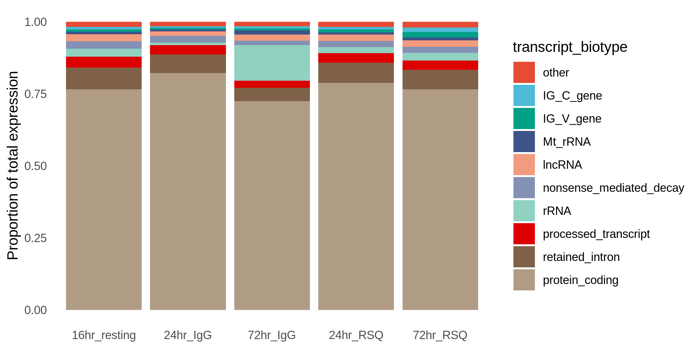
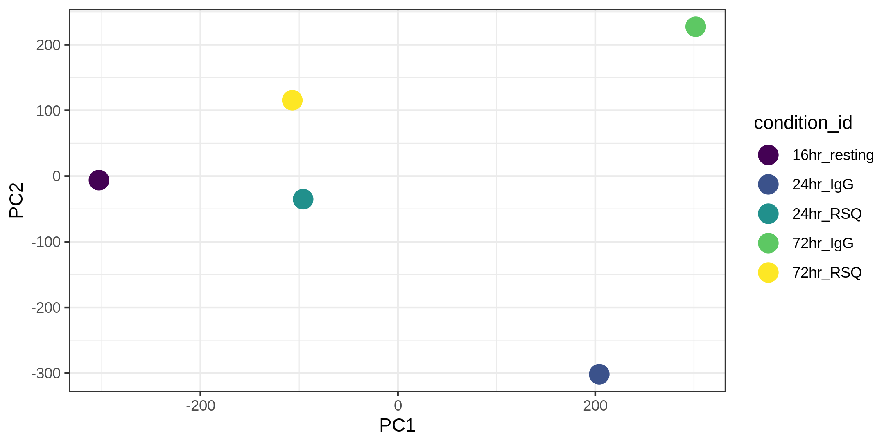
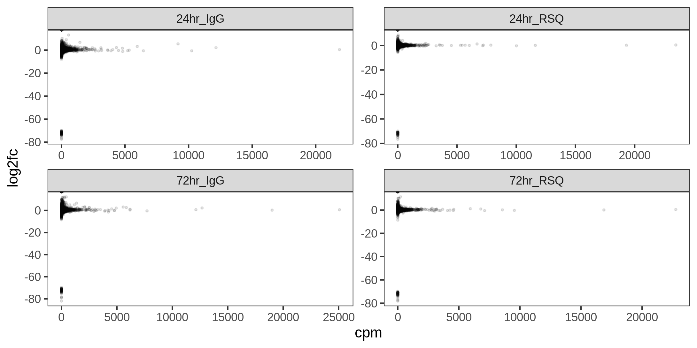
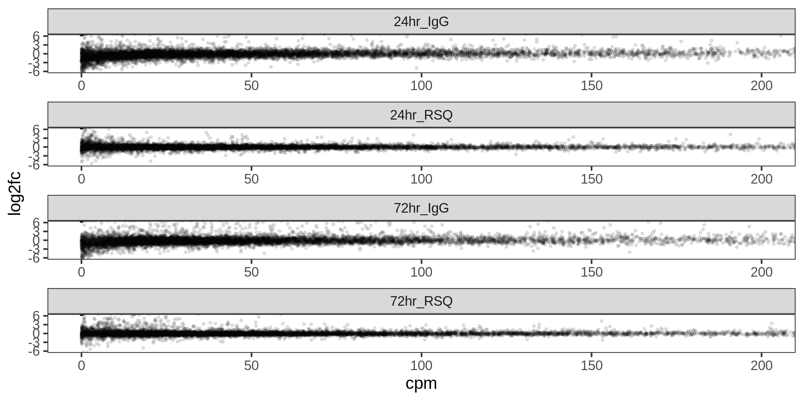
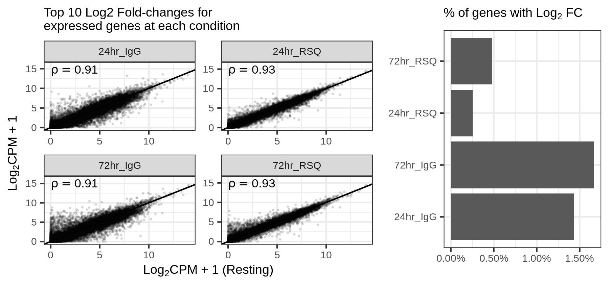
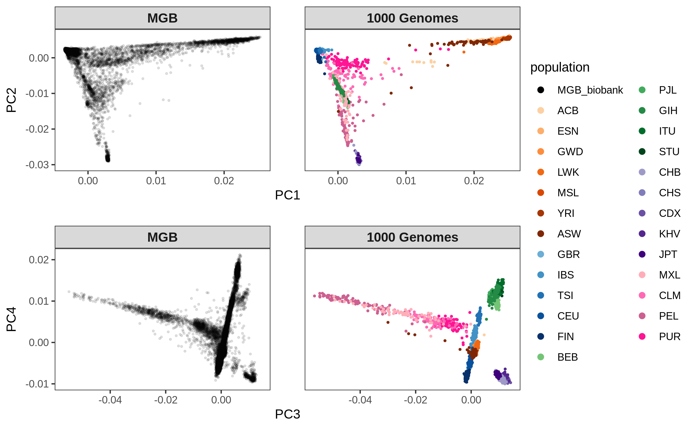
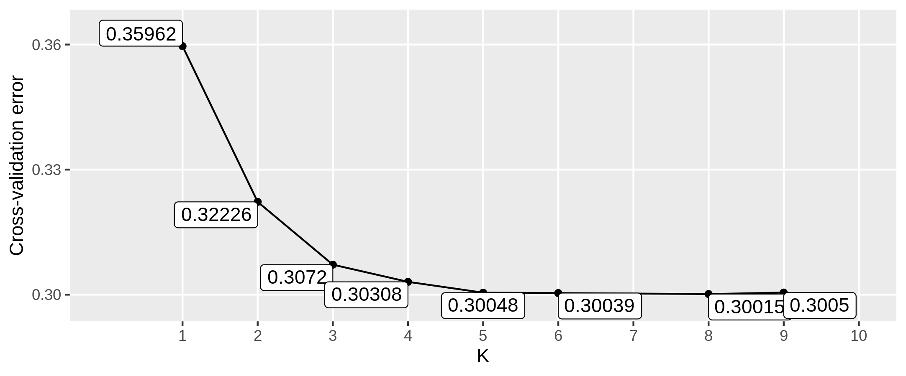
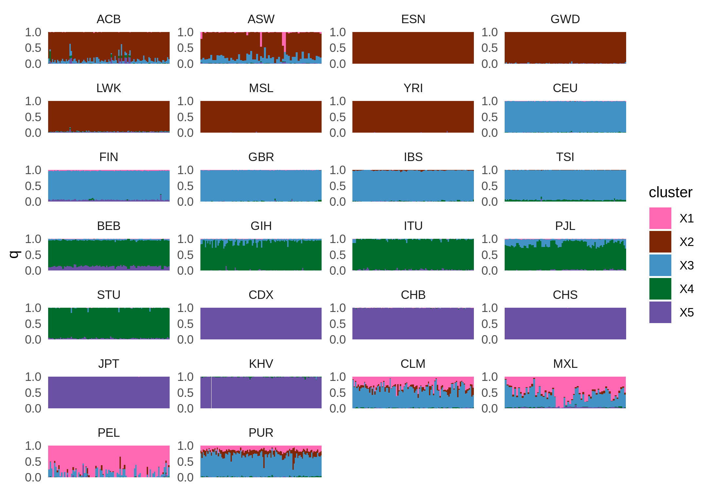
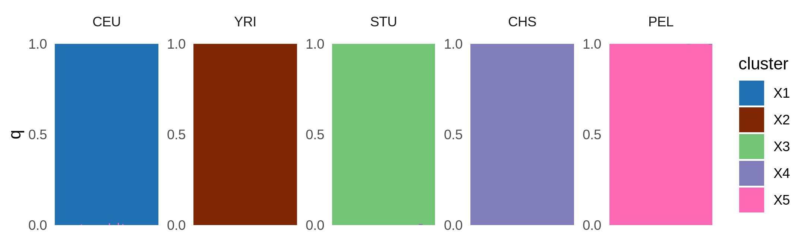
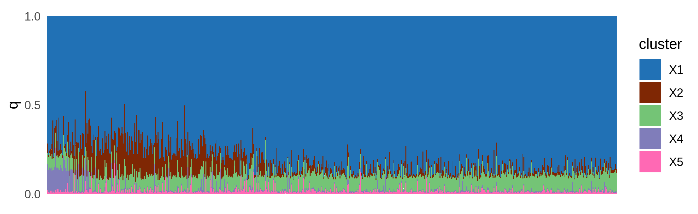

```{r setup, include=FALSE}
library(knitr)
knitr::opts_chunk$set(echo = FALSE, warning=FALSE, message=FALSE)
```


## 0. General info

All the scripts with the `.slurm` extension can be submitted to the cluster using the command `sbatch script_name.slurm`.

For the `.sh` scripts, I execute them with the command `./script_name.sh` in an interactive job.


## 1. B cells: Bulk RNAseq

### 1.1. Input data:

- 1 individual, 5 timepoints:
  - Resting for 16 hours
  - IgG stim for 24 hours
  - IgG stim for 72 hours
  - RSQ stim for 24 hours
  - RSQ stim for 72 hours
  
Fastq files located on directory:
/lab-share/IM-Gutierrez-e2/Public/B_cells/bulkTCpilot_1/34.198.31.178/210618_MG8989_fastq

### 1.2. Methods

#### 1.2.1. Alignment index

I obtained the genome sequence and annotation data from [Gencode](https://www.gencodegenes.org/human/release_38.html):

Using `wget **gencode_link**`, I downloaded the comprehensive gene annotation GTF file ("PRI") and the Genome sequence ("PRI"), which includes chromosomes and scaffolds. The files are in the `./data` directory.

Unfortunately, Gencode does not include a corresponding fasta file with transcript sequences for the "PRI" annotation, so I used RSEM to slice the Reference genome given the annotations, this way producing transcript sequences. For that I used the `./bcell_bulk/rsem.slurm` script.

I used Salmon to estimate expression. The script to create an index is `./bcell_bulk/salmon_index.slurm`.


#### 1.2.2. Expression estimation

Expression levels were estimated with script `./bcell_bulk/salmon_quant.slurm`.

#### 1.2.3. PCA on expression data

I used QTLtools to compute principal components from the expression matrix, using the script `./bcell_bull/pca.slurm`.

#### 1.2.4. Parsing result files

I compiled results from expression quantification, PCA, and other downstream analyses in R, with the script `./bcell_bulk/compile_results.R`.


#### 1.2.5. Plots

All the plots below were created with the script `./plot.R`.


### 1.3. Results

#### 1.3.1. Overview of expression levels

In the plot below we see the proportion of total expression attributed to each type of transcript, in Counts Per Million (CPM) and in Transcripts Per Million (TPM).

For the TPM plot, we see a jump in quantifications for rRNAs. But we need to keep in mind that these are very short RNAs, and a small increase in read counts can lead to large increases in TPM values.

```{r biotypes, echo=FALSE}

```

#### 1.3.2. PCA

PCA shows a separation of the RSQ and IgG treatments (PC1), and of the 24h/72h conditions (PC2).

```{r pca, echo=FALSE}

```

#### 1.3.3. Fold change in comparison with "resting"

Here we have a scatter plot of CPM values in each condition against the log2 Fold-change in respect to the resting state.

Extreme values correspond to genes that have no expression in either the resting or test condition.

```{r fc, echo=FALSE}

```

#### 1.3.4. Subset of the plot above:

```{r fcsub, echo=FALSE}

```

#### 1.3.5. Correlations with resting state:

```{r corr, echo=FALSE}

```

### 1.4. TO DO:

- Look at common DE genes across conditions;
- Select genes in LD with SLE variants and look at their DE status;
- Run kallisto + sleuth once we have more samples, and call significant genes.


## 2. MGB Biobank analysis

### 2.1. Goals

- Among the individuals in MGB Biobank, select those who carry more European ancestry;
- Among those, select 12 individuals who are more heterozygous at SLE loci;
- We will use the SLE loci reported by Langefeld et al. (2017);
- Recruit these individuals to donate samples;
- Perform transcriptomic (ASE) and other analyses in multiple timepoints and stims;
- Identify dysregulated loci.

### 2.2. Input data

- MGB: 
  - 4921 individuals;
  - ~79M variants.

- 1000 Genomes data:
  - 2,504 low coverage data realigned to GRCh38 (not NYGC version).

### 2.3. Methods

- VCF processing (`./mgb_biobank/process_vcf.slurm` script):
  - remove variants with any missing genotypes;
  - select only biallelic SNPs with MAF >= 0.1;
  - remove A/T and C/G genotypes due to potential strand ambiguity;
  - remove duplicates (these can be multiallelic variants or multiple variants with same position);
  - select variants with the same position and alleles in both datasets;
  - filter both datasets for the common set of variants;
  - merge VCFs and run LD pruning for r2 < 0.1.

- Concatenate VCFs for each chromosome into a single VCF (`./mgb_biobank/concat_vcf.sh`)

- PCA (`./mgb_biobank/run_pca.slurm` script):
  - plink pca

- ADMIXTURE
  - Cross-validations (`./mgb_biobank/admixture_cv.slurm`);
  - Projection of MGB individuals on 1000G reference panel (`./mgb_biobank/admixture_projection.sh`)

### 2.4. Results

The PCA plot shows the MGB individuals with the 1000 Genomes data superimposed. We can see that individuals are distributed along 5 axis of variation which correspond to the 5 main continental groups. 

```{r pca_genos, echo=FALSE}

```

Next, I wanted to run ADMIXTURE to determine the ancestry proportions in each individual, so I could select those who are (mostly) of European ancestry.

First, I ran the cross-validation procedure of ADMIXTURE to determine the best value of K cluster, and see if K = 5 would really make sense. Indeed, K=5 looks a good guess.

```{r admixture_cv}

```

In fact, separation of populations in 5 cluster makes sense:

```{r admixture_1000G}

```

Next, I asked ADMIXTURE to project the MGB biobank onto the 1000 Genomes reference in order to determine the ancestry proportions in MGB biobank.

The results don't make sense. All individuals seem to be admixed, including a almost constant proportion of South Asian ancestry. 

Then I tried reducing the reference panel to a single population from each continente, selecting individuals who carry at least 97.5% of that ancestry.


```{r admixture_refpanel}

```


However, when I project the MGB biobank individuals onto this reference panel, I get the same constant SAS ancestry on all individuals, with an average of 9%.

```{r admixture_mgb}

```

Is this share ancestry with EUR that are being marked as SAS?


### 2.5. TO DO:

- select SLE variants from Langefeld et al. (2017);
- select European individuals from MGB biobank.


