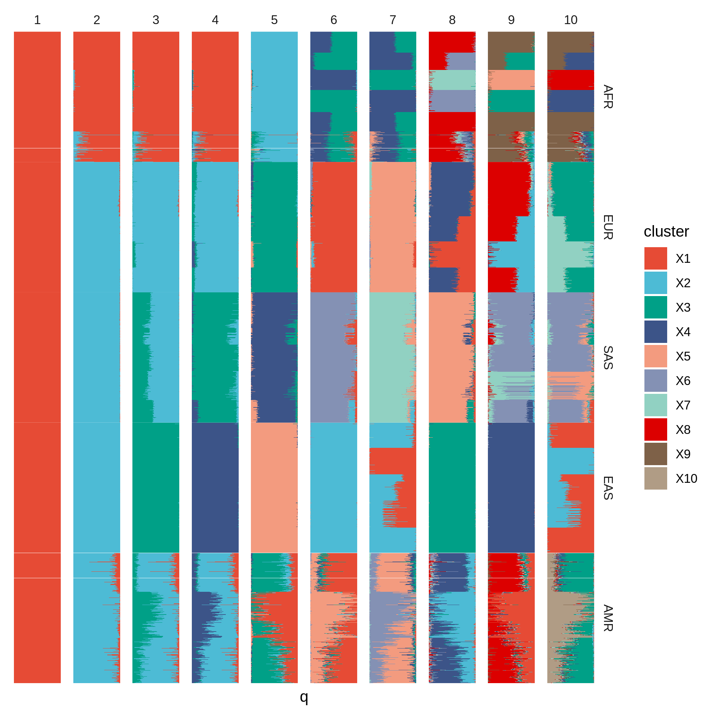
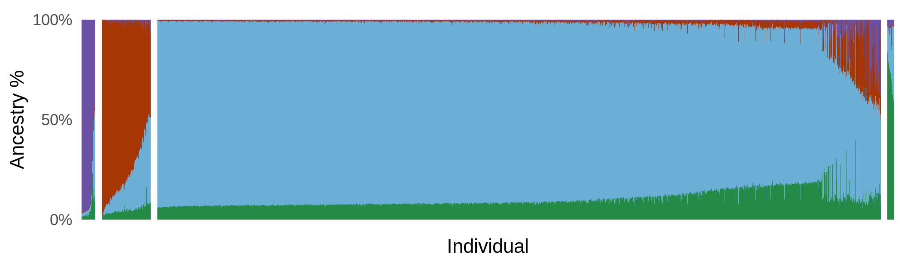
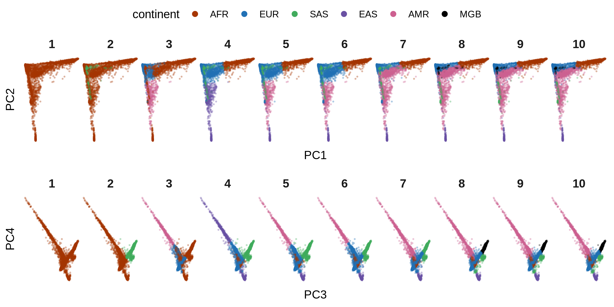
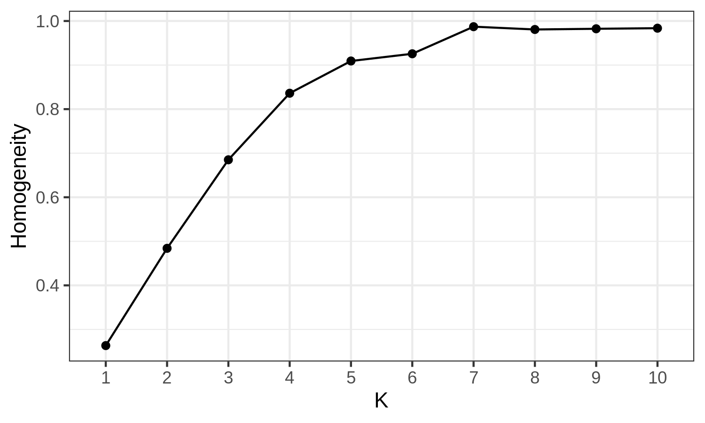
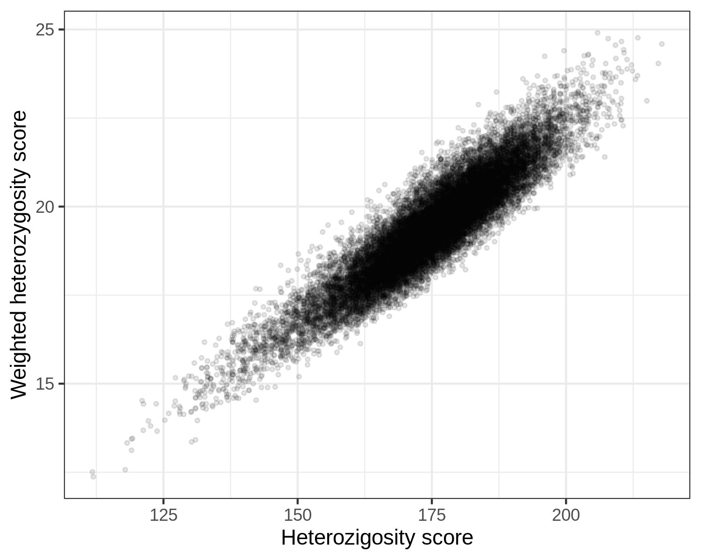

README
================

## 0. General info

All the scripts with the `.slurm` extension can be submitted to the
cluster using the command `sbatch script_name.slurm`.

For the `.sh` scripts, I execute them with the command
`./script_name.sh` in an interactive job.

## 1. B cells: Bulk RNAseq

### 1.1. Input data:

-   1 individual sequenced at:
    -   Resting for 16 hours
    -   IgG stim for 24 hours
    -   IgG stim for 72 hours
    -   RSQ stim for 24 hours
    -   RSQ stim for 72 hours

Fastq files located on directory:
/lab-share/IM-Gutierrez-e2/Public/B\_cells/bulkTCpilot\_1/34.198.31.178/210618\_MG8989\_fastq

### 1.2. Methods

#### 1.2.1. Alignment index

I obtained the genome sequence and annotation data from
[Gencode](https://www.gencodegenes.org/human/release_38.html):

Using `wget **gencode_link**`, I downloaded the comprehensive gene
annotation GTF file (“PRI”) and the Genome sequence (“PRI”), which
includes chromosomes and scaffolds. The files are in the `./data`
directory.

Unfortunately, Gencode does not include a corresponding fasta file with
transcript sequences for the “PRI” annotation, so I used RSEM to slice
the Reference genome given the annotations, this way producing
transcript sequences. For that I used the `./bcell_bulk/rsem.slurm`
script.

I used Salmon to estimate expression. The script to create an index is
`./bcell_bulk/salmon_index.slurm`.

#### 1.2.2. Expression estimation

Expression levels were estimated with script
`./bcell_bulk/salmon_quant.slurm`.

#### 1.2.3. PCA on expression data

I used QTLtools to compute principal components from the expression
matrix, using the script `./bcell_bull/pca.slurm`.

#### 1.2.4. Parsing result files

I compiled results from expression quantification, PCA, and other
downstream analyses in R, with the script
`./bcell_bulk/compile_results.R`.

#### 1.2.5. Plots

All the plots below were created with the script `./plot.R`.

### 1.3. Results

#### 1.3.1. Overview of expression levels

In the plot below we see the proportion of total expression attributed
to each type of transcript, in Counts Per Million (CPM) and in
Transcripts Per Million (TPM).

For the TPM plot, we see a jump in quantifications for rRNAs. But we
need to keep in mind that these are very short RNAs, and a small
increase in read counts can lead to large increases in TPM values.

#### 1.3.2. PCA

PCA shows a separation of the RSQ and IgG treatments (PC1), and of the
24h/72h conditions (PC2).

#### 1.3.3. Fold change in comparison with “resting”

Here we have a scatter plot of CPM values in each condition against the
log2 Fold-change in respect to the resting state.

Extreme values correspond to genes that have no expression in either the
resting or test condition.

#### 1.3.4. Subset of the plot above:

#### 1.3.5. Summary of direction of regulation

#### 1.3.6. Correlations with resting state:

#### 1.3.7. Comparison of FC for each stimulant

### 1.4. TO DO:

-   Select genes in LD with SLE variants and look at their DE status;
-   Run Maria’s script to model expression given condition;
-   Run kallisto + sleuth once we have more samples, and call
    significant genes.

## 2. MGB Biobank analysis

### 2.1. Goals

-   Among the individuals in MGB Biobank, select those who carry more
    European ancestry;
-   Among those, select individuals who are more heterozygous at SLE
    loci;
-   We will use the SLE loci reported by Langefeld et al. (2017);
-   Recruit these individuals to donate samples;
-   Perform transcriptomic (ASE) and other analyses in multiple
    timepoints and stims;
-   Identify dysregulated loci.

### 2.2. Input data

-   MGB:

| Batch |   N   | Variants (MM) |       Source       |
|:-----:|:-----:|:-------------:|:------------------:|
| 0401  | 4,921 |    \~79.1     |    MEGA\_TopMed    |
| 0402  | 5,336 |    \~80.1     |   MEGAEX\_TopMed   |
| 0403  | 4,780 |    \~79.8     | MEG\_A1\_A\_TopMed |
| 0404  | 5,016 |    \~80.9     | MEG\_A1\_B\_TopMed |

-   1000 Genomes data:
    -   \~2,500 individuals low coverage data realigned to GRCh38 (not
        NYGC version).

### 2.3. Methods

The workflow for the analyses below is described in
`./mgb_biobank/README.md`.

-   VCF processing:
    -   Remove variants with any missing genotypes;
    -   Select only biallelic SNPs with MAF &gt;= 0.1;
    -   Remove A/T and C/G genotypes due to potential strand ambiguity;
    -   Remove duplicates (these can be multiallelic variants or
        multiple variants with same position);
    -   Select variants with the same position and alleles in both
        datasets;
    -   Filter both datasets for the common set of variants;
    -   Merge VCFs and run LD pruning for r2 &lt; 0.1;
    -   Concatenate VCFs for each chromosome into a single VCF.
-   PCA:
    -   plink pca
-   ADMIXTURE
    -   Unsupervised analysis on 1000 Genomes data;
    -   Project MGB individuals onto 1000G reference panel.
-   SLE risk variants
    -   We take all variants at FDR&lt;5% from [Langefeld et
        al. (2017)](http://www.nature.com/articles/ncomms16021);
    -   For each individual, we compute an overall heterozygosity score
        at SLE variants.

### 2.4. Results

#### Ancestry information from genotype data

##### PCA

The PCA plot shows the MGB individuals in comparison with the 1000
Genomes data. We can see that individuals are distributed according to
the 5 main continental groups.

##### ADMIXTURE

First, I ran the cross-validation procedure of ADMIXTURE to determine
the best value of K (number of clusters).

And this is the separation we get in 1000 Genomes data:

Next, I asked ADMIXTURE to project the MGB biobank onto the 1000 Genomes
reference in order to determine the ancestry proportions in MGB biobank.

The results don’t make sense, because all individuals have some
proportion of South Asian “ancestry” (similarity).

##### K-means

I tried k-means to classify MGB individuals into continental groups,
giving their values for PC1:PC4.

The plot below shows the classifications according to the most likely
continental group for each cluster.

I computed specificity defined as the proportion of correct calls for
continental groups at each cluster, using known continental groups for
the 1000 Genomes data. For example, if at cluster X we have 90% of
individuals from a 1000G European population, the score will equal 0.9.

The specificity suggests K = 7 as the optimal value. However, in the
plot above we see that K = 7 does not correctly deal with a MGB subgroup
which appears to refer to European ancestries which are not sampled in
the 1000 Genomes data.

Anyway, for MGB data, no value of K seems to be very specific, as the
algorithm is clustering admixed individuals as Europeans.

##### PCA-based selection

Therefore, I’ve decided to simply select individuals based on PC1 and
PC2 values.

I computed the mean and SD for PC1 and PC2 in 1000 Genomes Europeans,
and computed a z-score for each MGB individuals, selecting all
individuals falling between -3 and +3 SDs.

#### SLE variants

We selected SLE risk variants from the Langefeld et al. study.

Then, I computed a heterozygosity score that corresponds to the number
of variants at which the individuals are heterozygotes. I also computed
a weighted score that is simply the number of alleles times the log(OR),
summed over all variants. Since the number of alleles for heterozygotes
is equal to 1, that corresponds to simply summing the log(OR) over all
SLE SNPs.

Since we are not intested in the direction of effect, I converted all
ORs &lt; 1 to the reciprocal 1/OR.

This is the relationship between the two scores:

This are the distributions according the European ancestry:

We can see that heterozygosity increases with European ancestry. We can
also see that if we color the PCA plot by heterozygosity.

