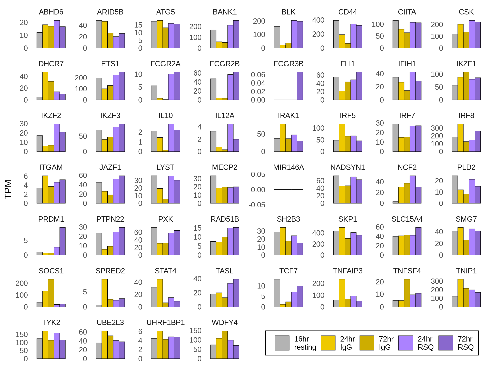
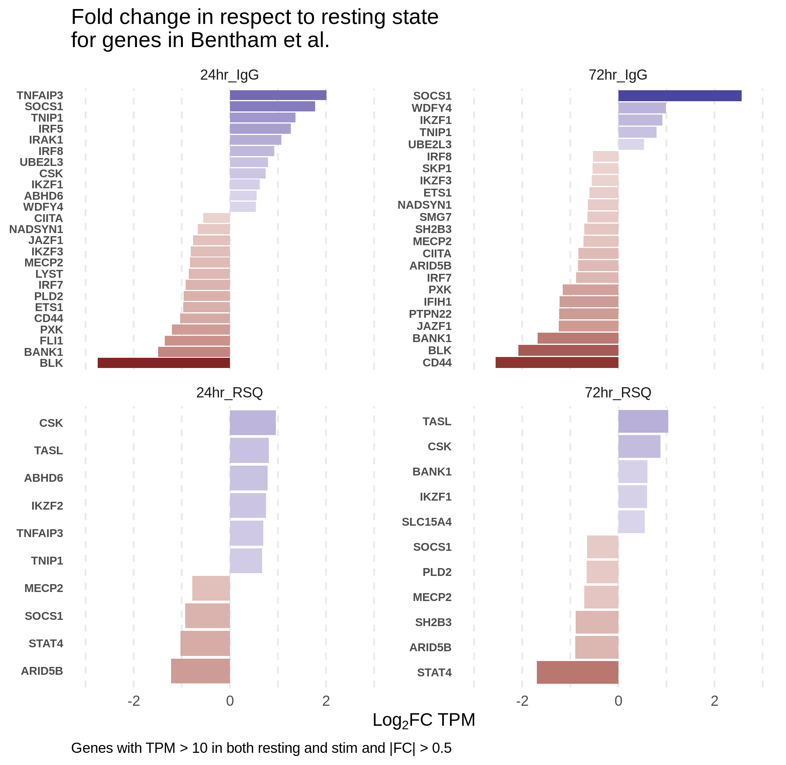
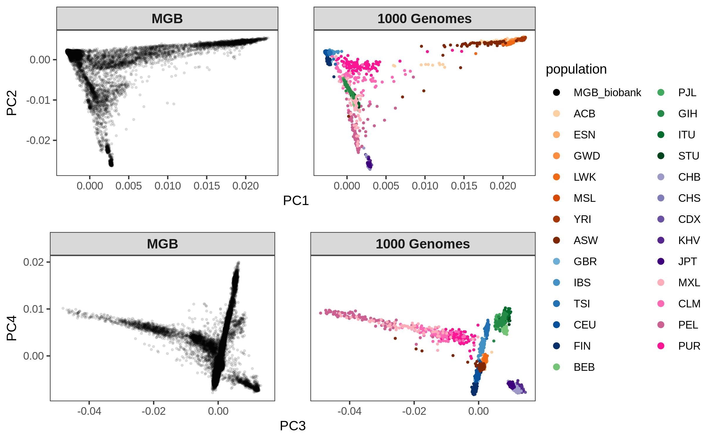

README
================

## 0. General info

All the scripts with the `.slurm` extension can be submitted to the
cluster using the command `sbatch script_name.slurm`.

For the `.sh` scripts, I execute them with the command
`./script_name.sh` in an interactive job.

## 1. B cells: Bulk RNAseq

### 1.1. Input data:

-   1 individual sequenced at:
    -   Resting for 16 hours
    -   IgG stim for 24 hours
    -   IgG stim for 72 hours
    -   RSQ stim for 24 hours
    -   RSQ stim for 72 hours

Fastq files located on directory:
/lab-share/IM-Gutierrez-e2/Public/B\_cells/bulkTCpilot\_1/34.198.31.178/210618\_MG8989\_fastq

### 1.2. Methods

#### 1.2.1. Alignment index

I obtained the genome sequence and annotation data from
[Gencode](https://www.gencodegenes.org/human/release_38.html):

Using `wget **gencode_link**`, I downloaded the comprehensive gene
annotation GTF file (“PRI”) and the Genome sequence (“PRI”), which
includes chromosomes and scaffolds. The files are in the `./data`
directory.

Unfortunately, Gencode does not include a corresponding fasta file with
transcript sequences for the “PRI” annotation, so I used RSEM to slice
the Reference genome given the annotations, this way producing
transcript sequences. For that I used the `./bcell_bulk/rsem.slurm`
script.

I used Salmon to estimate expression. The script to create an index is
`./bcell_bulk/salmon_index.slurm`.

#### 1.2.2. Expression estimation

Expression levels were estimated with script
`./bcell_bulk/salmon_quant.slurm`.

#### 1.2.3. PCA on expression data

I used QTLtools to compute principal components from the expression
matrix, using the script `./bcell_bull/pca.slurm`.

#### 1.2.4. Parsing result files

I compiled results from expression quantification, PCA, and other
downstream analyses in R, with the script
`./bcell_bulk/compile_results.R`.

#### 1.2.5. Plots

All the plots below were created with the script `./plot.R`.

### 1.3. Results

#### 1.3.1. Overview of expression levels

In the plot below we see the proportion of total expression attributed
to each type of transcript, in Counts Per Million (CPM) and in
Transcripts Per Million (TPM).

For the TPM plot, we see a jump in quantifications for rRNAs. But we
need to keep in mind that these are very short RNAs, and a small
increase in read counts can lead to large increases in TPM values.

#### 1.3.2. PCA

PCA shows a separation of the RSQ and IgG treatments (PC1), and of the
24h/72h conditions (PC2).

#### 1.3.3. Expression of candidate SLE genes

We looked at the expression of candidate genes suggested by [Bentham et
al. 2015, Table 2](http://www.nature.com/articles/ng.3434).

### 1.4 Allelic Imbalance

#### 1.4.1 Methods

-   Variant calling from the RNA-seq data with the GATK best practices’
    pipeline;
-   ASE analysis with GATK ASEReadCounter or QTLtools ase;
-   Statistical test: binomial test with p = overall reference allele
    ratio;
-   P-value adjustment via FDR (Qvalue R package);
-   Gene-level ASE with phASER.

#### 1.4.2 Results

##### Significat ASE per read depth bin

##### Coverage histogram

##### Number of sites

##### Distribution of reference allele fractions

##### Selected variants

Example variants selected after filtering for:

-   No imbalance at resting state;
-   Depth &gt; 20;
-   Imbalance &gt; 0.2;
-   FDR = 5%.

#### Gene-level ASE

Gene-level ASE reveals additional genes in respect to the SNP-level ASE.
Here we show selected genes after filtering for:

-   No imbalance at resting state;
-   Depth &gt;= 16;
-   Imbalance &gt; 0.2

And the comparison with the SNP-level ASE:

###### C22orf34 gene

###### FCER2 gene

## 2. MGB Biobank analysis

### 2.1. Goals

-   Among the individuals in MGB Biobank, select those who carry more
    European ancestry;
-   Among those, select individuals who are more heterozygous at SLE
    loci;
-   We will use the SLE loci reported by Bentham et al. (2015),
    Langefeld et al. (2017), and the TLR7 variant (see Teruel &
    Alarcon-Riquelme, 2016);
-   Recruit these individuals to donate samples;
-   Perform transcriptomic (ASE) and other analyses in multiple
    timepoints and stims;
-   Identify dysregulated loci.

### 2.2. Input data

-   MGB:

| Batch |   N    | Variants (MM) |       Source       |
|:-----:|:------:|:-------------:|:------------------:|
| 0401  | 4,921  |    \~79.1     |    MEGA\_TopMed    |
| 0402  | 5,336  |    \~80.1     |   MEGAEX\_TopMed   |
| 0403  | 4,780  |    \~79.8     | MEG\_A1\_A\_TopMed |
| 0404  | 5,016  |    \~80.9     | MEG\_A1\_B\_TopMed |
| 0405  | 5,491  |    \~81.9     |   MEG\_C\_TopMed   |
| 0406  | 5,143  |    \~80.0     |   MEG\_D\_TopMed   |
| 0407  | 4,847  |    \~76.4     |   MEG\_E\_TopMed   |
| 0408  |  866   |    \~40.0     |  MEG\_X1\_TopMed   |
| 0410  | 13,140 |      N/A      |        N/A         |

-   1000 Genomes data:
    -   \~2,500 individuals low coverage data realigned to GRCh38 (not
        NYGC version).

### 2.3. Methods

The workflow for the analyses below is described in
`./mgb_biobank/README.md`.

-   Selection of individuals who are genetically females
    -   Compute individual-level heterozygosity with vcftools;
    -   After visual inspection of the homozygosity distribution, select
        individuals with &lt;0.985 homozygosity.
-   VCF processing:
    -   Remove variants with any missing genotypes;
    -   Select only biallelic SNPs with MAF &gt;= 0.1;
    -   Remove A/T and C/G genotypes due to potential strand ambiguity;
    -   Remove duplicates (these can be multiallelic variants or
        multiple variants with same position);
    -   Select variants with the same position and alleles in both
        datasets;
    -   Filter both datasets for the common set of variants;
    -   Merge VCFs and run LD pruning for r2 &lt; 0.1;
    -   Concatenate VCFs for each chromosome into a single VCF.
-   PCA:
    -   plink pca
-   ADMIXTURE
    -   Unsupervised analysis on 1000 Genomes data;
    -   Project MGB individuals onto 1000G reference panel.
-   SLE risk variants
    -   We take all variants at FDR&lt;5% from [Langefeld et
        al. (2017)](http://www.nature.com/articles/ncomms16021);
    -   For each individual, we compute an overall heterozygosity score
        at SLE variants.

### 2.4. Results

#### Select females

After visual inspection of the plot below, we select individuals with
homozygosity &lt; 0.985, which we assume to be females. That includes
\~54.6% of the individuals.

#### Ancestry information from genotype data

##### PCA

The PCA plot shows the MGB individuals in comparison with the 1000
Genomes data. We can see that individuals are distributed according to
the 5 main continental groups.

We can really see that on the plot above, but most individuals appear to
have high European ancestry.

##### Selecting individuals with high European ancestry

In order to select individuals with European ancestry given PC
coordinates, we gate the PCA plot based on the range of values for
PC1–PC4 in the 1000 Genomes European set.

#### SLE variants

We selected SLE risk variants from Langefeld et al. and Bentham et al.

From Langefeld et al., we took all variants at FDR = 5%. From Bentham,
we selected the variants which are not in LD with any variant in
Langefeld et al. (
*r*2 &lt; 0.6
).

Then, we computed a heterozygosity score that corresponds to the number
of variants at which the individuals are heterozygotes. We also computed
a weighted score that is simply the number of alleles times the log(OR),
summed over all variants. Since the number of alleles for heterozygotes
is equal to 1, that corresponds to simply summing the log(OR) over all
SLE SNPs.

Since we are not interested in the direction of effect, we converted all
ORs &lt; 1 to their reciprocal (1/OR).

This is the relationship between the two scores:

This are the distributions according the European ancestry:

We can see that heterozygosity increases with European ancestry. We can
also see that if we color the PCA plot by heterozygosity.

