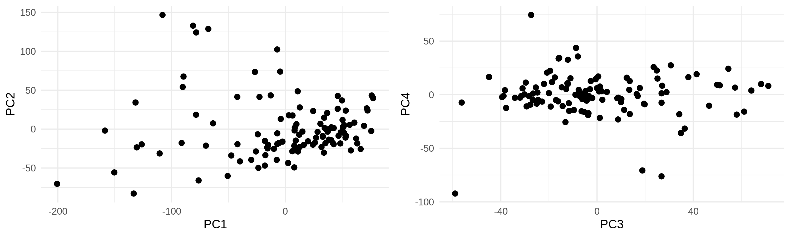
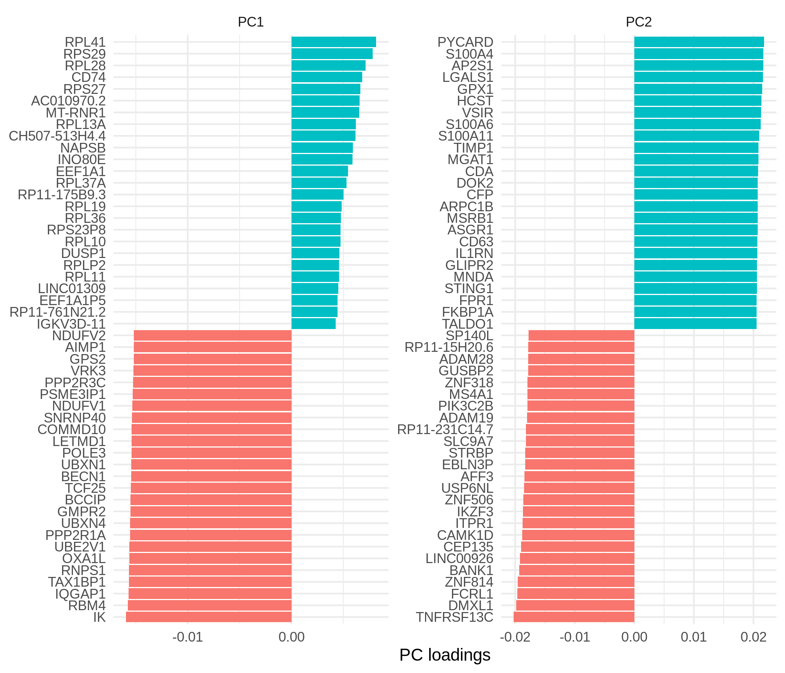

Read me
================

PCA
---

PCA was computed for genes with TPM &gt; 1 in at least 50% of
individuals (about 10,000 genes).

<!-- -->

### Variance explained

<!-- -->

### Gene weights

<!-- -->

### PCA colored by IFN score

IFN score was computed as the cummulative scaled expression levels for
IFN genes.

-   “Interferon Alpha Genes” are genes included in GSEA’s HALLMARK
    INTERFERON ALPHA list.
-   “Interferon Gamma Genes” are genes included in GSEA’s HALLMARK
    INTERFERON GAMMA list.
-   “Interferon Davenport Set” are 11 genes listed in Davenport et al
    (2018).

<!-- -->

### Correlation between IFN score and PC1

#### Interferon Alpha Genes

    ## 
    ##  Spearman's rank correlation rho
    ## 
    ## data:  test_df$ifn_a and test_df$PC1
    ## S = 499556, p-value < 2.2e-16
    ## alternative hypothesis: true rho is not equal to 0
    ## sample estimates:
    ##        rho 
    ## -0.7346899

#### Interferon Gamma Genes

    ## 
    ##  Spearman's rank correlation rho
    ## 
    ## data:  test_df$ifn_g and test_df$PC1
    ## S = 532690, p-value < 2.2e-16
    ## alternative hypothesis: true rho is not equal to 0
    ## sample estimates:
    ##        rho 
    ## -0.8497465

#### Interferon Davenport Genes

    ## 
    ##  Spearman's rank correlation rho
    ## 
    ## data:  test_df$ifn_daven and test_df$PC1
    ## S = 397970, p-value = 1.942e-05
    ## alternative hypothesis: true rho is not equal to 0
    ## sample estimates:
    ##        rho 
    ## -0.3819362

### K-means clustering of IFN genes expression levels

<!-- -->
