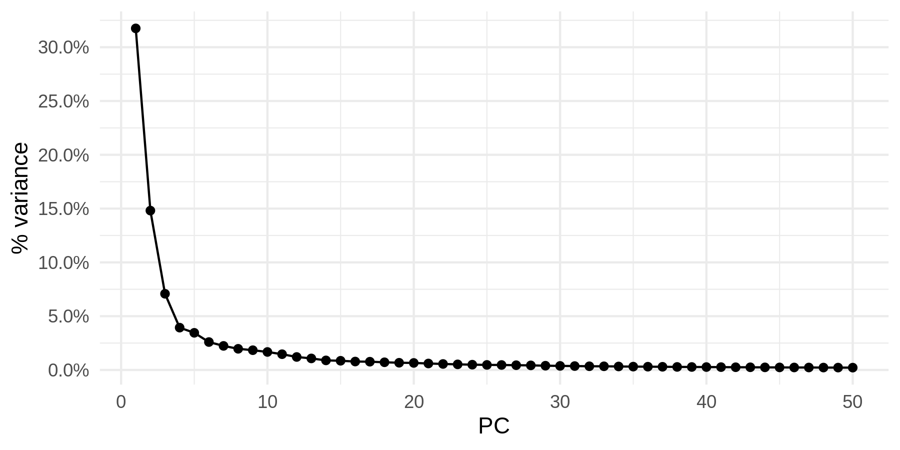
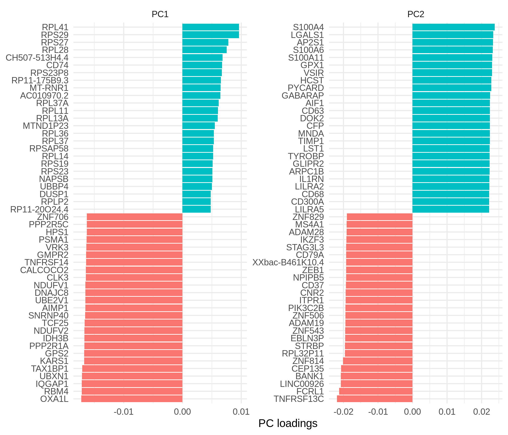

Read me
================

PCA
---

### Variance explained

<!-- -->

### Gene weights

<!-- -->

### PCA colored by IFN score

IFN score was computed as the cummulative scaled expression levels for
11 IFN genes listed in Davenport et al. (2018).

<!-- -->

### K-means clustering of IFN genes expression levels

<!-- -->

### Correlation between IFN score and PC1

    ## 
    ##  Spearman's rank correlation rho
    ## 
    ## data:  test_df$ifn and test_df$PC1
    ## S = 397970, p-value = 1.942e-05
    ## alternative hypothesis: true rho is not equal to 0
    ## sample estimates:
    ##        rho 
    ## -0.3819362
