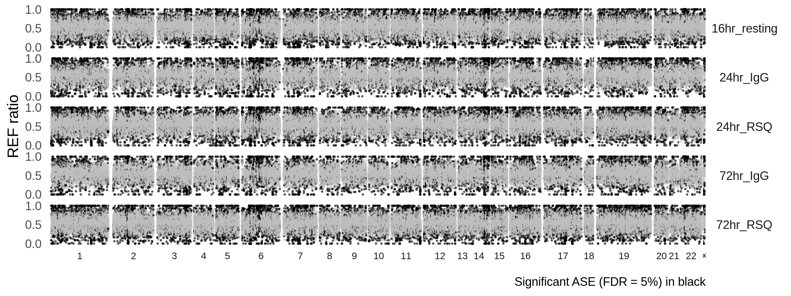
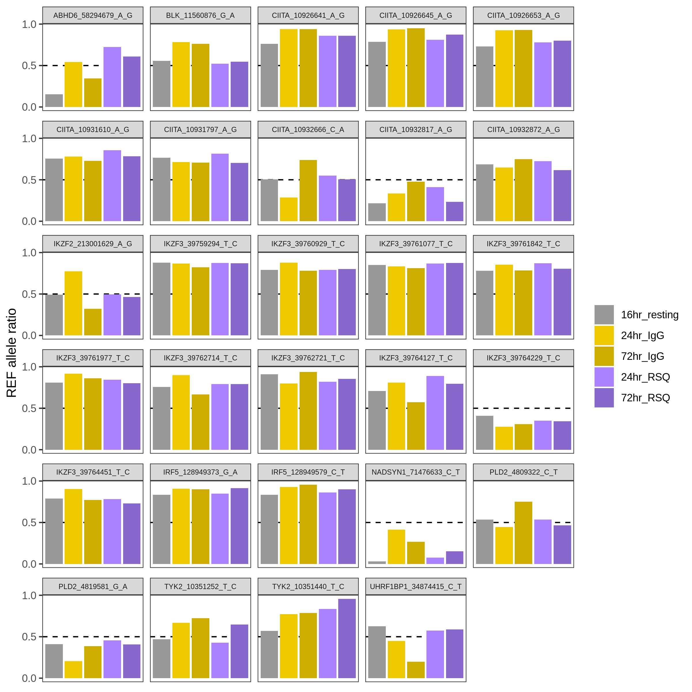

```{r setup, include=FALSE, message=FALSE, warning=FALSE}
library(knitr)
opts_chunk$set(echo = FALSE)
```


## Results

### Inflation of significat ASE at higher counts

```{r inflation}
include_graphics("./plots/imbalance_cutoffs.png")
```

### Genome-wide REF allele ration

```{r gw}

```

### ASE at SLE genes (Bentham et al.)

```{r}

```

