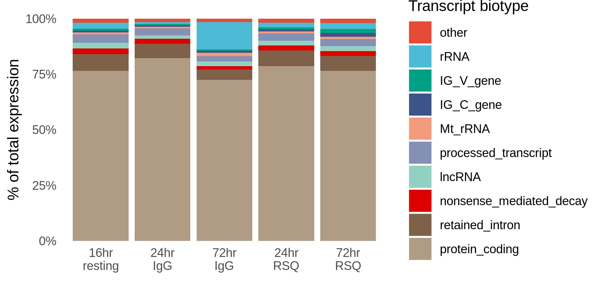
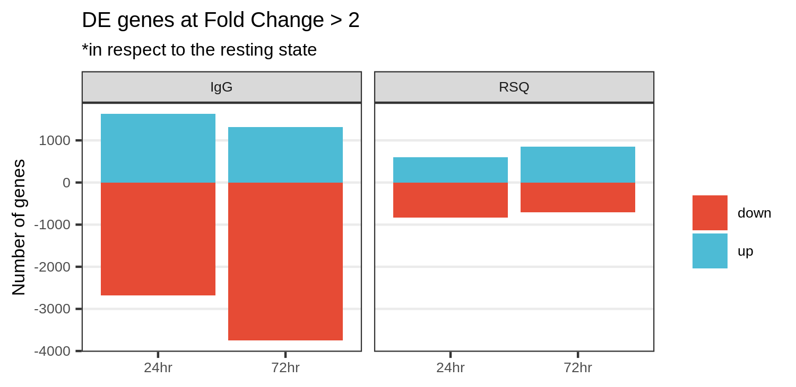
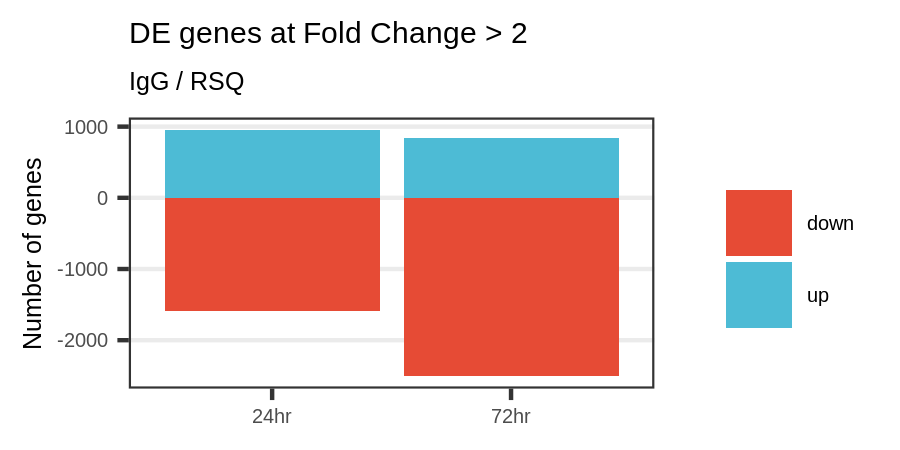
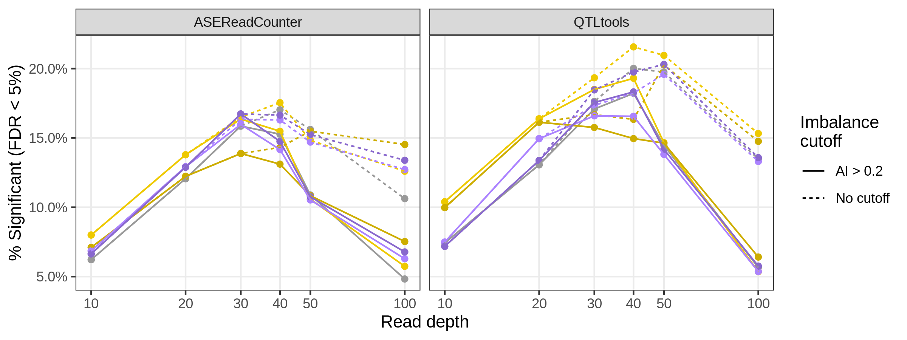
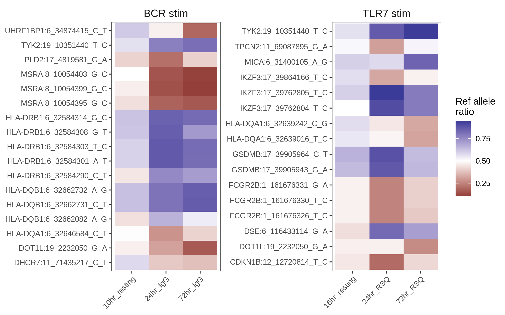
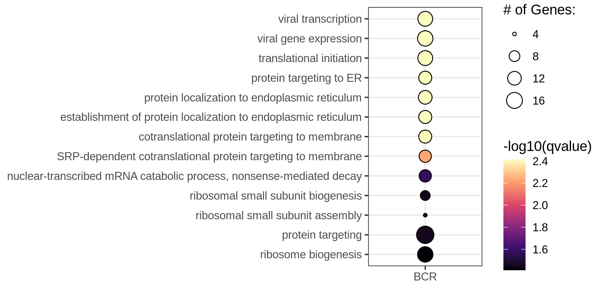

```{r setup, include=FALSE}
library(knitr)
knitr::opts_chunk$set(echo = FALSE, warning=FALSE, message=FALSE)
```


## 1. B cells: Bulk RNAseq

### 1.1. Input data:

- 1 individual sequenced at:
  - Resting for 16 hours
  - IgG stim for 24 hours
  - IgG stim for 72 hours
  - RSQ stim for 24 hours
  - RSQ stim for 72 hours
  
Fastq files located on directory:
/lab-share/IM-Gutierrez-e2/Public/B_cells/bulkTCpilot_1/34.198.31.178/210618_MG8989_fastq

### 1.2. Methods

#### 1.2.1. Alignment index

I obtained the genome sequence and annotation data from [Gencode](https://www.gencodegenes.org/human/release_38.html):

Using `wget **gencode_url**`, I downloaded the comprehensive gene annotation GTF file ("PRI") and the Genome sequence ("PRI"), which includes chromosomes and scaffolds. The files are in the `../data` directory.

Unfortunately, Gencode does not include a corresponding fasta file with transcript sequences for the "PRI" annotation, so I used RSEM to slice the Reference genome given the annotations, this way producing transcript sequences. For that I used the `rsem.slurm` script.

I used Salmon to estimate expression. The script to create an index is `salmon_index.slurm`.


#### 1.2.2. Expression estimation

Expression levels were estimated with script `salmon_quant.slurm`.

#### 1.2.3. PCA on expression data

I used QTLtools to compute principal components from the expression matrix, using the script `pca.slurm`.

#### 1.2.4. Parsing result files

I compiled results from expression quantification, PCA, and other downstream analyses in R, with the script `compile_results.R`.


#### 1.2.5. Plots

All the plots below were created with the script `plot.R`.


### 1.3. Results

#### 1.3.1. Overview of expression levels

In the plot below we see the proportion of total expression attributed to each type of transcript, in Counts Per Million (CPM) and in Transcripts Per Million (TPM).

For the TPM plot, we see a jump in quantifications for rRNAs. But we need to keep in mind that these are very short RNAs, and a small increase in read counts can lead to large increases in TPM values.

```{r biotypes, echo=FALSE}

```

#### 1.3.2. PCA

PCA shows a separation of the RSQ and IgG treatments (PC1), and of the 24h/72h conditions (PC2).

```{r pca, echo=FALSE}
include_graphics("./plots/pca_bcell_expression.png")
```

#### 1.3.3. Differential expression

```{r}

```

```{r}

```

#### 1.3.4. Expression of candidate SLE genes


We looked at the expression of candidate genes suggested by [Bentham et al. 2015, Table 2](http://www.nature.com/articles/ng.3434).

```{r sle}
include_graphics("./plots/bentham.png")
```

```{r sle_fc}
include_graphics("./plots/bentham_fc.png")
```


### 1.4 Allelic Imbalance

#### 1.4.1 Methods

- Variant calling from the RNA-seq data with the GATK best practices' pipeline;
- ASE analysis with GATK ASEReadCounter or QTLtools ase;
- Statistical test: binomial test with p = overall reference allele ratio;
- P-value adjustment via FDR (Qvalue R package);
- Gene-level ASE with phASER.

#### 1.4.2 Results

##### Significat ASE per read depth bin

```{r}

```

##### Coverage histogram

```{r}
include_graphics("./plots/coverage_hist.png")
```

##### Number of sites

```{r}
include_graphics("./plots/number_of_sites.png")
```

##### Distribution of reference allele fractions

```{r}
include_graphics("./plots/ref_fraction_hist.png")
```

##### Selected variants

Example variants selected after filtering for:

- No imbalance at resting state;
- Depth > 20;
- Imbalance > 0.2;
- FDR = 5%.


```{r}
include_graphics("./plots/selected_genes_ai.png")
```

##### ASE in GWAS genes

```{r}

```

##### Pathway enrichment analysis with ASE genes

```{r}

```


#### Gene-level ASE

Gene-level ASE reveals additional genes in respect to the SNP-level ASE. Here we show selected genes after filtering for:

- No imbalance at resting state;
- Depth >= 16;
- Imbalance > 0.2

And the comparison with the SNP-level ASE:

###### C22orf34 gene

```{r}
include_graphics("./plots/gene_level_ai_c22orf.png")
```

###### FCER2 gene

```{r}
include_graphics("./plots/gene_level_ai_fcer2.png")
```


