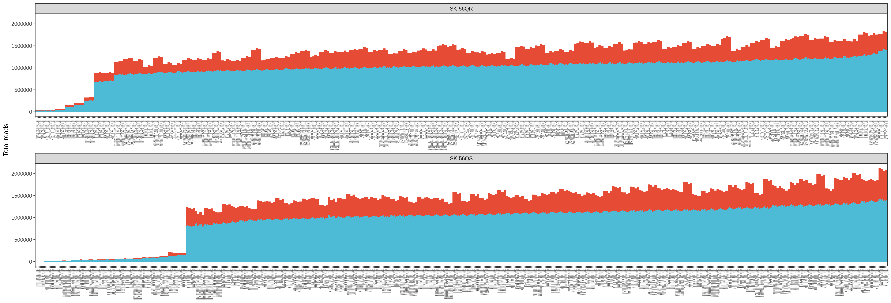
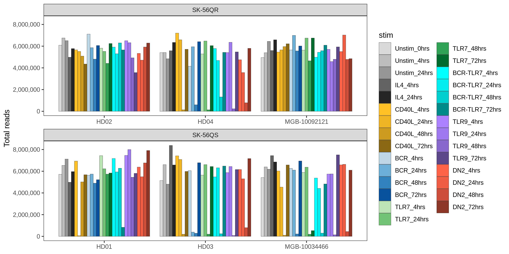
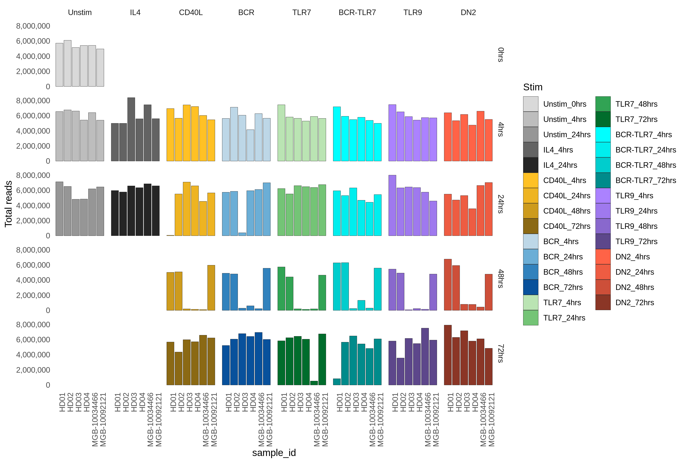
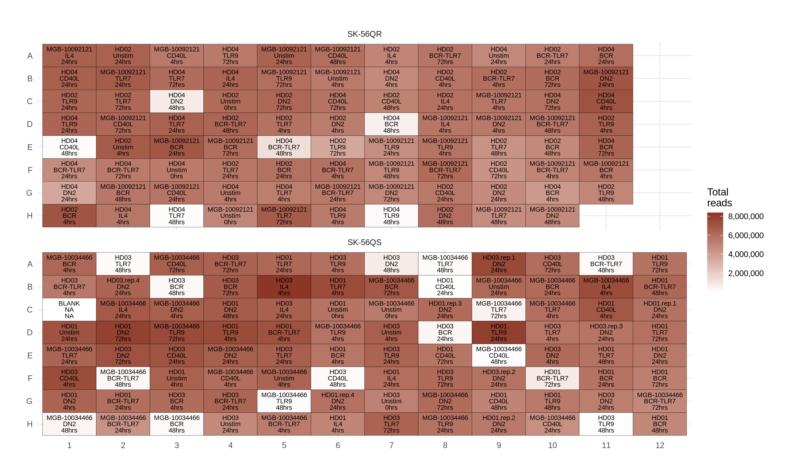
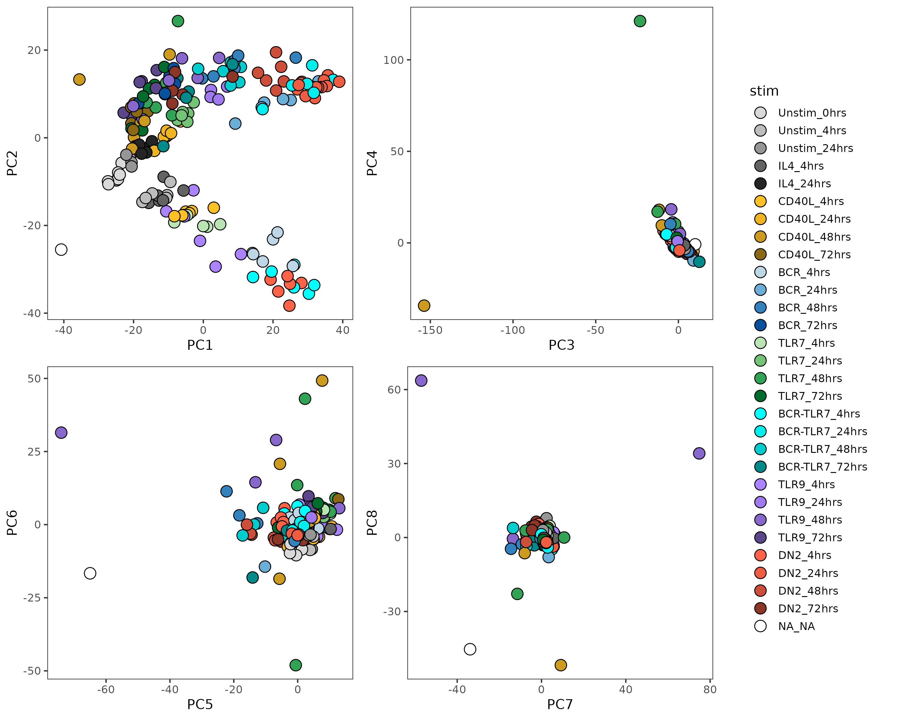

```{r setup, include=FALSE}
unix::rlimit_as(1e12)
library(knitr)
opts_chunk$set(echo = FALSE, 
	       message = FALSE, 
	       warning = FALSE, 
	       comment = "#",
               dpi = 300)
```

## QC

### Total of unique and duplicate reads in each fastq file

```{r}

```

### Total number of reads per individual and condition

```{r}

```

```{r}

```

### Plates colored by total number of reads

```{r}

```


## PCA

```{r}

```

