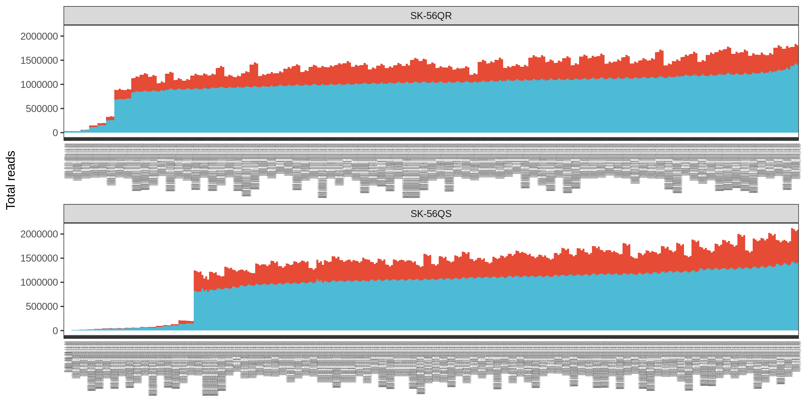
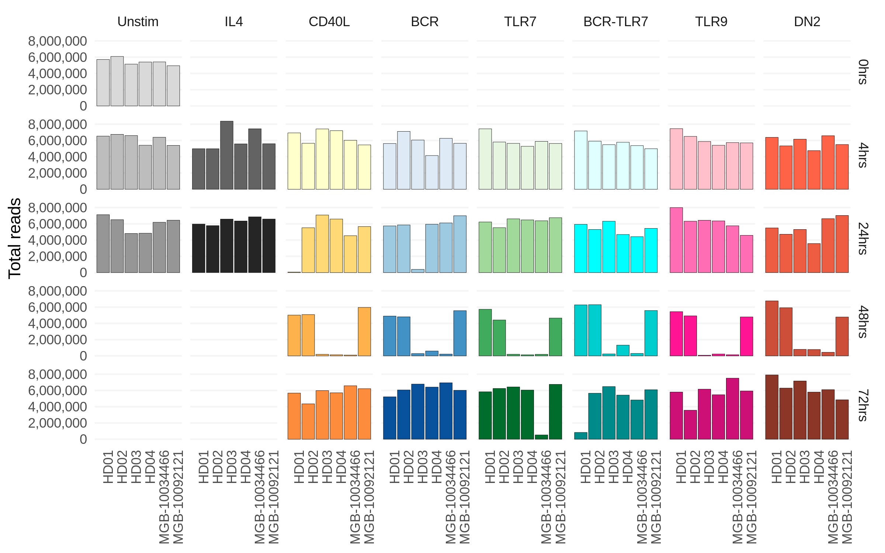
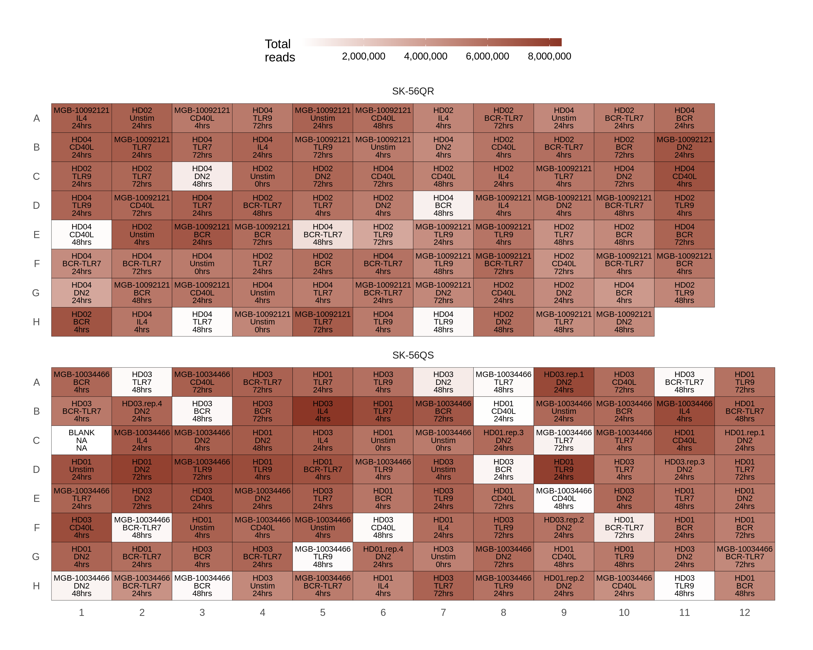
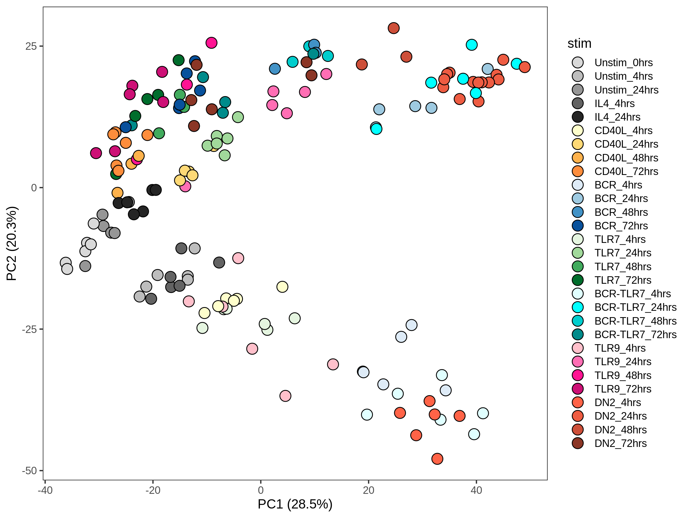
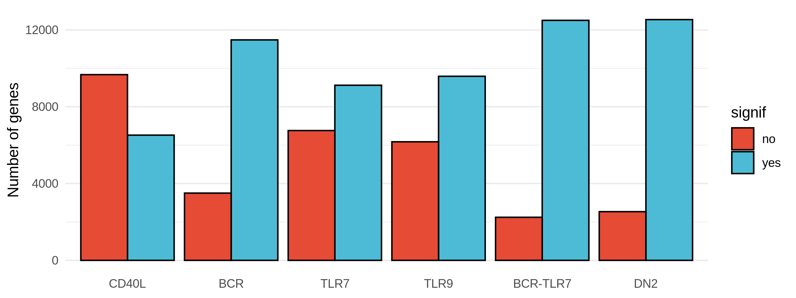
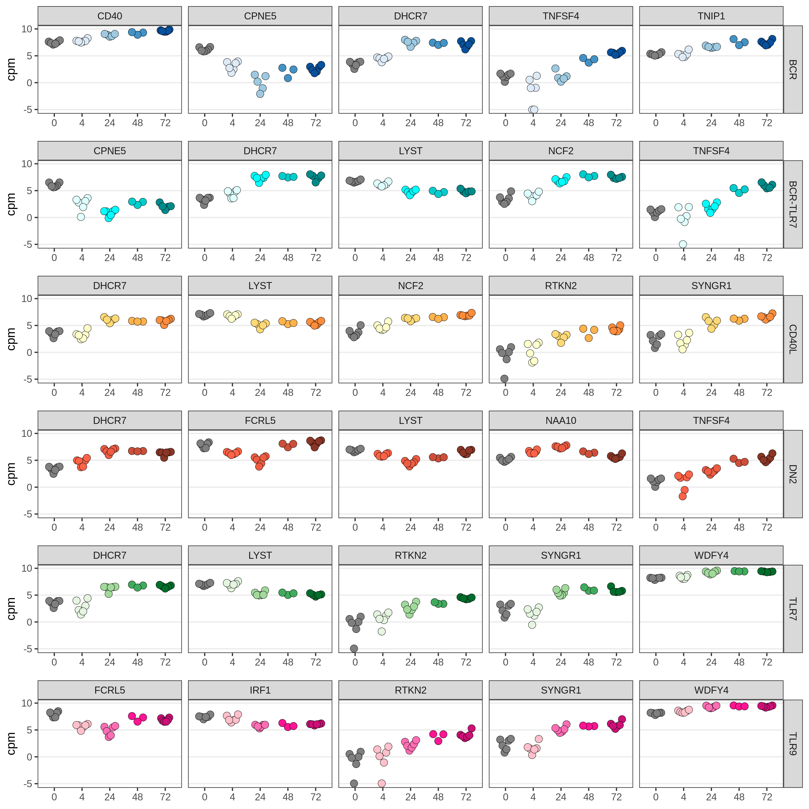
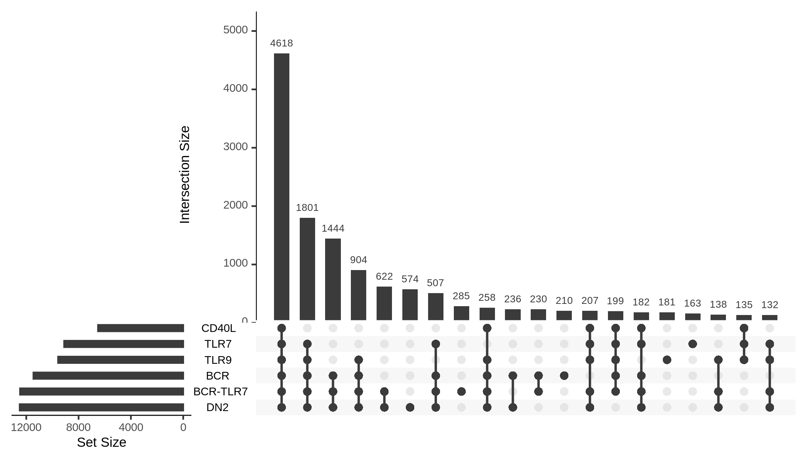

Low-input RNA-seq
================

## QC

### Total of unique and duplicate reads in each fastq file

<!-- -->

### Total number of reads per individual and condition

<!-- -->

### Plates colored by total number of reads

<!-- -->

## PCA

<!-- --> \## Time
course analysis

<!-- -->

## GWAS genes

<!-- -->

## Sharing of significant genes among conditions

<!-- -->
