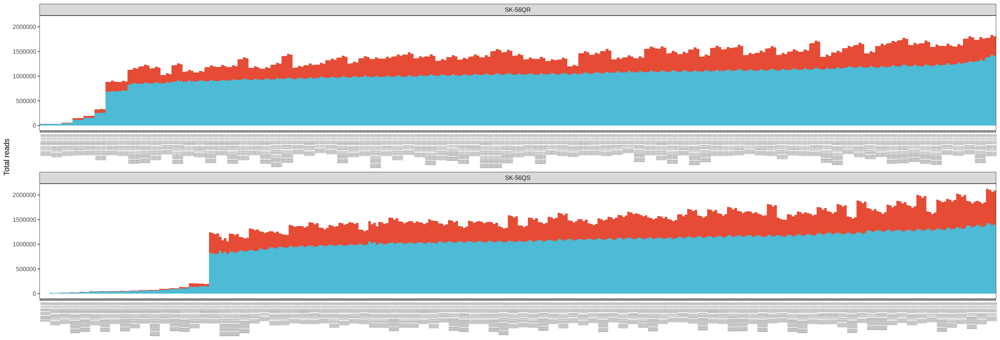
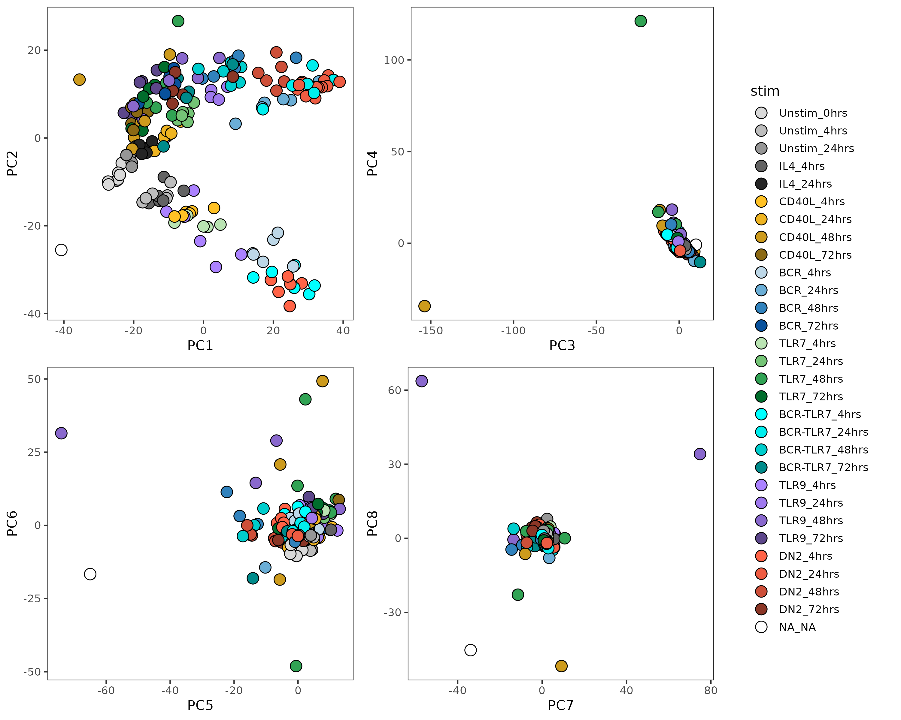

Low-input RNA-seq
================

QC
--

### Total of unique and duplicate reads in each fastq file

### Total number of reads per individual and condition

### Plates colored by total number of reads

PCA
---

