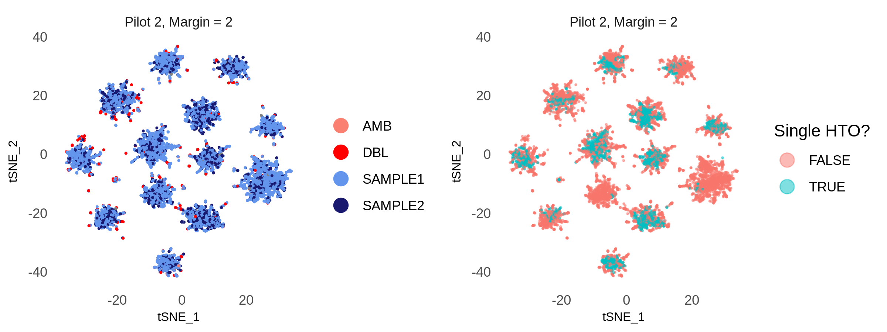
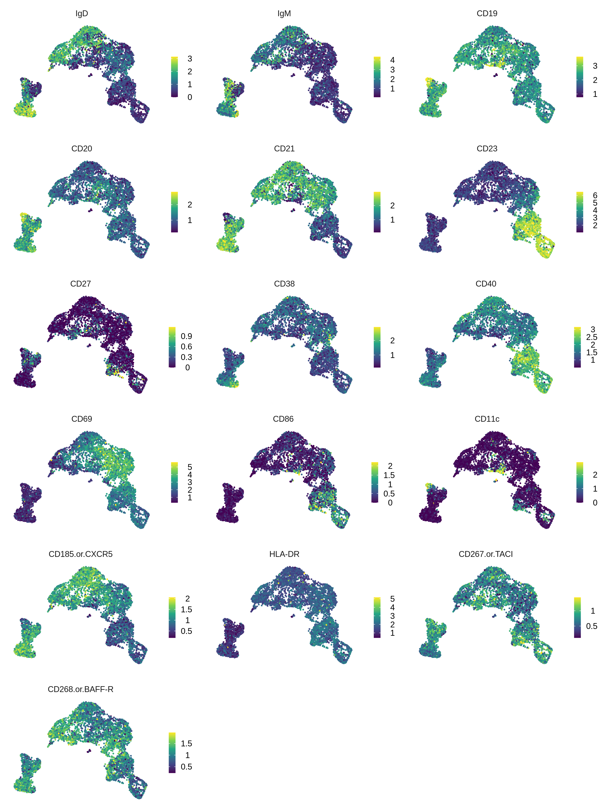
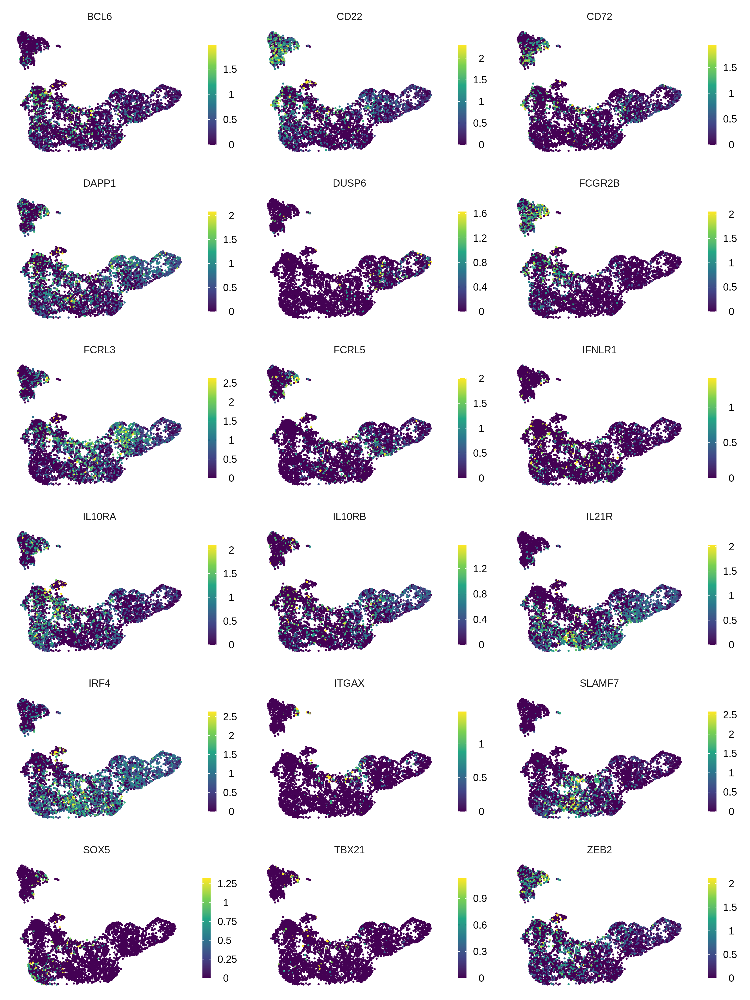
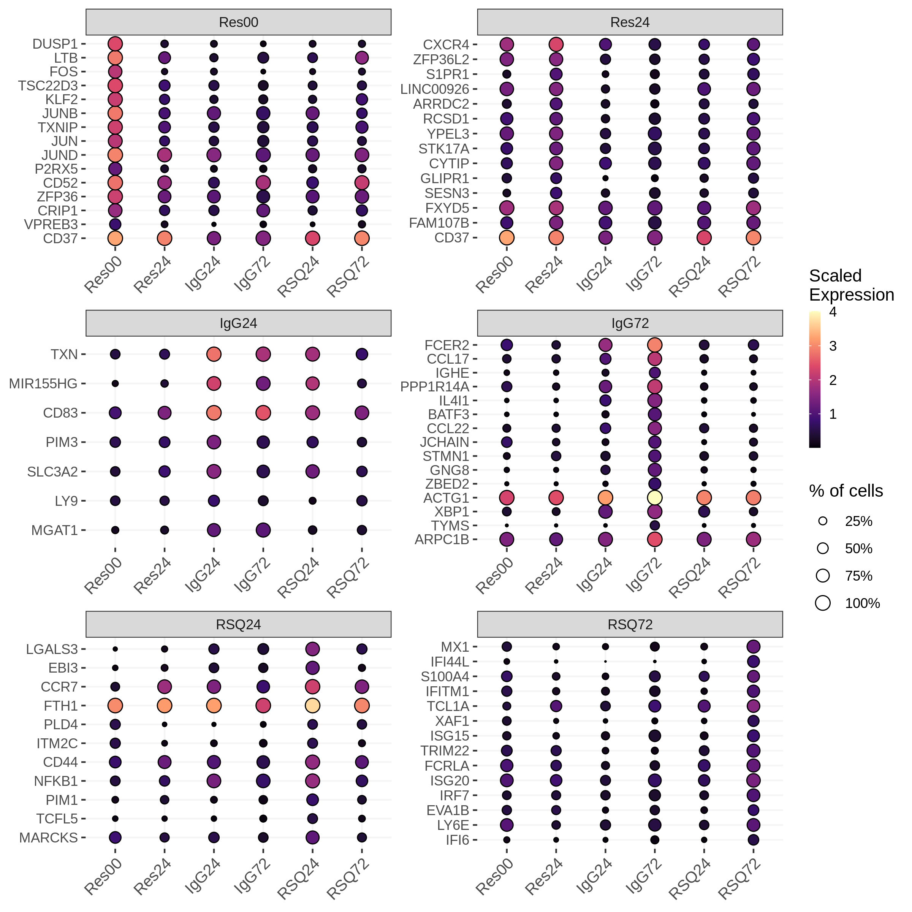
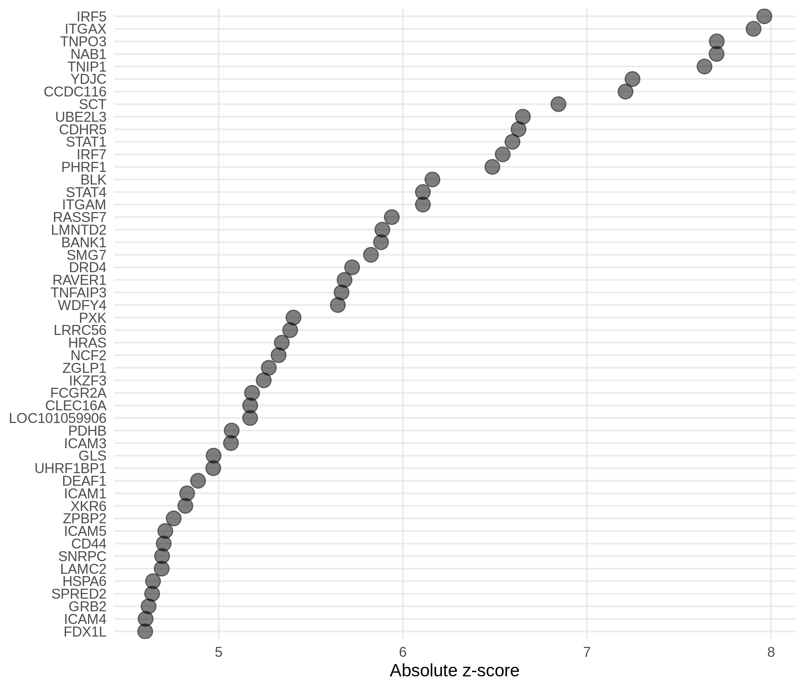
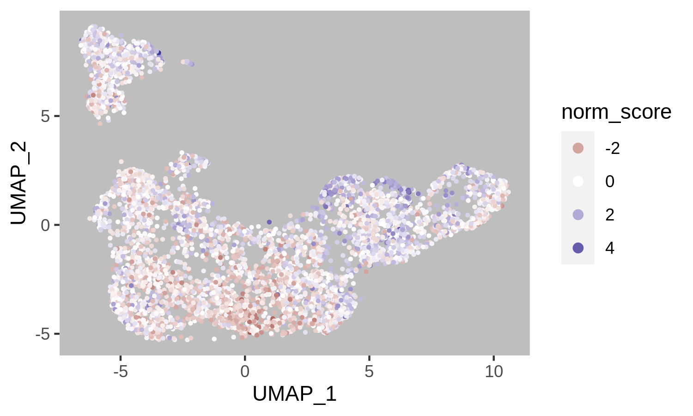

CITE-seq Pilot
================

## Packages

``` r
# Data wrangling
library(tidyverse)
library(rvest)

# single-cell data analysis
library(Seurat)

# Plotting
library(tidytext)
library(ggridges)
library(RColorBrewer)
library(cowplot)
```

## Cell Ranger data

``` r
cellranger_dir <- 
    file.path("/lab-share/IM-Gutierrez-e2/Public/scRNA/SN0231064/KW9100_Maria",
              "210726_10X_KW9100-2_bcl/cellranger-6.0.1/GRCh38/BRI-1283/outs",
              "filtered_feature_bc_matrix")

features_df <- file.path(cellranger_dir, "features.tsv.gz") %>%
    read_tsv(col_names = c("gene_id", "gene_name", "phenotype"))

mt_genes <- features_df %>%
    filter(phenotype == "Gene Expression", 
           grepl("^MT-", gene_name)) %>%
    pull(gene_id)

ribo_genes <- features_df %>%
    filter(phenotype == "Gene Expression", 
           grepl("^RPS\\d+|^RPL\\d+", gene_name))

data10x <- Read10X(cellranger_dir, gene.column = 1)
```

## Create the Seurat object

``` r
gene_exp <- data10x[["Gene Expression"]]

antibody <- data10x[["Antibody Capture"]] %>%
    .[!grepl("^Hashtag", rownames(.)), ] 

rownames(antibody) <- rownames(antibody) %>%
    sub("_prot$", "", .) %>%
    gsub("_", ".", .)

hashtags <- data10x[["Antibody Capture"]] %>%
    .[grepl("^Hashtag", rownames(.)), ]

rownames(hashtags) <- 
    c("IgG72", "RSQ72", "IgG24", "RSQ24", "Res24", "Res00")

# Create object
bcells <- CreateSeuratObject(counts = gene_exp, project = "bcells")
bcells[["ADT"]] <- CreateAssayObject(counts = antibody)
bcells[["HTO"]] <- CreateAssayObject(counts = hashtags)

# Normalize
bcells <- NormalizeData(bcells, normalization.method = "LogNormalize")
bcells <- FindVariableFeatures(bcells, selection.method = "vst")
bcells <- ScaleData(bcells, features = VariableFeatures(bcells))

bcells <- NormalizeData(bcells, assay = "HTO", 
                        normalization.method = "CLR")

bcells <- NormalizeData(bcells, assay = "ADT", 
                        normalization.method = "CLR",
                        margin = 2)
```

## Exploring the object

``` r
bcells
```

    # An object of class Seurat 
    # 36744 features across 13946 samples within 3 assays 
    # Active assay: RNA (36601 features, 2000 variable features)
    #  2 other assays present: ADT, HTO

``` r
#check out the output of str()
str(bcells)
```

## QC

``` r
stims <- c("Res00", "Res24", "IgG24", "IgG72", "RSQ24", "RSQ72")

bcells[["percent_mt"]] <- 
    PercentageFeatureSet(bcells, features = mt_genes)
```

<!-- -->

## Filter out cells with high % of mitochondrial RNA

``` r
bcells <- subset(bcells, subset = nFeature_RNA > 500 & percent_mt < 10)
```

## Demultiplex cells based on HTO

``` r
bcells <- HTODemux(bcells, assay = "HTO", positive.quantile = 0.99)

table(bcells$HTO_classification.global)
```

    # 
    #  Doublet Negative  Singlet 
    #     3005     1721     5786

``` r
Idents(bcells) <- "HTO_maxID"
```

<!-- -->

## Extract Singlets

``` r
Idents(bcells) <- "HTO_classification.global"

bcells_singlet <- subset(bcells, idents = "Singlet")

table(bcells_singlet@meta.data$HTO_maxID)[stims]
```

    # 
    # Res00 Res24 IgG24 IgG72 RSQ24 RSQ72 
    #   489   842  1601  1566  1094   194

## Feature quantifications

<!-- -->

## PCA

``` r
bcells_singlet <- 
    FindVariableFeatures(bcells_singlet, 
                         nfeatures = 1000,
                         selection.method = "vst")

all_genes <- rownames(bcells_singlet)

bcells_singlet <- 
    ScaleData(bcells_singlet, features = all_genes)

bcells_singlet <-
    RunPCA(bcells_singlet, features = VariableFeatures(bcells_singlet))
```

### Gene loadings

<!-- -->

### Standard deviation for each PC

<!-- -->

## UMAP

``` r
# Find neighboring cells
bcells_singlet <- FindNeighbors(bcells_singlet, dims = 1:20)

# Cluster
bcells_singlet <- FindClusters(bcells_singlet, resolution = 0.25)
```

    # Modularity Optimizer version 1.3.0 by Ludo Waltman and Nees Jan van Eck
    # 
    # Number of nodes: 5786
    # Number of edges: 211870
    # 
    # Running Louvain algorithm...
    # Maximum modularity in 10 random starts: 0.9056
    # Number of communities: 6
    # Elapsed time: 0 seconds

``` r
# UMAP
bcells_singlet <- RunUMAP(bcells_singlet, dims = 1:20)
```

<!-- -->

<!-- -->

## Downsampling

``` r
set.seed(1)
sampled_cells <- 
  tibble(cell_barcode = colnames(bcells_singlet@assays$RNA@counts),
         cell_stim = bcells_singlet@meta.data$HTO_maxID) %>%
  select(cell_stim, cell_barcode) %>%
  group_by(cell_stim) %>%
  sample_n(194) %>%
  ungroup() %>%
  pull(cell_barcode)

bcells_singlet_downsamp <- subset(bcells_singlet, cells = sampled_cells)

table(bcells_singlet_downsamp@meta.data$HTO_maxID)[stims]
```

    # 
    # Res00 Res24 IgG24 IgG72 RSQ24 RSQ72 
    #   194   194   194   194   194   194

``` r
bcells_singlet_downsamp <- 
    FindVariableFeatures(bcells_singlet_downsamp, 
                         nfeatures = 1000,
                         selection.method = "vst")

bcells_singlet_downsamp <- 
    ScaleData(bcells_singlet_downsamp, features = VariableFeatures(bcells_singlet_downsamp))

bcells_singlet_downsamp <-
    RunPCA(bcells_singlet_downsamp, features = VariableFeatures(bcells_singlet_downsamp))
```

<!-- -->

``` r
# Find neighboring cells
bcells_singlet_downsamp <- FindNeighbors(bcells_singlet_downsamp, dims = 1:20)

# Cluster
bcells_singlet_downsamp <- FindClusters(bcells_singlet_downsamp, resolution = 0.25)
```

    # Modularity Optimizer version 1.3.0 by Ludo Waltman and Nees Jan van Eck
    # 
    # Number of nodes: 1164
    # Number of edges: 44041
    # 
    # Running Louvain algorithm...
    # Maximum modularity in 10 random starts: 0.8913
    # Number of communities: 5
    # Elapsed time: 0 seconds

``` r
# UMAP
bbcells_singlet_downsamp <- RunUMAP(bcells_singlet_downsamp, dims = 1:20)
```

<!-- -->

## B cell genes (RNA)

<!-- -->

## B cell genes (Protein)

<!-- -->

### Proteins and mRNAs in the same scale

<!-- -->

### IgD vs CD27

``` r
igd_cd27_rna <- bcell_genes_quant %>%
  filter(gene_name %in% c("IGHD", "CD27")) %>%
  mutate(gene_name = recode(gene_name, "IGHD" = "IgD")) %>%
  select(barcode, gene_name, scale_exp = gene_exp) %>%
  left_join(select(umap_df, barcode, stim))

igd_cd27_prot <- adt_quants %>%
  filter(ab %in% c("IgD", "CD27")) %>%
  select(barcode, gene_name = ab, scale_exp = ab_level) %>%
  left_join(select(umap_df, barcode, stim))

bind_rows(mRNA = igd_cd27_rna, Protein = igd_cd27_prot, .id = "molecule") %>%
  pivot_wider(names_from = gene_name, values_from = scale_exp) %>%
  ggplot(aes(IgD, CD27)) +
  geom_point(size = .75, alpha = .5) +
  scale_color_manual(values = stim_colors) +
  facet_grid(molecule~stim) +
  theme_bw() +
  theme(panel.grid = element_blank())
```

<!-- -->

## DN2 genes (Jenks et al. (2018); Fig 4-C)

<!-- -->

## Lupus genes

<!-- -->

## TLR genes

<!-- -->

## MAGMA

Scores taken from the scDRS figshare.

<!-- -->

## scDRS

<!-- -->

## Find marker genes for each cluster

Here, I changed the clusters to make RSQ72 a separate cluster from
cluster 1, and I’m calling “IgG72-prolif” as a separate cluster from
IgG72 to denote the subcluster with high MIK62 gene expression.

``` r
cluster_renamed <- 
  tibble(cluster = Idents(bcells_singlet),
         hto = bcells_singlet@meta.data$HTO_maxID) %>%
  mutate(cluster = as.character(cluster),
         cluster = case_when(cluster == 1 & hto == "RSQ72" ~ "6",
                             TRUE ~ cluster),
         cluster = factor(cluster))

bcells_singlet_renamed <- bcells_singlet
Idents(bcells_singlet_renamed) <- cluster_renamed$cluster

new_cluster_ids <- c("IgG24", "Res24", "IgG72", "RSQ24", "Res00", "IgG72-prolif", "RSQ72")
names(new_cluster_ids) <- levels(bcells_singlet_renamed)

bcells_singlet_renamed <- RenameIdents(bcells_singlet_renamed, new_cluster_ids)

bcells_markers <- 
    FindAllMarkers(bcells_singlet_renamed, 
                   only.pos = TRUE,
                   min.pct = 1/3,
                   logfc.threshold = .5) %>%
    as_tibble()
```

## Top 10 marker genes per cluster

<!-- -->

## Marker genes IgG vs RSQ

``` r
bcells_markers_24 <- 
    FindMarkers(bcells_singlet_renamed, 
                   ident.1 = "IgG24",
                   ident.2 = "RSQ24",
                   only.pos = FALSE,
                   min.pct = 1/3,
                   logfc.threshold = 1) %>%
    rownames_to_column("gene") %>%
    as_tibble() %>%
    select(gene, avg_log2FC, IgG = pct.1, RSQ = pct.2)

bcells_markers_72 <- 
    FindMarkers(bcells_singlet_renamed, 
                   ident.1 = c("IgG72", "IgG72-prolif"),
                   ident.2 = "RSQ72",
                   only.pos = FALSE,
                   min.pct = 1/3,
                   logfc.threshold = 1) %>%
    rownames_to_column("gene") %>%
    as_tibble() %>%
    select(gene, avg_log2FC, IgG = pct.1, RSQ = pct.2)
```

<!-- -->

<!-- -->
