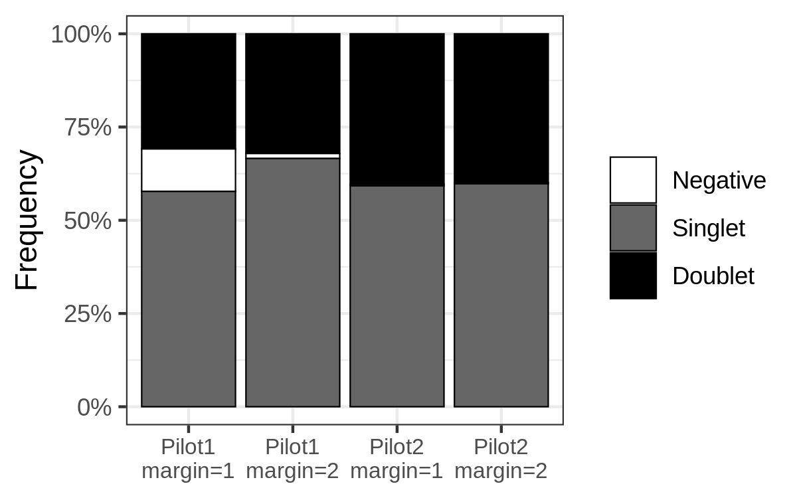

CITE-seq Pilot
================

## Packages

``` r
library(tidyverse)
library(Seurat)

# Plotting
library(ggridges)
library(RColorBrewer)
library(cowplot)
```

## Cell Ranger data

``` r
cellranger_dir <- 
    file.path("/lab-share/IM-Gutierrez-e2/Public/scRNA/SN0231064/KW9100_Maria",
              "210726_10X_KW9100-2_bcl/cellranger-6.0.1/GRCh38/BRI-1283/outs",
              "filtered_feature_bc_matrix")

features_df <- file.path(cellranger_dir, "features.tsv.gz") %>%
    read_tsv(col_names = c("gene_id", "gene_name", "phenotype"))

mt_genes <- features_df %>%
    filter(phenotype == "Gene Expression", 
           grepl("^MT-", gene_name)) %>%
    pull(gene_id)

ribo_genes <- features_df %>%
    filter(phenotype == "Gene Expression", 
           grepl("^RPS\\d+|^RPL\\d+", gene_name))

data10x <- Read10X(cellranger_dir, gene.column = 1)
```

## Create the Seurat object

``` r
gene_exp <- data10x[["Gene Expression"]]

antibody <- data10x[["Antibody Capture"]] %>%
    .[!grepl("^Hashtag", rownames(.)), ] 

rownames(antibody) <- rownames(antibody) %>%
    sub("_prot$", "", .) %>%
    gsub("_", ".", .)

hashtags <- data10x[["Antibody Capture"]] %>%
    .[grepl("^Hashtag", rownames(.)), ]

rownames(hashtags) <- 
    c("IgG72", "RSQ72", "IgG24", "RSQ24", "Res24", "Res00")

bcells <- CreateSeuratObject(counts = gene_exp, project = "bcells")
bcells <- NormalizeData(bcells, normalization.method = "LogNormalize")
bcells <- FindVariableFeatures(bcells, selection.method = "mean.var.plot")
bcells <- ScaleData(bcells, features = VariableFeatures(bcells))

bcells[["ADT"]] <- CreateAssayObject(counts = antibody)
bcells[["HTO"]] <- CreateAssayObject(counts = hashtags)

Assays(bcells)
```

    # [1] "RNA" "ADT" "HTO"

``` r
bcells <- NormalizeData(bcells, assay = "HTO", 
                        normalization.method = "CLR")

bcells <- NormalizeData(bcells, assay = "ADT", 
                        normalization.method = "CLR",
                        margin = 2)
```

## Demultiplex cells based on HTO

``` r
bcells <- HTODemux(bcells, assay = "HTO", positive.quantile = 0.99)

table(bcells$HTO_classification.global)
```

    # 
    #  Doublet Negative  Singlet 
    #     3691     3125     7130

``` r
Idents(bcells) <- "HTO_maxID"

stims <- c("Res00", "Res24", "IgG24", "IgG72", "RSQ24", "RSQ72")

hto_data <- bcells@assays$HTO@data
hto_class_df <- tibble(barcode = colnames(hto_data),
                       maxid = bcells@meta.data$HTO_maxID)

hto_df <- hto_data %>%
    as.data.frame() %>%
    rownames_to_column("hto") %>%
    pivot_longer(-hto, names_to = "barcode") %>%
    left_join(hto_class_df, by = "barcode") %>%
    select(maxid, hto, value) %>%
    mutate(maxid = factor(maxid, levels = stims),
           hto = factor(hto, levels = stims))

ggplot(hto_df, aes(value, maxid, fill = maxid)) +
    geom_density_ridges(show.legend = FALSE) +
    facet_wrap(~hto) +
    scale_fill_brewer(palette = "Paired") +
    theme_bw() +
    theme(panel.grid = element_blank()) +
    labs(x = "Expression level", y = NULL)
```

<!-- -->

## Extract Singlets

``` r
Idents(bcells) <- "HTO_classification.global"

bcells_singlet <- subset(bcells, idents = "Singlet")

tibble(cell_class = bcells_singlet@meta.data$HTO_classification) %>%
    count(cell_class) %>%
    mutate(cell_class = factor(cell_class, levels = stims)) %>%
    ggplot(aes(cell_class, n)) +
    geom_col(aes(fill = cell_class), show.legend = FALSE) +
    scale_fill_brewer(palette = "Paired") +
    theme_minimal() +
    theme(panel.grid.major.x = element_blank(),
          panel.grid.minor.y = element_blank()) +
    labs(x = NULL, y = "Number of cells")
```

<!-- -->

## Feature quantifications

``` r
bcells_singlet[["percent_mt"]] <- 
    PercentageFeatureSet(bcells_singlet, features = mt_genes)

bcells_meta <- bcells_singlet@meta.data %>%
    rownames_to_column("barcode") %>%
    mutate(cell_class = bcells_singlet@meta.data$HTO_maxID,
           cell_class = factor(cell_class, levels = stims)) %>%
    select(barcode, cell_class, 
           n_reads = nCount_RNA, n_genes = nFeature_RNA, percent_mt) %>%
    pivot_longer(-(barcode:cell_class), names_to = "feature")

ggplot(bcells_meta, aes(cell_class, value, fill = cell_class)) +
    geom_violin(size = .25) +
    scale_y_continuous(breaks = scales::pretty_breaks(7)) +
    scale_fill_brewer(palette = "Paired") +
    facet_wrap(~feature, nrow = 1, scales = "free") +
    theme_bw() +
    theme(axis.text.x = element_blank(),
          axis.title = element_blank(),
          axis.ticks.x = element_blank(),
          panel.grid.major.x = element_blank(),
          panel.grid.minor = element_blank(),
          legend.position = "bottom") +
    labs(fill = NULL)
```

<!-- -->

## Filter for Mitochondrial percentage

``` r
bcells_meta %>%
    filter(feature %in% c("n_genes", "percent_mt")) %>%
    pivot_wider(names_from = feature, values_from = value) %>%
    ggplot(aes(percent_mt, n_genes)) +
    geom_jitter(size = .25, alpha = .25) +
    geom_density2d_filled(alpha = .5) +
    geom_density_2d(size = .25, color = "black") +
    geom_vline(xintercept = 20, linetype = 2) +
    geom_hline(yintercept = 500, linetype = 2) +
    scale_x_continuous(breaks = c(0, 5, 10, 20, 40, 60, 80)) +
    scale_y_continuous(breaks = seq(0, 1e4, by = 1e3)) +
    theme_minimal() +
    theme(panel.grid.minor = element_blank(),
          legend.position = "none") +
    labs(x = "% Mitochondrial reads", y = "# of genes")
```

<!-- -->

``` r
bcells_singlet <- bcells_singlet %>%
    subset(subset = nFeature_RNA > 500 & percent_mt < 20)
```

# PCA

``` r
bcells_singlet <- 
    FindVariableFeatures(bcells_singlet, selection.method = "mean.var.plot")

bcells_singlet <- 
    ScaleData(bcells_singlet, features = VariableFeatures(bcells_singlet))

bcells_singlet <-
    RunPCA(bcells_singlet, features = VariableFeatures(bcells_singlet))

tibble(sdev = bcells_singlet@reductions$pca@stdev) %>%
    rownames_to_column("pc") %>%
    mutate(pc = fct_inorder(pc),
           var = sdev^2,
           prop_var = var/sum(var)) %>%
    filter(pc %in% 1:25) %>%
    ggplot(aes(pc, prop_var)) +
    geom_line(aes(group = 1)) +
    scale_y_continuous(labels = function(x) scales::percent(x, accuracy = 1L),
                       breaks = seq(0, .15, .01)) +
    theme_bw() +
    theme(panel.grid.minor = element_blank()) +
    labs(x = "Principal component", y = "Proportion of variance")
```

<!-- -->

## UMAP

``` r
bcells_singlet <- FindNeighbors(bcells_singlet, dims = 1:15)
bcells_singlet <- FindClusters(bcells_singlet, resolution = 0.25)
```

    # Modularity Optimizer version 1.3.0 by Ludo Waltman and Nees Jan van Eck
    # 
    # Number of nodes: 6176
    # Number of edges: 218977
    # 
    # Running Louvain algorithm...
    # Maximum modularity in 10 random starts: 0.9158
    # Number of communities: 7
    # Elapsed time: 0 seconds

``` r
bcells_singlet <- RunUMAP(bcells_singlet, dims = 1:15)

umap_df <- as.data.frame(bcells_singlet@reductions$umap@cell.embeddings) %>%
    as_tibble() %>%
    mutate(cluster = bcells_singlet@meta.data$seurat_clusters,
           stim = bcells_singlet@meta.data$HTO_maxID,
           stim = factor(stim, levels = stims),
           percent_mt = bcells_singlet@meta.data$percent_mt)

cell_class_p <- ggplot(umap_df, aes(UMAP_1, UMAP_2, color = stim)) +
    geom_point(size = 1) +
    scale_color_brewer(palette = "Paired") +
    theme_minimal() +
    theme(panel.grid = element_blank()) +
    guides(color = guide_legend(override.aes = list(size = 2))) +
    labs(title = "Hashtag classification")

seurat_cluster_p <- ggplot(umap_df, aes(UMAP_1, UMAP_2, color = cluster)) +
    geom_point(size = 1) +
    scale_color_brewer(palette = "Set1") +
    theme_minimal() +
    theme(panel.grid = element_blank()) +
    guides(color = guide_legend(override.aes = list(size = 2))) +
    labs(title = "Seurat cluster res = 0.25")

percent_mt_p <- ggplot(umap_df, aes(UMAP_1, UMAP_2, color = percent_mt)) +
    geom_point(size = 1) +
    scale_color_viridis_c() +
    theme_minimal() +
    theme(panel.grid = element_blank()) +
    guides(color = guide_legend(override.aes = list(size = 2))) +
    labs(title = "% Mitochondrial")

plot_grid(cell_class_p, seurat_cluster_p, percent_mt_p, nrow = 3)
```

<!-- -->

``` r
bcells_markers <- 
    FindAllMarkers(bcells_singlet, 
                   only.pos = TRUE,
                   min.pct = 1/3,
                   logfc.threshold = .5)
```
