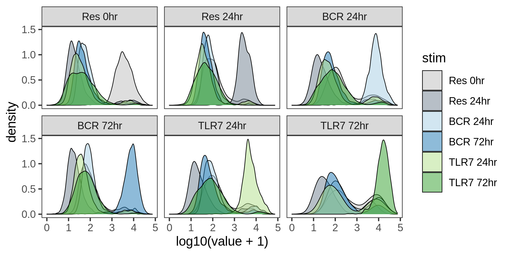
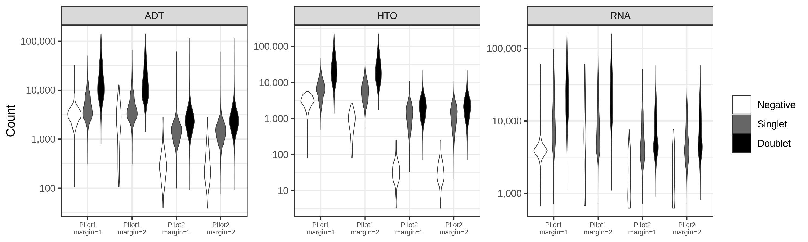

CITE-seq Pilot
================

## Packages

``` r
library(tidyverse)
library(Seurat)

# Plotting
library(ggridges)
library(RColorBrewer)
library(cowplot)
```

## Cell Ranger data

``` r
cellranger_dir <- 
    file.path("/lab-share/IM-Gutierrez-e2/Public/scRNA/SN0231064/KW9100_Maria",
              "210726_10X_KW9100-2_bcl/cellranger-6.0.1/GRCh38/BRI-1283/outs",
              "filtered_feature_bc_matrix")

features_df <- file.path(cellranger_dir, "features.tsv.gz") %>%
    read_tsv(col_names = c("gene_id", "gene_name", "phenotype"))

mt_genes <- features_df %>%
    filter(phenotype == "Gene Expression", 
           grepl("^MT-", gene_name)) %>%
    pull(gene_id)

ribo_genes <- features_df %>%
    filter(phenotype == "Gene Expression", 
           grepl("^RPS\\d+|^RPL\\d+", gene_name))

data10x <- Read10X(cellranger_dir, gene.column = 1)
```

## Create the Seurat object

``` r
gene_exp <- data10x[["Gene Expression"]]

antibody <- data10x[["Antibody Capture"]] %>%
    .[!grepl("^Hashtag", rownames(.)), ] 

rownames(antibody) <- rownames(antibody) %>%
    sub("_prot$", "", .) %>%
    gsub("_", ".", .)

hashtags <- data10x[["Antibody Capture"]] %>%
    .[grepl("^Hashtag", rownames(.)), ]

rownames(hashtags) <- 
    c("IgG72", "RSQ72", "IgG24", "RSQ24", "Res24", "Res00")

# Create object
bcells <- CreateSeuratObject(counts = gene_exp, project = "bcells")
bcells[["ADT"]] <- CreateAssayObject(counts = antibody)
bcells[["HTO"]] <- CreateAssayObject(counts = hashtags)

# Normalize
bcells <- NormalizeData(bcells, normalization.method = "LogNormalize")
bcells <- FindVariableFeatures(bcells, selection.method = "mean.var.plot")
bcells <- ScaleData(bcells, features = VariableFeatures(bcells))

bcells <- NormalizeData(bcells, assay = "HTO", 
                        normalization.method = "CLR")

bcells <- NormalizeData(bcells, assay = "ADT", 
                        normalization.method = "CLR",
                        margin = 2)
```

## Exploring the object

``` r
bcells
```

    # An object of class Seurat 
    # 36744 features across 13946 samples within 3 assays 
    # Active assay: RNA (36601 features, 1712 variable features)
    #  2 other assays present: ADT, HTO

``` r
str(bcells)
```

    # Formal class 'Seurat' [package "SeuratObject"] with 13 slots
    #   ..@ assays      :List of 3
    #   .. ..$ RNA:Formal class 'Assay' [package "SeuratObject"] with 8 slots
    #   .. .. .. ..@ counts       :Formal class 'dgCMatrix' [package "Matrix"] with 6 slots
    #   .. .. .. .. .. ..@ i       : int [1:38267402] 48 59 70 80 83 104 145 170 184 188 ...
    #   .. .. .. .. .. ..@ p       : int [1:13947] 0 2552 11135 11824 15249 15835 22542 25634 28834 30486 ...
    #   .. .. .. .. .. ..@ Dim     : int [1:2] 36601 13946
    #   .. .. .. .. .. ..@ Dimnames:List of 2
    #   .. .. .. .. .. .. ..$ : chr [1:36601] "ENSG00000243485" "ENSG00000237613" "ENSG00000186092" "ENSG00000238009" ...
    #   .. .. .. .. .. .. ..$ : chr [1:13946] "AAACCTGAGAAGCCCA-1" "AAACCTGAGAGACTTA-1" "AAACCTGAGAGTACAT-1" "AAACCTGAGCTAGTCT-1" ...
    #   .. .. .. .. .. ..@ x       : num [1:38267402] 1 2 1 1 1 1 1 12 1 1 ...
    #   .. .. .. .. .. ..@ factors : list()
    #   .. .. .. ..@ data         :Formal class 'dgCMatrix' [package "Matrix"] with 6 slots
    #   .. .. .. .. .. ..@ i       : int [1:38267402] 48 59 70 80 83 104 145 170 184 188 ...
    #   .. .. .. .. .. ..@ p       : int [1:13947] 0 2552 11135 11824 15249 15835 22542 25634 28834 30486 ...
    #   .. .. .. .. .. ..@ Dim     : int [1:2] 36601 13946
    #   .. .. .. .. .. ..@ Dimnames:List of 2
    #   .. .. .. .. .. .. ..$ : chr [1:36601] "ENSG00000243485" "ENSG00000237613" "ENSG00000186092" "ENSG00000238009" ...
    #   .. .. .. .. .. .. ..$ : chr [1:13946] "AAACCTGAGAAGCCCA-1" "AAACCTGAGAGACTTA-1" "AAACCTGAGAGTACAT-1" "AAACCTGAGCTAGTCT-1" ...
    #   .. .. .. .. .. ..@ x       : num [1:38267402] 0.731 1.149 0.731 0.731 0.731 ...
    #   .. .. .. .. .. ..@ factors : list()
    #   .. .. .. ..@ scale.data   : num [1:1712, 1:13946] -0.225 -0.253 -0.234 -0.566 1.716 ...
    #   .. .. .. .. ..- attr(*, "dimnames")=List of 2
    #   .. .. .. .. .. ..$ : chr [1:1712] "ENSG00000131591" "ENSG00000131584" "ENSG00000107404" "ENSG00000221978" ...
    #   .. .. .. .. .. ..$ : chr [1:13946] "AAACCTGAGAAGCCCA-1" "AAACCTGAGAGACTTA-1" "AAACCTGAGAGTACAT-1" "AAACCTGAGCTAGTCT-1" ...
    #   .. .. .. ..@ key          : chr "rna_"
    #   .. .. .. ..@ assay.orig   : NULL
    #   .. .. .. ..@ var.features : chr [1:1712] "ENSG00000275302" "ENSG00000173110" "ENSG00000211649" "ENSG00000198899" ...
    #   .. .. .. ..@ meta.features:'data.frame':    36601 obs. of  4 variables:
    #   .. .. .. .. ..$ mvp.mean             : num [1:36601] 0.000105 0 0 0.003213 0.000735 ...
    #   .. .. .. .. ..$ mvp.dispersion       : num [1:36601] -0.85 0 0 1.47 1.79 ...
    #   .. .. .. .. ..$ mvp.dispersion.scaled: num [1:36601] -1.468 -0.592 -0.592 0.927 1.25 ...
    #   .. .. .. .. ..$ mvp.variable         : logi [1:36601] FALSE FALSE FALSE FALSE FALSE FALSE ...
    #   .. .. .. ..@ misc         : list()
    #   .. ..$ ADT:Formal class 'Assay' [package "SeuratObject"] with 8 slots
    #   .. .. .. ..@ counts       :Formal class 'dgCMatrix' [package "Matrix"] with 6 slots
    #   .. .. .. .. .. ..@ i       : int [1:1694336] 0 1 2 3 4 5 6 7 8 9 ...
    #   .. .. .. .. .. ..@ p       : int [1:13947] 0 135 272 381 505 574 709 836 951 1078 ...
    #   .. .. .. .. .. ..@ Dim     : int [1:2] 137 13946
    #   .. .. .. .. .. ..@ Dimnames:List of 2
    #   .. .. .. .. .. .. ..$ : chr [1:137] "CD86" "CD274.or.B7-H1.PD-L1" "CD270.or.HVEM.TR2" "CD155.or.PVR" ...
    #   .. .. .. .. .. .. ..$ : chr [1:13946] "AAACCTGAGAAGCCCA-1" "AAACCTGAGAGACTTA-1" "AAACCTGAGAGTACAT-1" "AAACCTGAGCTAGTCT-1" ...
    #   .. .. .. .. .. ..@ x       : num [1:1694336] 3 12 39 8 14 134 265 90 36 79 ...
    #   .. .. .. .. .. ..@ factors : list()
    #   .. .. .. ..@ data         : num [1:137, 1:13946] 0.138 0.464 1.071 0.332 0.524 ...
    #   .. .. .. .. ..- attr(*, "dimnames")=List of 2
    #   .. .. .. .. .. ..$ : chr [1:137] "CD86" "CD274.or.B7-H1.PD-L1" "CD270.or.HVEM.TR2" "CD155.or.PVR" ...
    #   .. .. .. .. .. ..$ : chr [1:13946] "AAACCTGAGAAGCCCA-1" "AAACCTGAGAGACTTA-1" "AAACCTGAGAGTACAT-1" "AAACCTGAGCTAGTCT-1" ...
    #   .. .. .. ..@ scale.data   : num[0 , 0 ] 
    #   .. .. .. ..@ key          : chr "adt_"
    #   .. .. .. ..@ assay.orig   : NULL
    #   .. .. .. ..@ var.features : logi(0) 
    #   .. .. .. ..@ meta.features:'data.frame':    137 obs. of  0 variables
    #   .. .. .. ..@ misc         : list()
    #   .. ..$ HTO:Formal class 'Assay' [package "SeuratObject"] with 8 slots
    #   .. .. .. ..@ counts       :Formal class 'dgCMatrix' [package "Matrix"] with 6 slots
    #   .. .. .. .. .. ..@ i       : int [1:83669] 0 1 2 3 4 5 0 1 2 3 ...
    #   .. .. .. .. .. ..@ p       : int [1:13947] 0 6 12 18 24 30 36 42 48 54 ...
    #   .. .. .. .. .. ..@ Dim     : int [1:2] 6 13946
    #   .. .. .. .. .. ..@ Dimnames:List of 2
    #   .. .. .. .. .. .. ..$ : chr [1:6] "IgG72" "RSQ72" "IgG24" "RSQ24" ...
    #   .. .. .. .. .. .. ..$ : chr [1:13946] "AAACCTGAGAAGCCCA-1" "AAACCTGAGAGACTTA-1" "AAACCTGAGAGTACAT-1" "AAACCTGAGCTAGTCT-1" ...
    #   .. .. .. .. .. ..@ x       : num [1:83669] 5389 156 448 204 88 ...
    #   .. .. .. .. .. ..@ factors : list()
    #   .. .. .. ..@ data         : num [1:6, 1:13946] 3.498 1.123 0.986 1.079 1.13 ...
    #   .. .. .. .. ..- attr(*, "dimnames")=List of 2
    #   .. .. .. .. .. ..$ : chr [1:6] "IgG72" "RSQ72" "IgG24" "RSQ24" ...
    #   .. .. .. .. .. ..$ : chr [1:13946] "AAACCTGAGAAGCCCA-1" "AAACCTGAGAGACTTA-1" "AAACCTGAGAGTACAT-1" "AAACCTGAGCTAGTCT-1" ...
    #   .. .. .. ..@ scale.data   : num[0 , 0 ] 
    #   .. .. .. ..@ key          : chr "hto_"
    #   .. .. .. ..@ assay.orig   : NULL
    #   .. .. .. ..@ var.features : logi(0) 
    #   .. .. .. ..@ meta.features:'data.frame':    6 obs. of  0 variables
    #   .. .. .. ..@ misc         : list()
    #   ..@ meta.data   :'data.frame':  13946 obs. of  7 variables:
    #   .. ..$ orig.ident  : Factor w/ 1 level "bcells": 1 1 1 1 1 1 1 1 1 1 ...
    #   .. ..$ nCount_RNA  : num [1:13946] 9283 101789 1172 15002 881 ...
    #   .. ..$ nFeature_RNA: int [1:13946] 2552 8583 689 3425 586 6707 3092 3200 1652 7225 ...
    #   .. ..$ nCount_ADT  : num [1:13946] 10008 53811 1855 3363 242 ...
    #   .. ..$ nFeature_ADT: int [1:13946] 135 137 109 124 69 135 127 115 127 134 ...
    #   .. ..$ nCount_HTO  : num [1:13946] 13978 78385 1561 11415 244 ...
    #   .. ..$ nFeature_HTO: int [1:13946] 6 6 6 6 6 6 6 6 6 6 ...
    #   ..@ active.assay: chr "RNA"
    #   ..@ active.ident: Factor w/ 1 level "bcells": 1 1 1 1 1 1 1 1 1 1 ...
    #   .. ..- attr(*, "names")= chr [1:13946] "AAACCTGAGAAGCCCA-1" "AAACCTGAGAGACTTA-1" "AAACCTGAGAGTACAT-1" "AAACCTGAGCTAGTCT-1" ...
    #   ..@ graphs      : list()
    #   ..@ neighbors   : list()
    #   ..@ reductions  : list()
    #   ..@ images      : list()
    #   ..@ project.name: chr "bcells"
    #   ..@ misc        : list()
    #   ..@ version     :Classes 'package_version', 'numeric_version'  hidden list of 1
    #   .. ..$ : int [1:3] 4 0 2
    #   ..@ commands    :List of 5
    #   .. ..$ NormalizeData.RNA       :Formal class 'SeuratCommand' [package "SeuratObject"] with 5 slots
    #   .. .. .. ..@ name       : chr "NormalizeData.RNA"
    #   .. .. .. ..@ time.stamp : POSIXct[1:1], format: "2022-03-13 12:28:55"
    #   .. .. .. ..@ assay.used : chr "RNA"
    #   .. .. .. ..@ call.string: chr "NormalizeData(bcells, normalization.method = \"LogNormalize\")"
    #   .. .. .. ..@ params     :List of 5
    #   .. .. .. .. ..$ assay               : chr "RNA"
    #   .. .. .. .. ..$ normalization.method: chr "LogNormalize"
    #   .. .. .. .. ..$ scale.factor        : num 10000
    #   .. .. .. .. ..$ margin              : num 1
    #   .. .. .. .. ..$ verbose             : logi TRUE
    #   .. ..$ FindVariableFeatures.RNA:Formal class 'SeuratCommand' [package "SeuratObject"] with 5 slots
    #   .. .. .. ..@ name       : chr "FindVariableFeatures.RNA"
    #   .. .. .. ..@ time.stamp : POSIXct[1:1], format: "2022-03-13 12:29:05"
    #   .. .. .. ..@ assay.used : chr "RNA"
    #   .. .. .. ..@ call.string: chr "FindVariableFeatures(bcells, selection.method = \"mean.var.plot\")"
    #   .. .. .. ..@ params     :List of 12
    #   .. .. .. .. ..$ assay              : chr "RNA"
    #   .. .. .. .. ..$ selection.method   : chr "mean.var.plot"
    #   .. .. .. .. ..$ loess.span         : num 0.3
    #   .. .. .. .. ..$ clip.max           : chr "auto"
    #   .. .. .. .. ..$ mean.function      :function (mat, display_progress)  
    #   .. .. .. .. ..$ dispersion.function:function (mat, display_progress)  
    #   .. .. .. .. ..$ num.bin            : num 20
    #   .. .. .. .. ..$ binning.method     : chr "equal_width"
    #   .. .. .. .. ..$ nfeatures          : num 2000
    #   .. .. .. .. ..$ mean.cutoff        : num [1:2] 0.1 8
    #   .. .. .. .. ..$ dispersion.cutoff  : num [1:2] 1 Inf
    #   .. .. .. .. ..$ verbose            : logi TRUE
    #   .. ..$ ScaleData.RNA           :Formal class 'SeuratCommand' [package "SeuratObject"] with 5 slots
    #   .. .. .. ..@ name       : chr "ScaleData.RNA"
    #   .. .. .. ..@ time.stamp : POSIXct[1:1], format: "2022-03-13 12:29:07"
    #   .. .. .. ..@ assay.used : chr "RNA"
    #   .. .. .. ..@ call.string: chr "ScaleData(bcells, features = VariableFeatures(bcells))"
    #   .. .. .. ..@ params     :List of 10
    #   .. .. .. .. ..$ features          : chr [1:1712] "ENSG00000275302" "ENSG00000173110" "ENSG00000211649" "ENSG00000198899" ...
    #   .. .. .. .. ..$ assay             : chr "RNA"
    #   .. .. .. .. ..$ model.use         : chr "linear"
    #   .. .. .. .. ..$ use.umi           : logi FALSE
    #   .. .. .. .. ..$ do.scale          : logi TRUE
    #   .. .. .. .. ..$ do.center         : logi TRUE
    #   .. .. .. .. ..$ scale.max         : num 10
    #   .. .. .. .. ..$ block.size        : num 1000
    #   .. .. .. .. ..$ min.cells.to.block: num 3000
    #   .. .. .. .. ..$ verbose           : logi TRUE
    #   .. ..$ NormalizeData.HTO       :Formal class 'SeuratCommand' [package "SeuratObject"] with 5 slots
    #   .. .. .. ..@ name       : chr "NormalizeData.HTO"
    #   .. .. .. ..@ time.stamp : POSIXct[1:1], format: "2022-03-13 12:29:08"
    #   .. .. .. ..@ assay.used : chr "HTO"
    #   .. .. .. ..@ call.string: chr "NormalizeData(bcells, assay = \"HTO\", normalization.method = \"CLR\")"
    #   .. .. .. ..@ params     :List of 5
    #   .. .. .. .. ..$ assay               : chr "HTO"
    #   .. .. .. .. ..$ normalization.method: chr "CLR"
    #   .. .. .. .. ..$ scale.factor        : num 10000
    #   .. .. .. .. ..$ margin              : num 1
    #   .. .. .. .. ..$ verbose             : logi TRUE
    #   .. ..$ NormalizeData.ADT       :Formal class 'SeuratCommand' [package "SeuratObject"] with 5 slots
    #   .. .. .. ..@ name       : chr "NormalizeData.ADT"
    #   .. .. .. ..@ time.stamp : POSIXct[1:1], format: "2022-03-13 12:29:09"
    #   .. .. .. ..@ assay.used : chr "ADT"
    #   .. .. .. ..@ call.string: chr [1:2] "NormalizeData(bcells, assay = \"ADT\", normalization.method = \"CLR\", " "    margin = 2)"
    #   .. .. .. ..@ params     :List of 5
    #   .. .. .. .. ..$ assay               : chr "ADT"
    #   .. .. .. .. ..$ normalization.method: chr "CLR"
    #   .. .. .. .. ..$ scale.factor        : num 10000
    #   .. .. .. .. ..$ margin              : num 2
    #   .. .. .. .. ..$ verbose             : logi TRUE
    #   ..@ tools       : list()

``` r
bcells@assays$RNA@counts %>%
    .[100:105, 1:10]
```

    # 6 x 10 sparse Matrix of class "dgCMatrix"
    #                                     
    # ENSG00000157933 .  . . . . . 1 . . .
    # ENSG00000287356 .  . . . . . . . . .
    # ENSG00000116151 .  . . . . . . . . 1
    # ENSG00000272161 .  . . . . . . . . .
    # ENSG00000272420 .  . . . . . . . . .
    # ENSG00000157916 1 13 . 2 . 8 . . . 4

``` r
bcells@assays$ADT %>% 
    .[1:6, 1:3]
```

    #                      AAACCTGAGAAGCCCA-1 AAACCTGAGAGACTTA-1 AAACCTGAGAGTACAT-1
    # CD86                          0.1376218          0.3990019          0.0000000
    # CD274.or.B7-H1.PD-L1          0.4638382          0.6131435          0.4879326
    # CD270.or.HVEM.TR2             1.0709117          1.1274862          1.1957789
    # CD155.or.PVR                  0.3317782          0.3044576          0.1903297
    # CD112.or.Nectin-2             0.5238564          0.7528437          0.6090008
    # CD47                          2.0268558          1.3160021          2.3450865

``` r
bcells@assays$HTO %>% 
    .[, 1:3]
```

    #       AAACCTGAGAAGCCCA-1 AAACCTGAGAGACTTA-1 AAACCTGAGAGTACAT-1
    # IgG72          3.4981357           3.904613         0.06894380
    # RSQ72          1.1234252           1.926714         0.33583606
    # IgG24          0.9860487           4.237654         0.07582998
    # RSQ24          1.0788961           5.646598         0.11664339
    # Res24          1.1302845           5.452269         0.23275097
    # Res00          2.6258684           3.056762         1.24002203

## Demultiplex cells based on HTO

``` r
bcells <- HTODemux(bcells, assay = "HTO", positive.quantile = 0.99)

table(bcells$HTO_classification.global)
```

    # 
    #  Doublet Negative  Singlet 
    #     3691     3125     7130

``` r
Idents(bcells) <- "HTO_maxID"

stims <- c("Res00", "Res24", "IgG24", "IgG72", "RSQ24", "RSQ72")

hto_data <- bcells@assays$HTO@data
hto_class_df <- tibble(barcode = colnames(hto_data),
                       maxid = bcells@meta.data$HTO_maxID)

hto_df <- hto_data %>%
    as.data.frame() %>%
    rownames_to_column("hto") %>%
    pivot_longer(-hto, names_to = "barcode") %>%
    left_join(hto_class_df, by = "barcode") %>%
    select(maxid, hto, value) %>%
    mutate(maxid = factor(maxid, levels = stims),
           hto = factor(hto, levels = stims))

ggplot(hto_df, aes(value, maxid, fill = maxid)) +
    geom_density_ridges(show.legend = FALSE, size = .25) +
    facet_wrap(~hto, nrow = 3) +
    scale_fill_brewer(palette = "Paired") +
    theme_bw() +
    theme(panel.grid = element_blank()) +
    labs(x = "Expression level", y = NULL)
```

<!-- -->

## Extract Singlets

``` r
Idents(bcells) <- "HTO_classification.global"

bcells_singlet <- subset(bcells, idents = "Singlet")

table(bcells_singlet@meta.data$HTO_maxID)[stims]
```

    # 
    # Res00 Res24 IgG24 IgG72 RSQ24 RSQ72 
    #  1031   883  1792  2068  1137   219

``` r
tibble(cell_class = bcells_singlet@meta.data$HTO_classification) %>%
    count(cell_class) %>%
    mutate(cell_class = factor(cell_class, levels = stims)) %>%
    ggplot(aes(cell_class, n)) +
    geom_col(aes(fill = cell_class), show.legend = FALSE) +
    scale_fill_brewer(palette = "Paired") +
    theme_minimal() +
    theme(panel.grid.major.x = element_blank(),
          panel.grid.minor.y = element_blank()) +
    labs(x = NULL, y = "Number of cells")
```

<!-- -->

## Feature quantifications

``` r
bcells_singlet[["percent_mt"]] <- 
    PercentageFeatureSet(bcells_singlet, features = mt_genes)

bcells_meta <- bcells_singlet@meta.data %>%
    rownames_to_column("barcode") %>%
    mutate(cell_class = bcells_singlet@meta.data$HTO_maxID,
           cell_class = factor(cell_class, levels = stims)) %>%
    select(barcode, cell_class, 
           n_reads = nCount_RNA, n_genes = nFeature_RNA, percent_mt) %>%
    pivot_longer(-(barcode:cell_class), names_to = "feature")

ggplot(bcells_meta, aes(cell_class, value, fill = cell_class)) +
    geom_violin(size = .25) +
    scale_y_continuous(breaks = scales::pretty_breaks(7)) +
    scale_fill_brewer(palette = "Paired") +
    facet_wrap(~feature, nrow = 1, scales = "free") +
    theme_bw() +
    theme(axis.text.x = element_blank(),
          axis.title = element_blank(),
          axis.ticks.x = element_blank(),
          panel.grid.major.x = element_blank(),
          panel.grid.minor = element_blank(),
          legend.position = "bottom") +
    labs(fill = NULL)
```

<!-- -->

## Filter for Mitochondrial percentage

``` r
bcells_meta %>%
    filter(feature %in% c("n_genes", "percent_mt")) %>%
    pivot_wider(names_from = feature, values_from = value) %>%
    ggplot(aes(percent_mt, n_genes)) +
    geom_jitter(size = .25, alpha = .25) +
    geom_density2d_filled(alpha = .5) +
    geom_density_2d(size = .25, color = "black") +
    geom_vline(xintercept = 20, linetype = 2) +
    geom_hline(yintercept = 500, linetype = 2) +
    scale_x_continuous(breaks = c(0, 5, 10, 20, 40, 60, 80)) +
    scale_y_continuous(breaks = seq(0, 1e4, by = 1e3)) +
    theme_minimal() +
    theme(panel.grid.minor = element_blank(),
          legend.position = "none") +
    labs(x = "% Mitochondrial reads", y = "# of genes")
```

<!-- -->

``` r
bcells_singlet <- bcells_singlet %>%
    subset(subset = nFeature_RNA > 500 & percent_mt < 20)

table(bcells_singlet@meta.data$HTO_maxID)[stims]
```

    # 
    # Res00 Res24 IgG24 IgG72 RSQ24 RSQ72 
    #   846   826  1599  1650  1060   195

# PCA

``` r
bcells_singlet <- 
    FindVariableFeatures(bcells_singlet, selection.method = "mean.var.plot")

bcells_singlet <- 
    ScaleData(bcells_singlet, features = VariableFeatures(bcells_singlet))

bcells_singlet <-
    RunPCA(bcells_singlet, features = VariableFeatures(bcells_singlet))

tibble(sdev = bcells_singlet@reductions$pca@stdev) %>%
    rownames_to_column("pc") %>%
    mutate(pc = fct_inorder(pc),
           var = sdev^2,
           prop_var = var/sum(var)) %>%
    filter(pc %in% 1:25) %>%
    ggplot(aes(pc, prop_var)) +
    geom_line(aes(group = 1)) +
    scale_y_continuous(labels = function(x) scales::percent(x, accuracy = 1L),
                       breaks = seq(0, .15, .01)) +
    theme_bw() +
    theme(panel.grid.minor = element_blank()) +
    labs(x = "Principal component", y = "Proportion of variance")
```

<!-- -->

## UMAP

``` r
bcells_singlet <- FindNeighbors(bcells_singlet, dims = 1:15)
bcells_singlet <- FindClusters(bcells_singlet, resolution = 0.25)
```

    # Modularity Optimizer version 1.3.0 by Ludo Waltman and Nees Jan van Eck
    # 
    # Number of nodes: 6176
    # Number of edges: 218977
    # 
    # Running Louvain algorithm...
    # Maximum modularity in 10 random starts: 0.9158
    # Number of communities: 7
    # Elapsed time: 1 seconds

``` r
bcells_singlet <- RunUMAP(bcells_singlet, dims = 1:15)

umap_df <- as.data.frame(bcells_singlet@reductions$umap@cell.embeddings) %>%
    as_tibble() %>%
    mutate(barcode = colnames(bcells_singlet@assays$RNA@data),
        cluster = bcells_singlet@meta.data$seurat_clusters,
           stim = bcells_singlet@meta.data$HTO_maxID,
           stim = factor(stim, levels = stims),
           percent_mt = bcells_singlet@meta.data$percent_mt)

cell_class_p <- ggplot(umap_df, aes(UMAP_1, UMAP_2, color = stim)) +
    geom_point(size = 1) +
    scale_color_brewer(palette = "Paired") +
    theme_minimal() +
    theme(panel.grid = element_blank()) +
    guides(color = guide_legend(override.aes = list(size = 2))) +
    labs(title = "Hashtag classification")

seurat_cluster_p <- ggplot(umap_df, aes(UMAP_1, UMAP_2, color = cluster)) +
    geom_point(size = 1) +
    scale_color_brewer(palette = "Set1", labels = function(x) str_pad(x, 5)) +
    theme_minimal() +
    theme(panel.grid = element_blank()) +
    guides(color = guide_legend(override.aes = list(size = 2))) +
    labs(title = "Seurat cluster res = 0.25")

plot_grid(cell_class_p, seurat_cluster_p, ncol = 1)
```

<!-- -->

``` r
mki_gene_df <- features_df %>%
    filter(gene_name == "MKI67") %>%
    select(gene_id, gene_name)

mki_gene_quant <- bcells_singlet@assays$RNA@data %>% 
    .[mki_gene_df$gene_id, ,drop = FALSE] %>%
    as.data.frame() %>%
    rownames_to_column("gene_id") %>%
    as_tibble() %>%
    left_join(mki_gene_df, by = "gene_id") %>%
    pivot_longer(-c("gene_id", "gene_name"), 
                 names_to = "barcode", values_to = "gene_exp")

mki_umap <- umap_df %>%
    select(barcode, UMAP_1, UMAP_2) %>%
    left_join(mki_gene_quant, by = "barcode") %>%
    ggplot(aes(UMAP_1, UMAP_2, color = gene_exp)) +
    geom_point(size = 1) +
    scale_color_viridis_c() +
    theme_minimal() +
    theme(panel.grid = element_blank()) +
    guides(color = guide_legend(override.aes = list(size = 2))) +
    labs(title = "MKI67 RNA expression", color = NULL)


mt_umap <- ggplot(umap_df, aes(UMAP_1, UMAP_2, color = percent_mt)) +
    geom_point(size = 1) +
    scale_color_viridis_c() +
    theme_minimal() +
    theme(panel.grid = element_blank()) +
    guides(color = guide_legend(override.aes = list(size = 2))) +
    labs(title = "% Mitochondrial", color = "%")

plot_grid(mki_umap, mt_umap, ncol = 1)
```

<!-- -->

# B cell genes (RNA)

``` r
bcell_genes <- 
    c("IGHD", "IGHM", "CD19", 
      "CR2", "CD27", "CD38", 
      "CD69", "CD86", "ITGAX",
      "CXCR5", "HLA-DRA", "TBX21")

bcell_genes_df <- features_df %>%
    filter(phenotype == "Gene Expression", 
           gene_name %in% bcell_genes) %>%
    select(gene_id, gene_name)

bcell_genes_quant <- bcells_singlet@assays$RNA@data %>% 
    .[bcell_genes_df$gene_id, ] %>%
    as.data.frame() %>%
    rownames_to_column("gene_id") %>%
    as_tibble() %>%
    left_join(bcell_genes_df, by = "gene_id") %>%
    pivot_longer(-c("gene_id", "gene_name"), 
                 names_to = "barcode", values_to = "gene_exp")

bcell_genes_plot_list <- umap_df %>%
    select(barcode, UMAP_1, UMAP_2) %>%
    left_join(bcell_genes_quant, by = "barcode") %>%
    group_split(gene_id) %>%
    map(~ggplot(data = ., aes(UMAP_1, UMAP_2, color = gene_exp)) +
            geom_point(size = .2) +
            scale_color_viridis_c(labels = function(x) str_pad(x, 3),
                                  guide = guide_colorbar(barwidth = .5)) +
            facet_wrap(~gene_name) +
            theme_minimal() +
            theme(panel.grid = element_blank(),
                  axis.title = element_blank(),
                  axis.text = element_blank()) +
            labs(color = NULL))

plot_grid(plotlist = bcell_genes_plot_list, ncol = 3)
```

<!-- -->

# B cell genes (Protein)

``` r
bcell_prots <- 
    c("IgD", "IgM", "CD19", 
      "CD21", "CD27", "CD38", 
      "CD69", "CD86", "CD11c",
      "CD185.or.CXCR5", "HLA-DR")

adt_quants <- bcells_singlet@assays$ADT@data[bcell_prots, ] %>%
    as.data.frame() %>%
    rownames_to_column("ab") %>%
    as_tibble() %>%
    pivot_longer(-ab, names_to = "barcode", values_to = "ab_level")

bcell_prots_plot_list <- umap_df %>%
    select(barcode, UMAP_1, UMAP_2) %>%
    left_join(adt_quants, by = "barcode") %>%
    group_split(ab) %>%
    map(~ggplot(data = ., aes(UMAP_1, UMAP_2, color = ab_level)) +
            geom_point(size = .2) +
            scale_color_viridis_c(labels = function(x) str_pad(x, 3),
                                  guide = guide_colorbar(barwidth = .5,
                                                         barheight = 3)) +
            facet_wrap(~ab) +
            theme_minimal() +
            theme(panel.grid = element_blank(),
                  axis.title = element_blank(),
                  axis.text = element_blank()) +
            labs(color = NULL))

plot_grid(plotlist = bcell_prots_plot_list, ncol = 3)
```

<!-- -->

``` r
bcells_markers <- 
    FindAllMarkers(bcells_singlet, 
                   only.pos = TRUE,
                   min.pct = 1/3,
                   logfc.threshold = .5)
```
