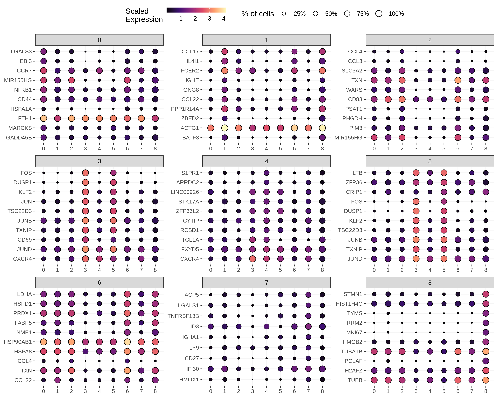
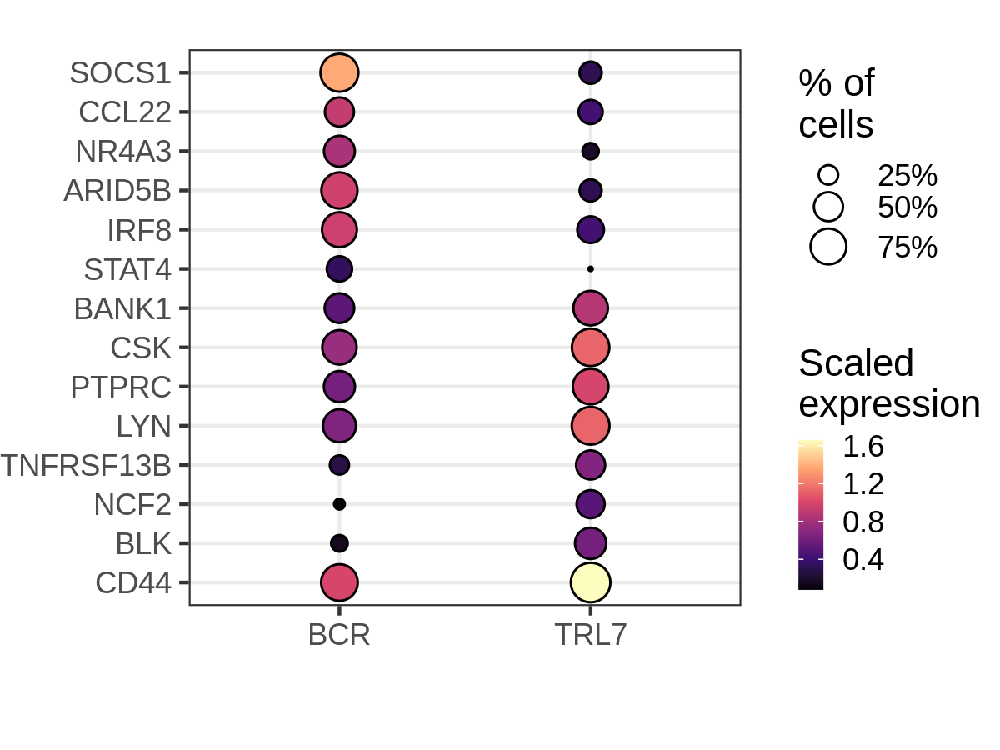

CITE-seq Pilot
================

Packages
--------

    # single-cell data analysis
    library(Seurat)
    library(miQC)
    library(scater)

    # Data wrangling
    library(tidyverse)
    library(rvest)

    # Plotting
    library(tidytext)
    library(ggridges)
    library(RColorBrewer)
    library(cowplot)

Cell Ranger data
----------------

    cellranger_dir <- 
        file.path("/lab-share/IM-Gutierrez-e2/Public/Lab_datasets/CITEseq_pilot", 
                  "SN0231064/KW9100_Maria/210726_10X_KW9100-2_bcl/cellranger-6.0.1",
                  "GRCh38/BRI-1283/outs/filtered_feature_bc_matrix")

    features_df <- file.path(cellranger_dir, "features.tsv.gz") %>%
        read_tsv(col_names = c("gene_id", "gene_name", "phenotype"))

    mt_genes <- features_df %>%
        filter(phenotype == "Gene Expression", 
               grepl("^MT-", gene_name)) %>%
        pull(gene_id)

    ribo_genes <- features_df %>%
        filter(phenotype == "Gene Expression", 
               grepl("^RPS\\d+|^RPL\\d+", gene_name)) %>%
      pull(gene_id)

    data10x <- Read10X(cellranger_dir, gene.column = 1)

Create the Seurat object
------------------------

    gene_exp <- data10x[["Gene Expression"]]

    antibody <- data10x[["Antibody Capture"]] %>%
        .[!grepl("^Hashtag", rownames(.)), ] 

    rownames(antibody) <- rownames(antibody) %>%
        sub("_prot$", "", .) %>%
        gsub("_", ".", .)

    hashtags <- data10x[["Antibody Capture"]] %>%
        .[grepl("^Hashtag", rownames(.)), ]

    rownames(hashtags) <- 
        c("IgG72", "RSQ72", "IgG24", "RSQ24", "Res24", "Res00")

    # Create object
    bcells <- CreateSeuratObject(counts = gene_exp, project = "bcells")
    bcells[["ADT"]] <- CreateAssayObject(counts = antibody)
    bcells[["HTO"]] <- CreateAssayObject(counts = hashtags)

    # Normalize
    bcells <- bcells %>%
      NormalizeData(normalization.method = "LogNormalize", margin = 2) %>%
      NormalizeData(assay = "HTO", normalization.method = "CLR", margin = 2) %>%
      NormalizeData(assay = "ADT", normalization.method = "CLR", margin = 2)

    bcells[["percent_mt"]] <- PercentageFeatureSet(bcells, features = mt_genes)
    bcells[["percent_ribo"]] <- PercentageFeatureSet(bcells, features = ribo_genes)

QC
--

Here we use the miQC package to model the percentage of mitochondrial
reads and number of genes, in order to identify and remove compromised
cells.

    bcells_sce <- bcells %>%
        as.SingleCellExperiment() %>%
        addPerCellQC(subsets = list(mito = mt_genes))

    model <- mixtureModel(bcells_sce)

    plotFiltering(bcells_sce, model, posterior_cutoff = 0.8) +
      scale_y_continuous(breaks = scales::pretty_breaks(8)) +
      theme_bw()

<!-- -->

Remove compromised cells
------------------------

    bcells_sce <- filterCells(bcells_sce, model)

    # Removing 4104 out of 13946 cells.

    cells_keep <- rownames(colData(bcells_sce))
    bcells <- subset(bcells, cells = cells_keep)

Demultiplex cells based on HTO
------------------------------

    bcells <- HTODemux(bcells, assay = "HTO", positive.quantile = 0.99)

    table(bcells$HTO_classification.global)

    # 
    #  Doublet Negative  Singlet 
    #     2755      692     6395

    Idents(bcells) <- "HTO_maxID"

<!-- -->

<!-- --> \#\#\# HTO
relative levels in Singlet, Doublet, and Negative droplets

<!-- -->

Extract Singlets
----------------

    Idents(bcells) <- "HTO_classification.global"

    bcells_singlet <- subset(bcells, idents = "Singlet")

    table(bcells_singlet@meta.data$HTO_maxID)[stims]

    # 
    # Res00 Res24 IgG24 IgG72 RSQ24 RSQ72 
    #  1442   768  1455  1489  1063   178

Feature quantifications
-----------------------

<!-- -->

PCA
---

    bcells_singlet <- bcells_singlet %>%
        FindVariableFeatures(nfeatures = 2000, selection.method = "vst") %>%
        ScaleData(., features = rownames(.)) %>%
        RunPCA(., features = VariableFeatures(.))

<!-- -->

### Number of genes

<!-- -->

UMAP and clustering
-------------------

    bcells_singlet <- bcells_singlet %>%
      RunUMAP(dims = 1:20, verbose = FALSE) %>%
      FindNeighbors(dims = 1:20, verbose = FALSE) %>%
      FindClusters(resolution = 0.5, verbose = FALSE)

### HTO classification

<!-- -->

### Cell cycling

<!-- -->

Marker genes for Seurat clusters (whole data, res = 0.5)
--------------------------------------------------------

    cluster_markers <- 
        FindAllMarkers(bcells_singlet, 
                       only.pos = TRUE,
                       min.pct = 0.05,
                       logfc.threshold = 1) %>%
        as_tibble() %>%
        filter(p_val_adj < 0.05)

Marker genes per cluster
------------------------

<!-- -->

Marker genes for each stim condition
------------------------------------

    Idents(bcells_singlet) <- "HTO_maxID"

    bcells_markers <- 
        FindAllMarkers(bcells_singlet, 
                       only.pos = TRUE,
                       min.pct = 0.1,
                       logfc.threshold = 1) %>%
        as_tibble()

<!-- -->

B cell genes (RNA)
------------------

<!-- -->

B cell genes (Protein)
----------------------

<!-- -->

Lupus genes
-----------

<!-- -->

Marker genes IgG vs RSQ
-----------------------

### 24 hours

    bcells_markers_24 <- 
        FindMarkers(bcells_singlet, 
                       ident.1 = "IgG24",
                       ident.2 = "RSQ24",
                       only.pos = FALSE,
                       min.pct = 0.1,
                       logfc.threshold = 0.5) %>%
        rownames_to_column("gene") %>%
        as_tibble() %>%
        select(gene, avg_log2FC, IgG24 = pct.1, RSQ24 = pct.2, p = p_val_adj) %>%
        filter(p < 0.05)

#### GWAS genes

<!-- -->

MAGMA
-----

Scores taken from the scDRS figshare.

scDRS
-----
