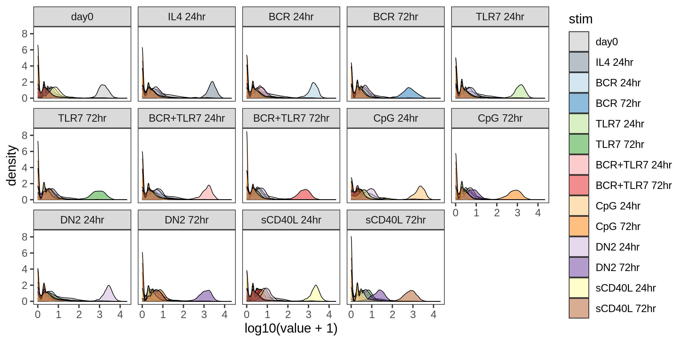

CITE-seq Pilots
================

Raw counts
----------

<!-- -->

QC
--

Here we use the miQC package to model the percentage of mitochondrial
reads and number of genes, in order to identify and remove compromised
cells.

<!-- -->

    # Removing 4104 out of 13946 cells.

    # Removing 723 out of 10562 cells.

Demultiplex cells based on HTO
------------------------------

<!-- -->

<!-- -->

<!-- -->

<!-- -->
