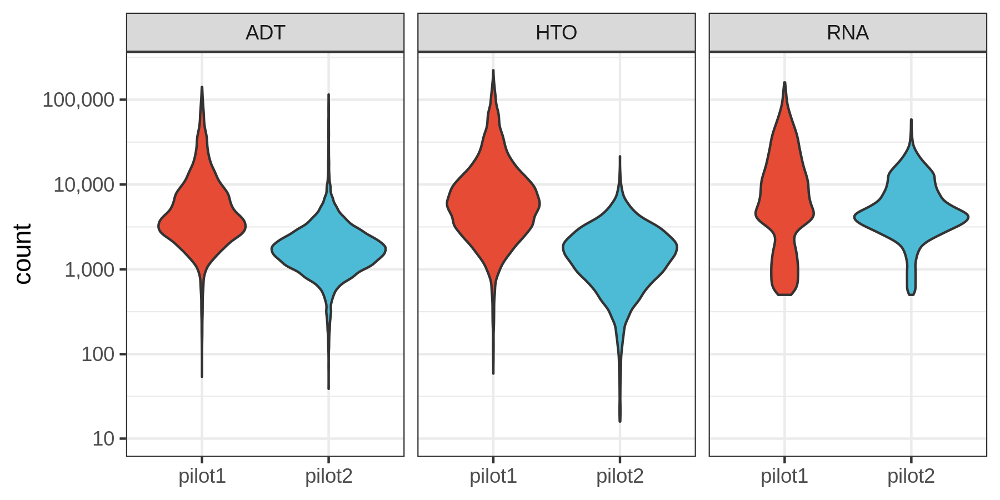
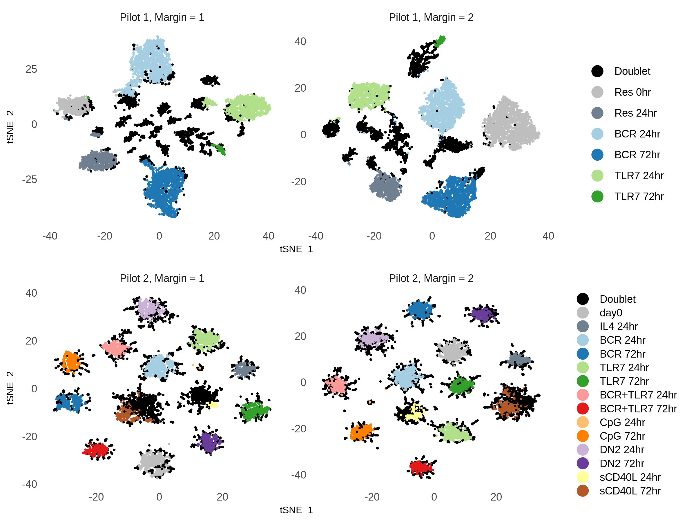
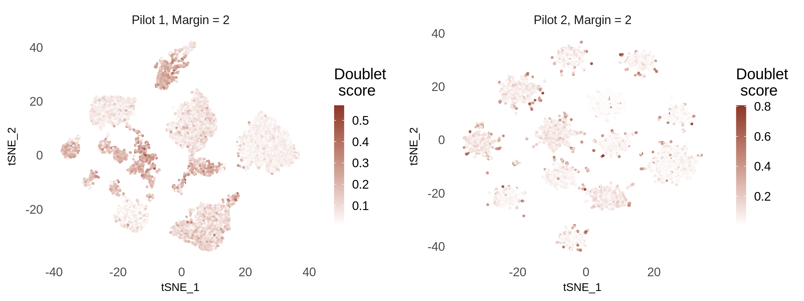
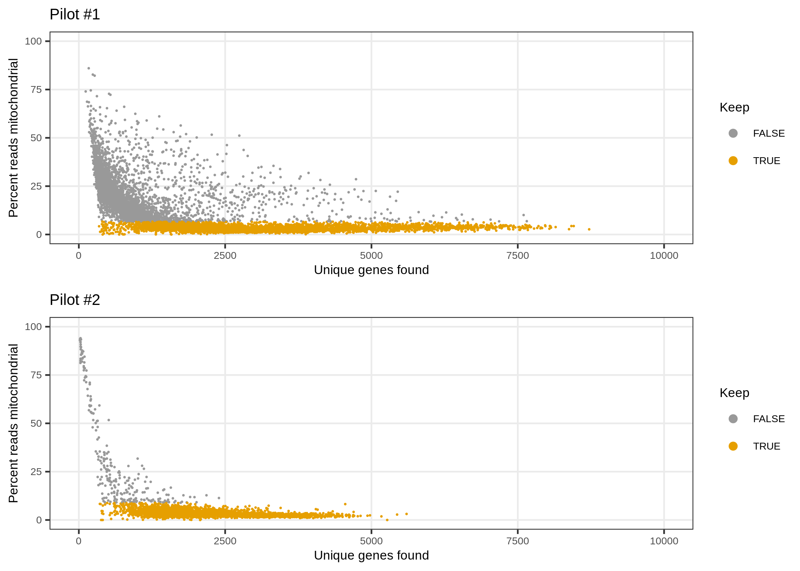
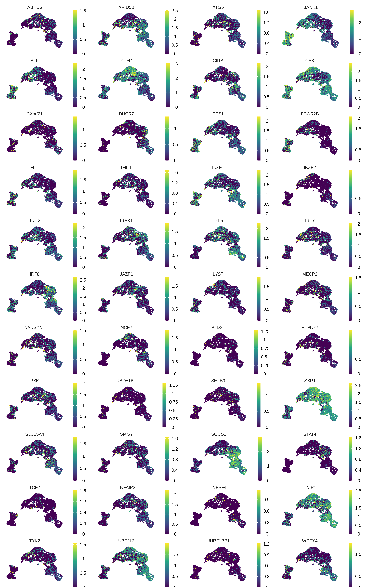
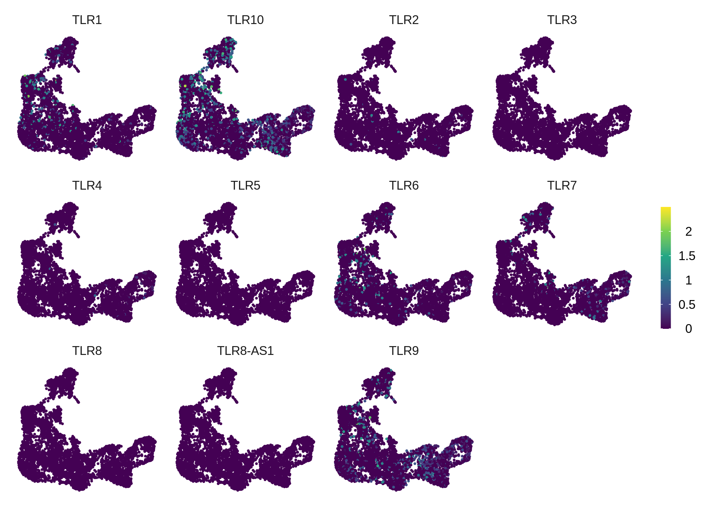
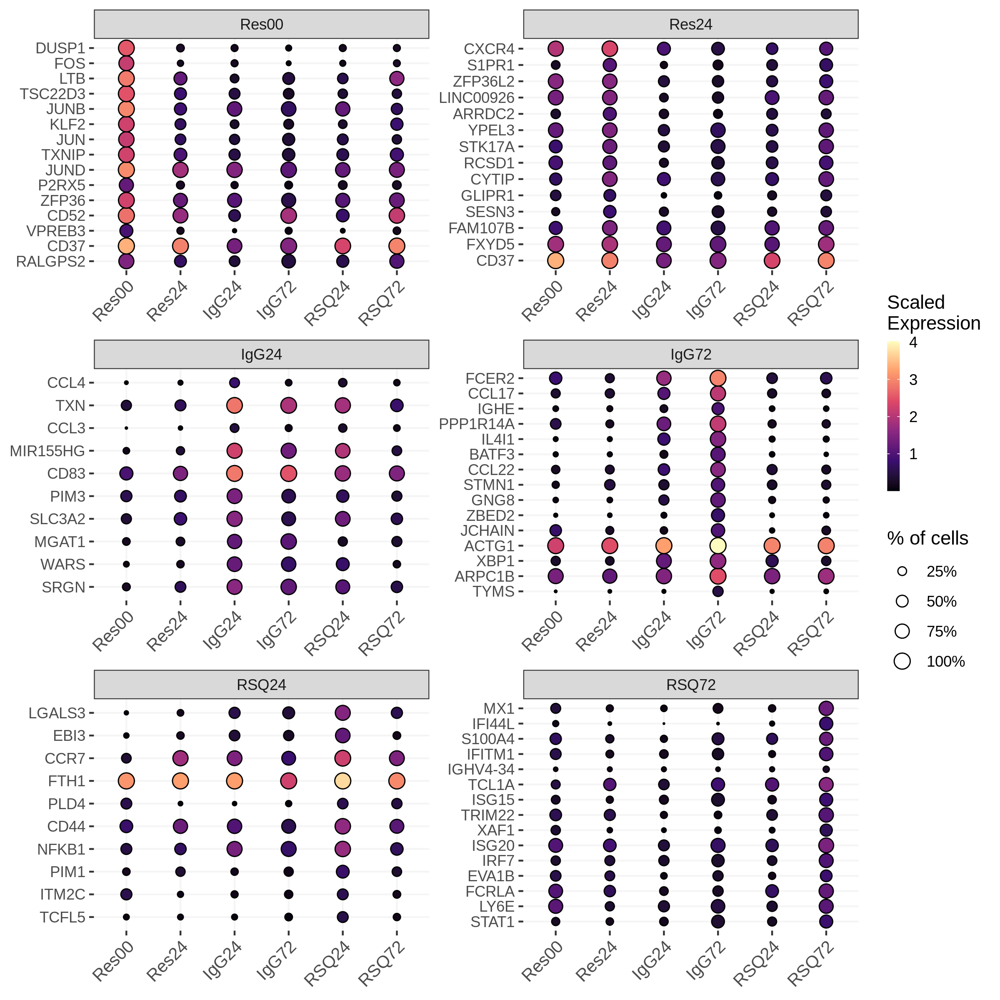

CITE-seq Pilot
================

Packages
--------

    # Data wrangling
    library(tidyverse)
    library(rvest)

    # single-cell data analysis
    library(Seurat)

    # Plotting
    library(tidytext)
    library(ggridges)
    library(RColorBrewer)
    library(cowplot)

Cell Ranger data
----------------

    cellranger_dir <- 
        file.path("/lab-share/IM-Gutierrez-e2/Public/scRNA/SN0231064/KW9100_Maria",
                  "210726_10X_KW9100-2_bcl/cellranger-6.0.1/GRCh38/BRI-1283/outs",
                  "filtered_feature_bc_matrix")

    features_df <- file.path(cellranger_dir, "features.tsv.gz") %>%
        read_tsv(col_names = c("gene_id", "gene_name", "phenotype"))

    mt_genes <- features_df %>%
        filter(phenotype == "Gene Expression", 
               grepl("^MT-", gene_name)) %>%
        pull(gene_id)

    ribo_genes <- features_df %>%
        filter(phenotype == "Gene Expression", 
               grepl("^RPS\\d+|^RPL\\d+", gene_name))

    data10x <- Read10X(cellranger_dir, gene.column = 1)

Create the Seurat object
------------------------

    gene_exp <- data10x[["Gene Expression"]]

    antibody <- data10x[["Antibody Capture"]] %>%
        .[!grepl("^Hashtag", rownames(.)), ] 

    rownames(antibody) <- rownames(antibody) %>%
        sub("_prot$", "", .) %>%
        gsub("_", ".", .)

    hashtags <- data10x[["Antibody Capture"]] %>%
        .[grepl("^Hashtag", rownames(.)), ]

    rownames(hashtags) <- 
        c("IgG72", "RSQ72", "IgG24", "RSQ24", "Res24", "Res00")

    # Create object
    bcells <- CreateSeuratObject(counts = gene_exp, project = "bcells")
    bcells[["ADT"]] <- CreateAssayObject(counts = antibody)
    bcells[["HTO"]] <- CreateAssayObject(counts = hashtags)

    # Normalize
    bcells <- NormalizeData(bcells, normalization.method = "LogNormalize")
    bcells <- FindVariableFeatures(bcells, selection.method = "vst")
    bcells <- ScaleData(bcells, features = VariableFeatures(bcells))

    bcells <- NormalizeData(bcells, assay = "HTO", 
                            normalization.method = "CLR")

    bcells <- NormalizeData(bcells, assay = "ADT", 
                            normalization.method = "CLR",
                            margin = 2)

QC
--

    bcells[["percent_mt"]] <- 
        PercentageFeatureSet(bcells, features = mt_genes)

<!-- -->

Filter out cells with high % of mitochondrial RNA
-------------------------------------------------

    bcells <- subset(bcells, subset = nFeature_RNA > 500 & percent_mt < 10)

Demultiplex cells based on HTO
------------------------------

    bcells <- HTODemux(bcells, assay = "HTO", positive.quantile = 0.99)

    table(bcells$HTO_classification.global)

    # 
    #  Doublet Negative  Singlet 
    #     3005     1721     5786

    Idents(bcells) <- "HTO_maxID"

<!-- -->

<!-- -->

### HTO levels in Negative droplets

<!-- -->

### HTO relative levels in Singlet, Doublet, and Negative droplets

<!-- -->

Extract Singlets
----------------

    Idents(bcells) <- "HTO_classification.global"

    bcells_singlet <- subset(bcells, idents = "Singlet")

    table(bcells_singlet@meta.data$HTO_maxID)[stims]

    # 
    # Res00 Res24 IgG24 IgG72 RSQ24 RSQ72 
    #   489   842  1601  1566  1094   194

Feature quantifications
-----------------------

<!-- -->

PCA
---

    bcells_singlet <- 
        FindVariableFeatures(bcells_singlet, 
                             nfeatures = 2000,
                             selection.method = "vst")

    all_genes <- rownames(bcells_singlet)

    bcells_singlet <- ScaleData(bcells_singlet, features = all_genes)

    bcells_singlet <- RunPCA(bcells_singlet, features = VariableFeatures(bcells_singlet))

<!-- -->

### Gene loadings

<!-- -->

### Standard deviation for each PC

<!-- -->

Clustering
----------

    # Find neighboring cells
    bcells_singlet <- FindNeighbors(bcells_singlet, dims = 1:20)

    # Cluster
    bcells_singlet <- FindClusters(bcells_singlet, resolution = 0.25)

    # Modularity Optimizer version 1.3.0 by Ludo Waltman and Nees Jan van Eck
    # 
    # Number of nodes: 5786
    # Number of edges: 208879
    # 
    # Running Louvain algorithm...
    # Maximum modularity in 10 random starts: 0.9161
    # Number of communities: 7
    # Elapsed time: 0 seconds

    bcells_singlet <- FindClusters(bcells_singlet, resolution = 0.5)

    # Modularity Optimizer version 1.3.0 by Ludo Waltman and Nees Jan van Eck
    # 
    # Number of nodes: 5786
    # Number of edges: 208879
    # 
    # Running Louvain algorithm...
    # Maximum modularity in 10 random starts: 0.8815
    # Number of communities: 10
    # Elapsed time: 0 seconds

    bcells_singlet <- FindClusters(bcells_singlet, resolution = 1.25)

    # Modularity Optimizer version 1.3.0 by Ludo Waltman and Nees Jan van Eck
    # 
    # Number of nodes: 5786
    # Number of edges: 208879
    # 
    # Running Louvain algorithm...
    # Maximum modularity in 10 random starts: 0.8152
    # Number of communities: 18
    # Elapsed time: 0 seconds

UMAP
----

    bcells_singlet <- RunUMAP(bcells_singlet, dims = 1:20)

### HTO classification

<!-- -->

### Clustering at different resolutions

<!-- -->

### Proliferation marker

<!-- -->

Downsampling
------------

We see that RSQ 72hr is picked as a separate cluster with resolution =
0.6. In the full dataset, that does not happen even if we increase the
resolution. Therefore, RSQ 72hr is not a separate cluster in the full
dataset potentially due to low number of cells.

    set.seed(1)
    sampled_cells <- 
      tibble(cell_barcode = colnames(bcells_singlet@assays$RNA@counts),
             cell_stim = bcells_singlet@meta.data$HTO_maxID) %>%
      select(cell_stim, cell_barcode) %>%
      group_by(cell_stim) %>%
      sample_n(194) %>%
      ungroup() %>%
      pull(cell_barcode)

    bcells_singlet_downsamp <- subset(bcells_singlet, cells = sampled_cells)

    table(bcells_singlet_downsamp@meta.data$HTO_maxID)[stims]

    # 
    # Res00 Res24 IgG24 IgG72 RSQ24 RSQ72 
    #   194   194   194   194   194   194

    bcells_singlet_downsamp <- 
        FindVariableFeatures(bcells_singlet_downsamp, 
                             nfeatures = 1000,
                             selection.method = "vst")

    bcells_singlet_downsamp <- 
        ScaleData(bcells_singlet_downsamp, features = VariableFeatures(bcells_singlet_downsamp))

    bcells_singlet_downsamp <-
        RunPCA(bcells_singlet_downsamp, features = VariableFeatures(bcells_singlet_downsamp))

    # Find neighboring cells
    bcells_singlet_downsamp <- FindNeighbors(bcells_singlet_downsamp, dims = 1:20)

    # Cluster
    bcells_singlet_downsamp <- FindClusters(bcells_singlet_downsamp, resolution = 0.6)

    # Modularity Optimizer version 1.3.0 by Ludo Waltman and Nees Jan van Eck
    # 
    # Number of nodes: 1164
    # Number of edges: 45153
    # 
    # Running Louvain algorithm...
    # Maximum modularity in 10 random starts: 0.8150
    # Number of communities: 7
    # Elapsed time: 0 seconds

    # UMAP
    bbcells_singlet_downsamp <- RunUMAP(bcells_singlet_downsamp, dims = 1:20)

<!-- -->

B cell genes (RNA)
------------------

<!-- -->

B cell genes (Protein)
----------------------

<!-- -->

### IgD vs CD27

<!-- -->

DN2 genes (Jenks et al. (2018); Fig 4-C)
----------------------------------------

<!-- -->

Lupus genes
-----------

<!-- -->

TLR genes
---------

<!-- -->

MAGMA
-----

Scores taken from the scDRS figshare.

<!-- -->

scDRS
-----

<!-- -->

Find marker genes for each stim condition
-----------------------------------------

    Idents(bcells_singlet) <- "HTO_maxID"

    bcells_markers <- 
        FindAllMarkers(bcells_singlet, 
                       only.pos = TRUE,
                       min.pct = 1/3,
                       logfc.threshold = 1) %>%
        as_tibble()

Top 10 marker genes per cluster
-------------------------------

<!-- -->

Marker genes IgG vs RSQ
-----------------------

### 24 hours

    bcells_markers_24 <- 
        FindMarkers(bcells_singlet, 
                       ident.1 = "IgG24",
                       ident.2 = "RSQ24",
                       only.pos = FALSE,
                       min.pct = 1/3,
                       logfc.threshold = 0.5) %>%
        rownames_to_column("gene") %>%
        as_tibble() %>%
        select(gene, avg_log2FC, IgG24 = pct.1, RSQ24 = pct.2, p = p_val_adj) %>%
        filter(p < 0.01)

Genes marked with an asterisk were either reported as a SLE risk gene,
or it is within +- 200kb from a SLE risk variant in GWAS catalog.

### 72 hours

    bcells_markers_72 <- 
        FindMarkers(bcells_singlet, 
                       ident.1 = "IgG72",
                       ident.2 = "RSQ72",
                       only.pos = FALSE,
                       min.pct = 1/3,
                       logfc.threshold = 0.5) %>%
        rownames_to_column("gene") %>%
        as_tibble() %>%
        select(gene, avg_log2FC, IgG72 = pct.1, RSQ72 = pct.2, p = p_val_adj) %>%
        filter(p < 0.01)
