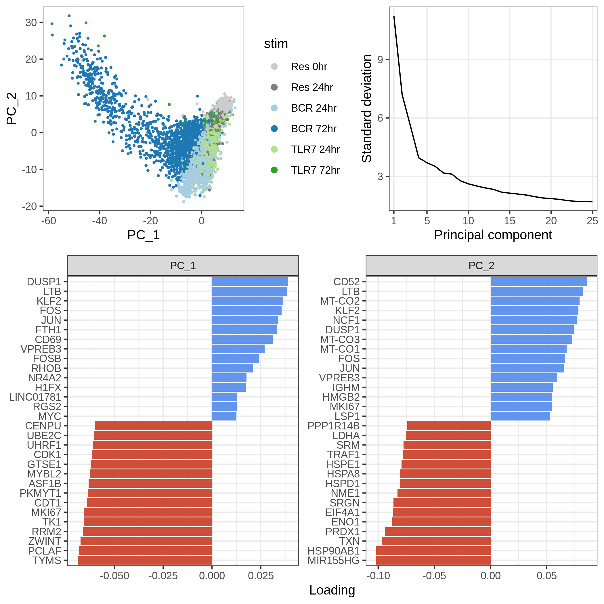
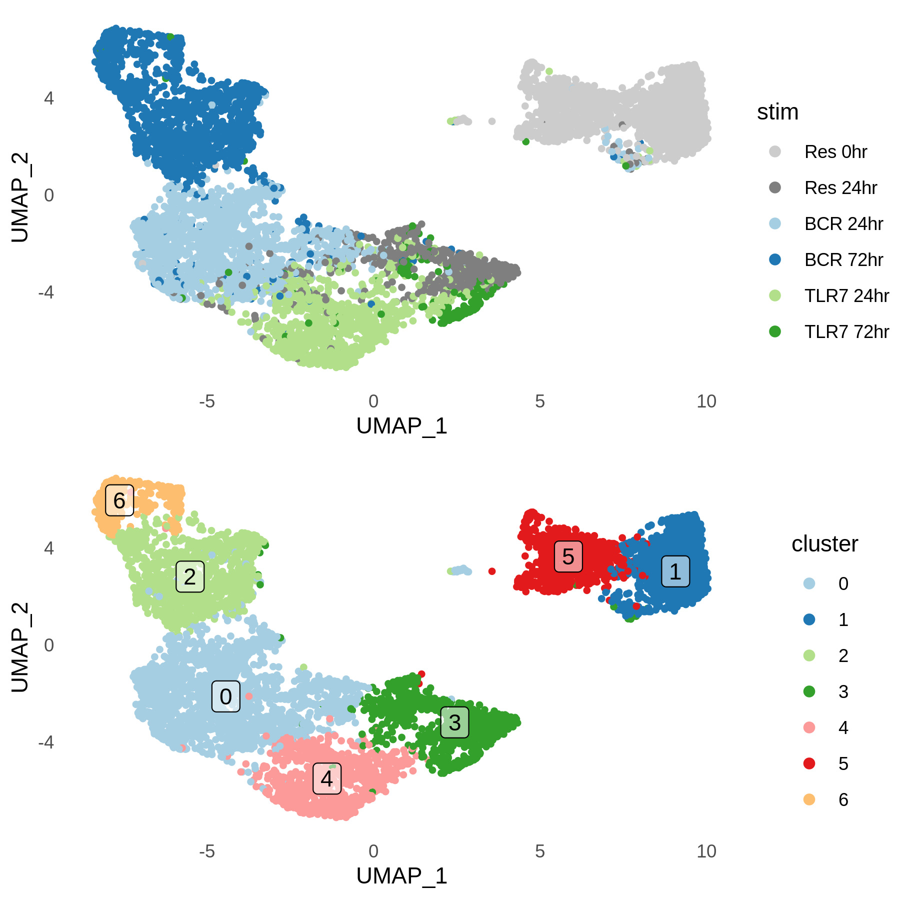
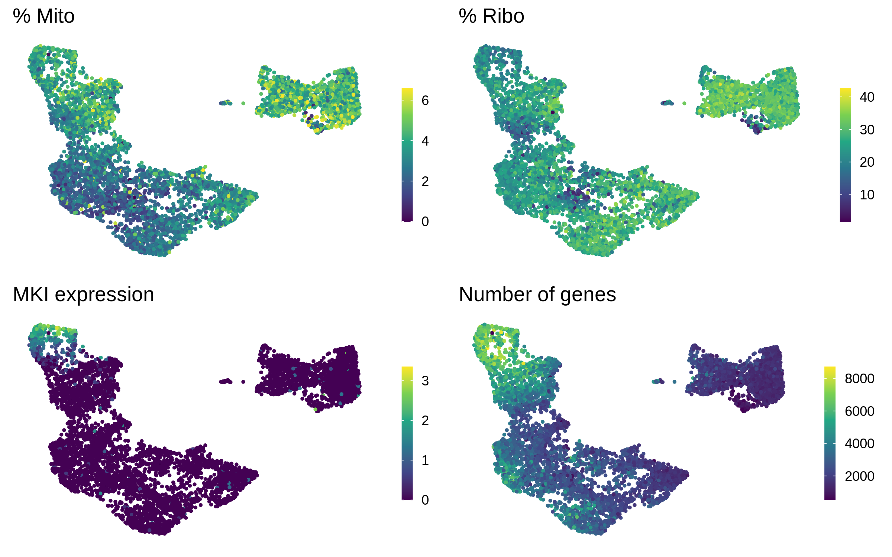
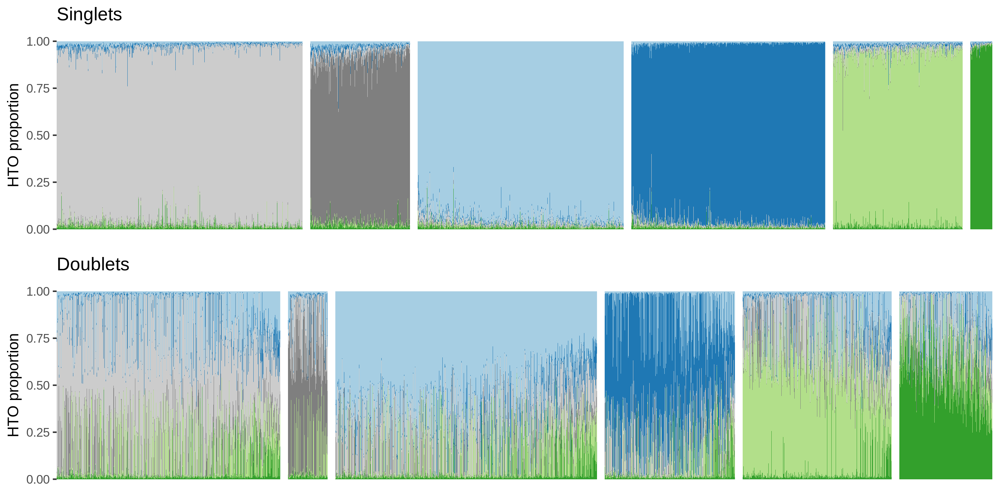
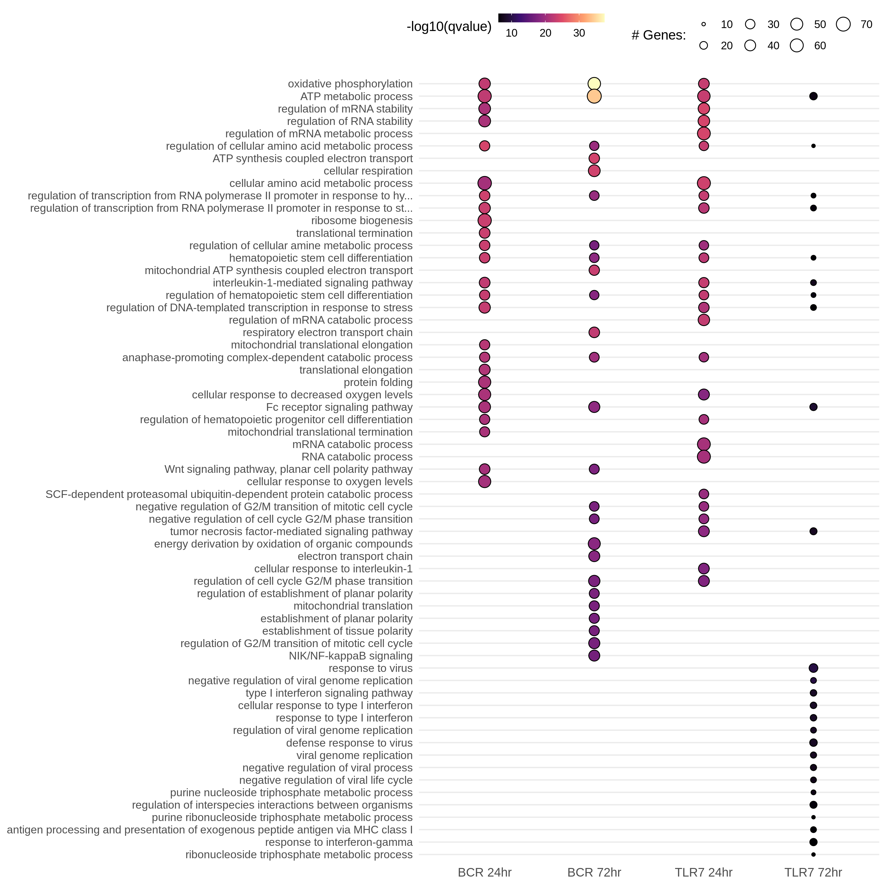
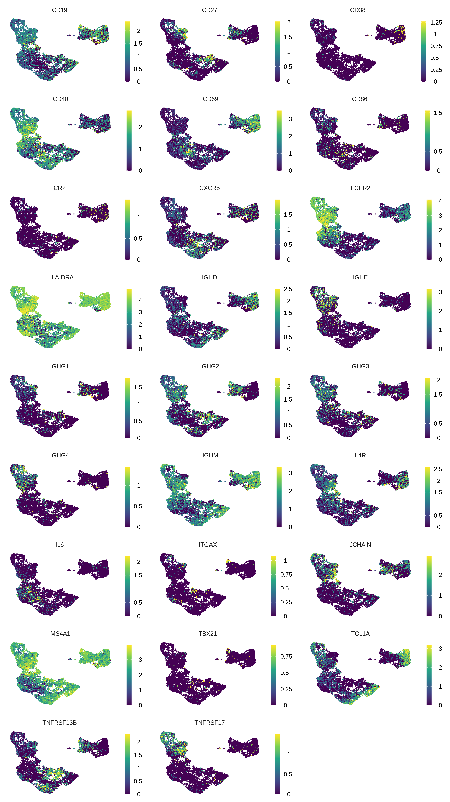
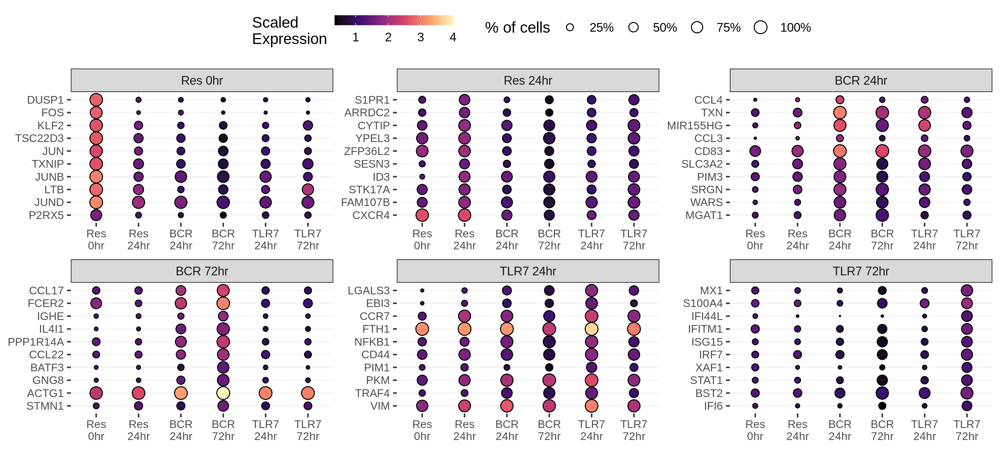
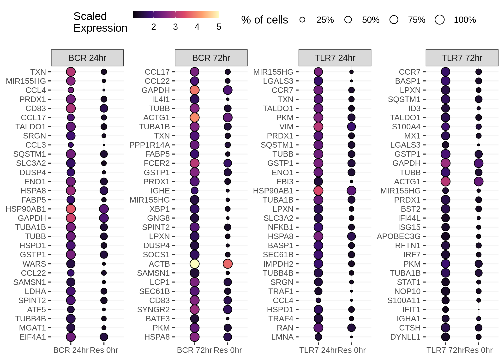
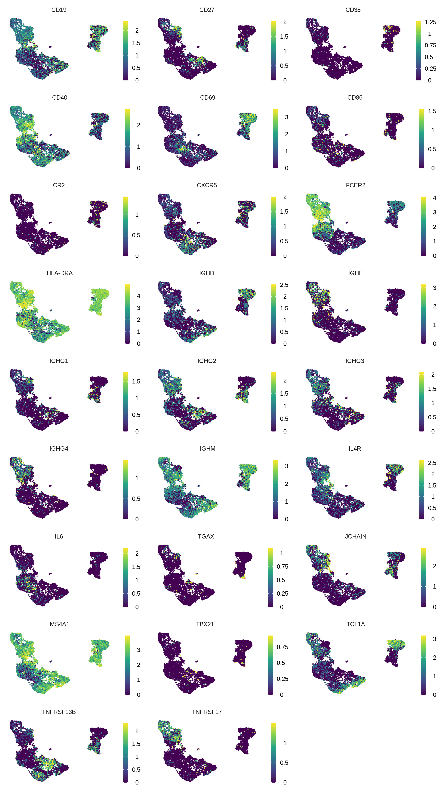

CITE-seq Pilot
================

Packages
--------

    # single-cell data analysis
    library(Seurat)
    library(miQC)
    library(scater)

    # Gene Ontology
    library(clusterProfiler)
    library(org.Hs.eg.db)

    # Data wrangling
    library(tidyverse)

    # Plotting
    library(tidytext)
    library(ggridges)
    library(RColorBrewer)
    library(scico)
    library(cowplot)
    library(UpSetR)

Cell Ranger data
----------------

    cellranger_dir <- 
        file.path("/lab-share/IM-Gutierrez-e2/Public/Lab_datasets/CITEseq_pilot", 
                  "SN0231064/KW9100_Maria/210726_10X_KW9100-2_bcl/cellranger-6.0.1",
                  "GRCh38/BRI-1283/outs/filtered_feature_bc_matrix")

    features_df <- file.path(cellranger_dir, "features.tsv.gz") %>%
        read_tsv(col_names = c("gene_id", "gene_name", "phenotype"))

    genes_df <- features_df %>%
      filter(phenotype == "Gene Expression") %>%
      select(gene_id, gene_name)

    mt_genes <- genes_df %>%
        filter(grepl("^MT-", gene_name)) %>%
        pull(gene_id)

    ribo_genes <- genes_df %>%
        filter(grepl("^RPS\\d+|^RPL\\d+", gene_name)) %>%
      pull(gene_id)

    sctype_gs_list <- read_rds("/home/ch229163/mouse10x/sctype_gs_list.rds")

    data10x <- Read10X(cellranger_dir, gene.column = 1)

Create the Seurat object
------------------------

    gene_exp <- data10x[["Gene Expression"]]

    antibody <- data10x[["Antibody Capture"]] %>%
        .[!grepl("^Hashtag", rownames(.)), ] 

    rownames(antibody) <- rownames(antibody) %>%
        sub("_prot$", "", .) %>%
        gsub("_", ".", .)

    hashtags <- data10x[["Antibody Capture"]] %>%
        .[grepl("^Hashtag", rownames(.)), ]

    rownames(hashtags) <- 
        c("BCR 72hr", "TLR7 72hr", "BCR 24hr", "TLR7 24hr", "Res 24hr", "Res 0hr")

    # Create object
    bcells <- CreateSeuratObject(counts = gene_exp, project = "bcells")
    bcells[["ADT"]] <- CreateAssayObject(counts = antibody)
    bcells[["HTO"]] <- CreateAssayObject(counts = hashtags)

    # Normalize
    bcells <- bcells %>%
      NormalizeData(normalization.method = "LogNormalize", margin = 2) %>%
      NormalizeData(assay = "HTO", normalization.method = "CLR", margin = 2) %>%
      NormalizeData(assay = "ADT", normalization.method = "CLR", margin = 2)

    bcells[["percent_mt"]] <- PercentageFeatureSet(bcells, features = mt_genes)
    bcells[["percent_ribo"]] <- PercentageFeatureSet(bcells, features = ribo_genes)

QC
--

Here we use the miQC package to model the percentage of mitochondrial
reads and number of genes, in order to identify and remove compromised
cells.

    bcells_sce <- bcells %>%
        as.SingleCellExperiment() %>%
        addPerCellQC(subsets = list(mito = mt_genes))

    model <- mixtureModel(bcells_sce)

    plotFiltering(bcells_sce, model, posterior_cutoff = 0.8) +
      scale_y_continuous(breaks = scales::pretty_breaks(8)) +
      theme_bw() +
      theme(text = element_text(size = 8),
            panel.grid.minor = element_blank())

<!-- -->

Remove compromised cells
------------------------

    bcells_sce <- filterCells(bcells_sce, model)

    # Removing 4104 out of 13946 cells.

    cells_keep <- rownames(colData(bcells_sce))

    bcells <- subset(bcells, cells = cells_keep) %>%
      subset(nFeature_RNA > 500)

Demultiplex cells based on HTO
------------------------------

    bcells <- HTODemux(bcells, assay = "HTO", positive.quantile = 0.99)

    table(bcells$HTO_classification.global)

    # 
    #  Doublet Negative  Singlet 
    #     3143      131     6518

    Idents(bcells) <- "HTO_maxID"

<!-- -->

<!-- -->

### HTO relative levels in Singlet, Doublet, and Negative droplets

<!-- -->

Extract Singlets
----------------

    Idents(bcells) <- "HTO_classification.global"

    bcells_singlet <- subset(bcells, idents = "Singlet")

    table(bcells_singlet@meta.data$HTO_maxID)[stims]

    # 
    #   Res 0hr  Res 24hr  BCR 24hr  BCR 72hr TLR7 24hr TLR7 72hr 
    #      1786       725      1496      1408       943       160

Feature quantifications
-----------------------

<!-- -->

PCA
---

    bcells_singlet <- bcells_singlet %>%
        FindVariableFeatures(nfeatures = 2000, selection.method = "vst") %>%
        ScaleData(., features = rownames(.)) %>%
        RunPCA(., features = VariableFeatures(.))

<!-- -->

### Number of genes

<!-- -->

UMAP and clustering
-------------------

    bcells_singlet <- bcells_singlet %>%
      RunUMAP(dims = 1:20, verbose = FALSE) %>%
      FindNeighbors(dims = 1:20, verbose = FALSE) %>%
      FindClusters(resolution = 0.25, verbose = FALSE)

### Stimulus and Seurat clusters

<!-- -->

### Cell cycling

<!-- -->

Marker genes for Seurat clusters (whole data, res = 0.5)
--------------------------------------------------------

    Idents(bcells_singlet) <- "seurat_clusters"

    cluster_markers <- 
        FindAllMarkers(bcells_singlet, 
                       only.pos = TRUE,
                       min.pct = 0.1,
                       logfc.threshold = 1) %>%
        as_tibble() %>%
        filter(p_val_adj < 0.05)

Marker genes per cluster
------------------------

<!-- -->

Marker genes for each stim condition
------------------------------------

    Idents(bcells_singlet) <- "HTO_maxID"

    bcells_markers <- 
        FindAllMarkers(bcells_singlet, 
                       only.pos = TRUE,
                       min.pct = 0.1,
                       logfc.threshold = 1) %>%
        as_tibble()

<!-- -->

### DE genes between each condition and day 0

    bcr24_markers <- 
        FindMarkers(bcells_singlet, 
                       ident.1 = "BCR 24hr",
                       ident.2 = "Res 0hr",
                       only.pos = TRUE,
                       min.pct = 0.1,
                       logfc.threshold = .5) %>%
        rownames_to_column("gene") %>%
        as_tibble()

    tlr24_markers <- 
        FindMarkers(bcells_singlet, 
                       ident.1 = "TLR7 24hr",
                       ident.2 = "Res 0hr",
                       only.pos = TRUE,
                       min.pct = 0.1,
                       logfc.threshold = .5) %>%
        rownames_to_column("gene") %>%
        as_tibble()

    bcr72_markers <- 
        FindMarkers(bcells_singlet, 
                       ident.1 = "BCR 72hr",
                       ident.2 = "Res 0hr",
                       only.pos = TRUE,
                       min.pct = 0.1,
                       logfc.threshold = .5) %>%
        rownames_to_column("gene") %>%
        as_tibble()

    tlr72_markers <- 
        FindMarkers(bcells_singlet, 
                       ident.1 = "TLR7 72hr",
                       ident.2 = "Res 0hr",
                       only.pos = TRUE,
                       min.pct = 0.1,
                       logfc.threshold = .5) %>%
        rownames_to_column("gene") %>%
        as_tibble()

    markers_day0_df <-
      bind_rows("BCR 24hr" = bcr24_markers,
                "TLR7 24hr" = tlr24_markers,
                "BCR 72hr" = bcr72_markers,
                "TLR7 72hr" = tlr72_markers,
                .id = "stim") %>%
      filter(p_val_adj < 0.05) %>%
      select(-p_val, -p_val_adj)

<!-- -->

<!-- -->

<!-- -->

B cell genes (RNA)
------------------

<!-- -->

B cell genes (Protein)
----------------------

<!-- -->

SLE GWAS genes
--------------

Reported genes in GWAS Catalog, with significant differential expression
(Log2FC &gt; 1, FDR = 5%) in any condition in respect to Resting 0
hours.

<!-- -->
