CITE-seq Pilot
================

Packages
--------

    # single-cell data analysis
    library(Seurat)
    library(miQC)
    library(scater)
    library(MCPcounter)

    # Gene Ontology
    library(clusterProfiler)
    library(org.Hs.eg.db)

    # Data wrangling
    library(tidyverse)

    # Plotting
    library(tidytext)
    library(UpSetR)
    library(ggridges)
    library(RColorBrewer)
    library(scico)
    library(cowplot)

Cell Ranger data
----------------

    cellranger_dir <- 
        file.path("/lab-share/IM-Gutierrez-e2/Public/Lab_datasets/CITEseq_pilot_2",
        "SN0257788/broad/hptmp/curtism/bwh10x/KW10170_Maria/220617_10X_KW10170_bcl",
        "cellranger-6.1.1/GRCh38/BRI-1743_hashing/outs/filtered_feature_bc_matrix") 

    features_df <- file.path(cellranger_dir, "features.tsv.gz") %>%
        read_tsv(col_names = c("gene_id", "gene_name", "phenotype"))

    gene_ids <- features_df  %>%
      filter(phenotype == "Gene Expression") %>%
      select(gene_id, gene_name)

    mt_genes <- features_df %>%
        filter(phenotype == "Gene Expression", 
               grepl("^MT-", gene_name)) %>%
        pull(gene_id)

    ribo_genes <- features_df %>%
        filter(phenotype == "Gene Expression", 
               grepl("^RPS\\d+|^RPL\\d+", gene_name)) %>%
        pull(gene_id)

    data10x <- Read10X(cellranger_dir, gene.column = 1)

Create the Seurat object
------------------------

    gene_exp <- data10x[["Gene Expression"]]

    antibody <- data10x[["Antibody Capture"]] %>%
        .[!grepl("^Hashtag", rownames(.)), ] 

    rownames(antibody) <- rownames(antibody) %>%
        sub("_prot$", "", .) %>%
        gsub("_", ".", .)

    hashtags <- data10x[["Antibody Capture"]] %>%
        .[grepl("^Hashtag", rownames(.)), ]

    rownames(hashtags) <- 
        c("day0", 
          "IL4 24hr",
          "BCR 24hr",
          "BCR+TLR7 24hr",
          "TLR7 24hr", 
          "sCD40L 24hr",
          "CpG 24hr",
          "DN2 24hr",
          "BCR 72hr",
          "BCR+TLR7 72hr",
          "TLR7 72hr",
          "sCD40L 72hr",
          "DN2 72hr",
          "CpG 72hr")

    # stims in order for plotting
    stims <- c("day0", "IL4 24hr", "BCR 24hr", "BCR 72hr", "TLR7 24hr", "TLR7 72hr",
               "BCR+TLR7 24hr", "BCR+TLR7 72hr", "CpG 24hr", "CpG 72hr", 
               "sCD40L 24hr", "sCD40L 72hr", "DN2 24hr", "DN2 72hr")

    stims_colors <- c("grey", "black", brewer.pal(12, "Paired")) %>%
      setNames(stims)

    # Create object
    bcells <- CreateSeuratObject(counts = gene_exp, project = "bcells")
    bcells[["ADT"]] <- CreateAssayObject(counts = antibody)
    bcells[["HTO"]] <- CreateAssayObject(counts = hashtags)

    # Normalize
    bcells <- bcells %>%
      NormalizeData(normalization.method = "LogNormalize", margin = 2) %>%
      NormalizeData(assay = "HTO", normalization.method = "CLR", margin = 2) %>%
      NormalizeData(assay = "ADT", normalization.method = "CLR", margin = 2)

    bcells[["percent_mt"]] <- PercentageFeatureSet(bcells, features = mt_genes)
    bcells[["percent_ribo"]] <- PercentageFeatureSet(bcells, features = ribo_genes)

    # demuxlet result
    demuxlet_df <-
      "/lab-share/IM-Gutierrez-e2/Public/vitor/lupus/bcell_scrna/pilot_2/demuxlet/demuxlet_allsnps.best" %>%
      read_tsv() %>%
      select(barcode = BARCODE, best = BEST) %>%
      extract(best, c("status", "sample"), "([^-]+)-(.+)")

    demuxlet_sng <- demuxlet_df %>%
      filter(status == "SNG")

QC
--

Here we use the miQC package to model the percentage of mitochondrial
reads and number of genes, in order to identify and remove compromised
cells.

    bcells_sce <- bcells %>%
        as.SingleCellExperiment() %>%
        addPerCellQC(subsets = list(mito = mt_genes))

    model <- mixtureModel(bcells_sce)

    plotFiltering(bcells_sce, model, posterior_cutoff = 0.8) +
      scale_y_continuous(breaks = scales::pretty_breaks(8)) +
      theme_bw() +
      theme(text = element_text(size = 8))

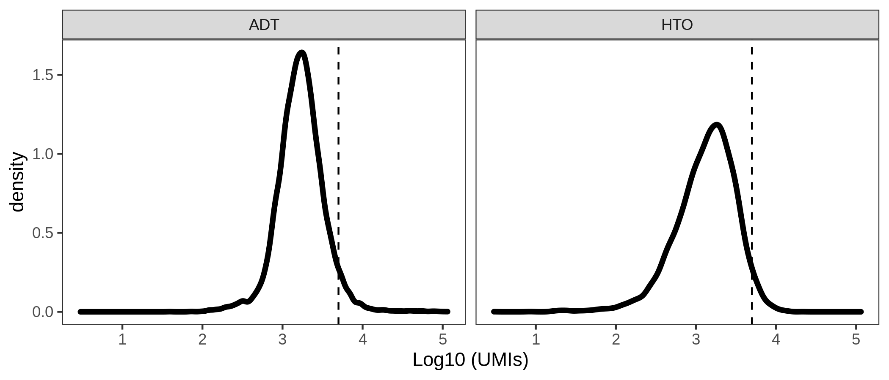<!-- -->

Remove compromised cells
------------------------

    bcells_sce <- filterCells(bcells_sce, model)

    # Removing 723 out of 10562 cells.

    cells_keep <- rownames(colData(bcells_sce))

    bcells <- subset(bcells, cells = cells_keep) %>%
      subset(nFeature_RNA > 500)

Demultiplex given the individual genotypes
------------------------------------------

    bcells_sng <- subset(bcells, cells = demuxlet_sng$barcode)

Demultiplex cells based on HTO
------------------------------

    bcells_sng <- HTODemux(bcells_sng, assay = "HTO", positive.quantile = 0.99)

    table(bcells_sng$HTO_classification.global)

    # 
    #  Doublet Negative  Singlet 
    #     3665       30     5618

    Idents(bcells_sng) <- "HTO_maxID"

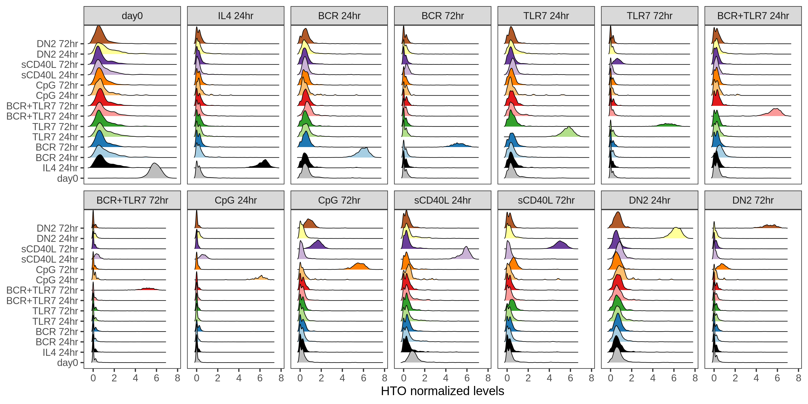<!-- -->

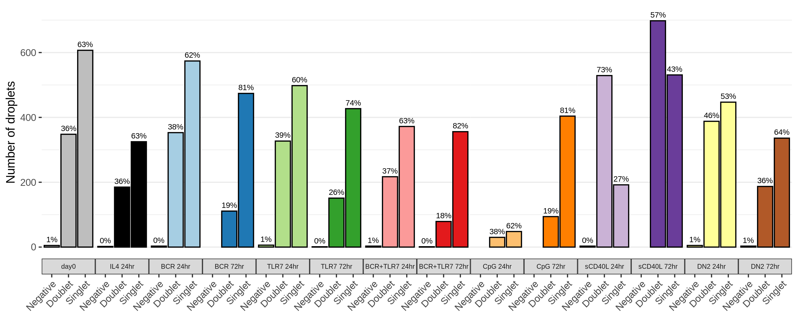<!-- -->

### HTO relative levels in Singlets and Doublets

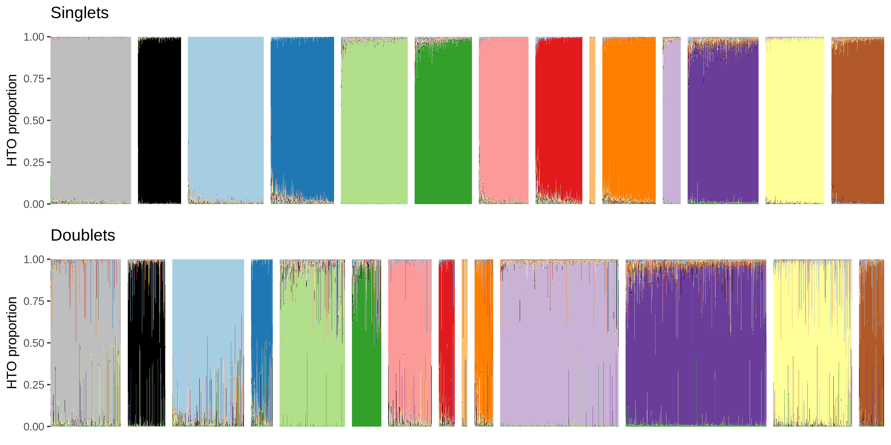<!-- -->

Extract Singlets
----------------

    Idents(bcells_sng) <- "HTO_classification.global"

    bcells_singlet <- subset(bcells_sng, idents = "Singlet")

    table(bcells_singlet@meta.data$HTO_maxID)[stims]

    # 
    #          day0      IL4 24hr      BCR 24hr      BCR 72hr     TLR7 24hr     TLR7 72hr BCR+TLR7 24hr BCR+TLR7 72hr      CpG 24hr      CpG 72hr   sCD40L 24hr   sCD40L 72hr      DN2 24hr      DN2 72hr 
    #           608           325           573           478           504           433           375           354            48           403           138           535           446           398

Feature quantifications
-----------------------

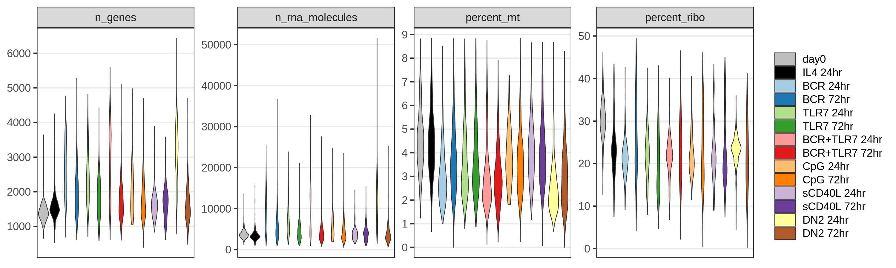<!-- -->

PCA
---

    bcells_singlet <- bcells_singlet %>%
        FindVariableFeatures(nfeatures = 2000, selection.method = "vst") %>%
        ScaleData(., features = rownames(.)) %>%
        RunPCA(., features = VariableFeatures(.))

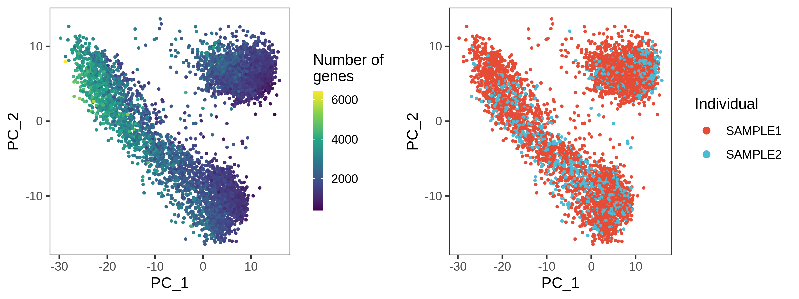<!-- -->

### Number of genes and cells per individual

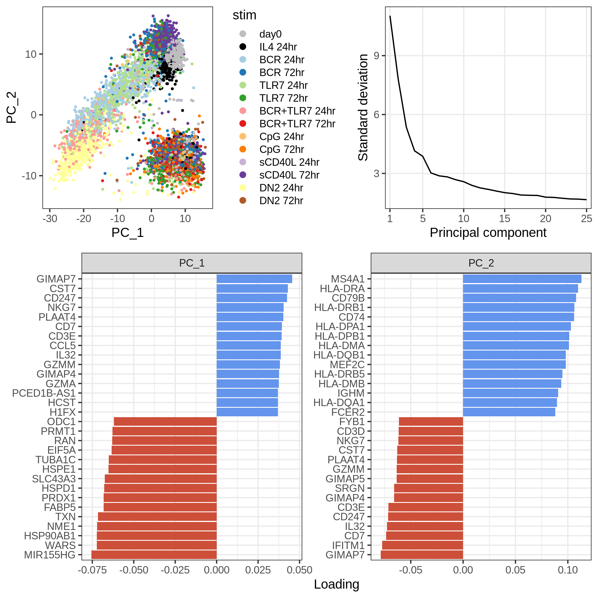<!-- -->

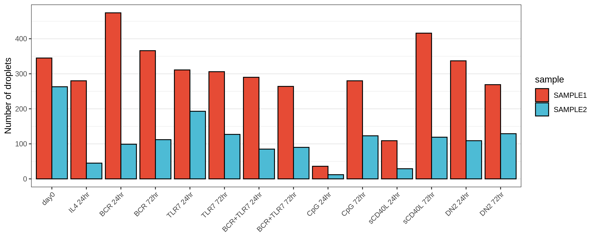<!-- -->

UMAP and clustering
-------------------

    bcells_singlet <- bcells_singlet %>%
      RunUMAP(dims = 1:20, verbose = FALSE) %>%
      FindNeighbors(dims = 1:20, verbose = FALSE) %>%
      FindClusters(resolution = 0.5, verbose = FALSE)

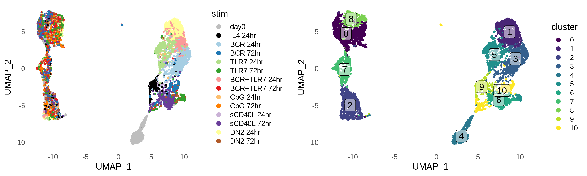<!-- -->

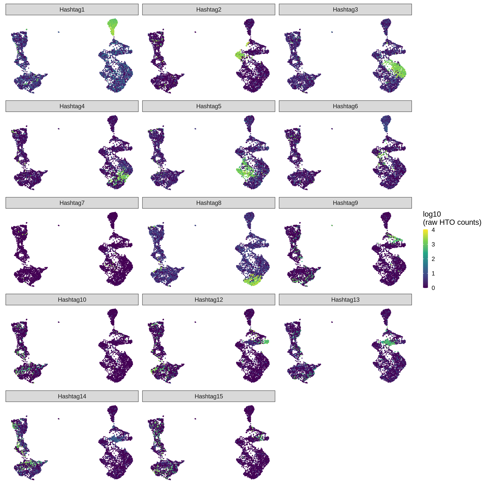<!-- -->

### Hashtag staining

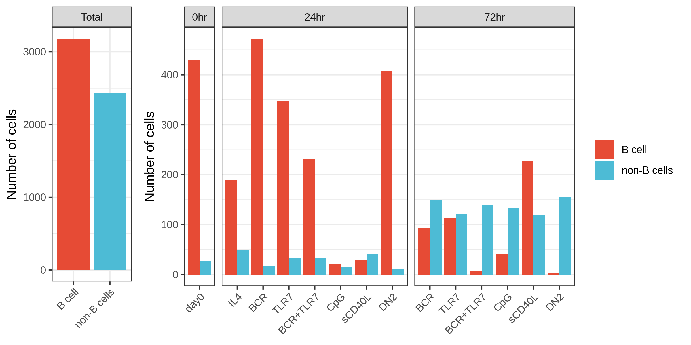<!-- -->

### Total of B and non-B cells

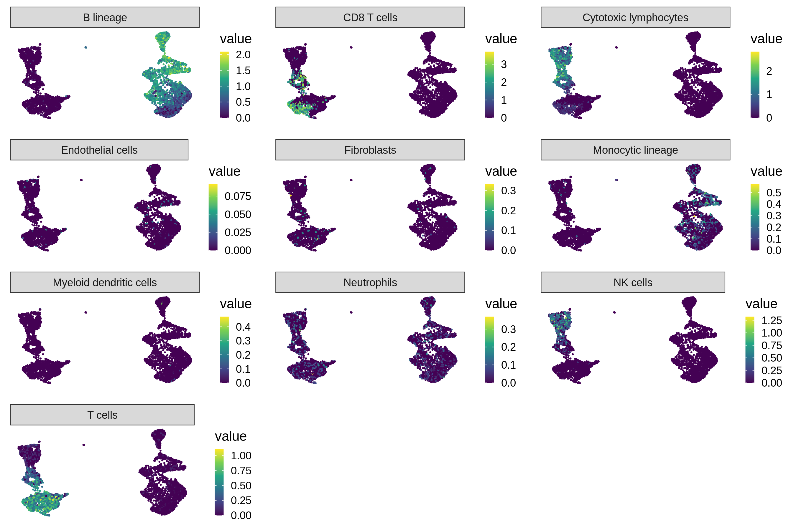<!-- -->

### Cell type annotation with MCP counter

<!-- -->

### Cell cycling

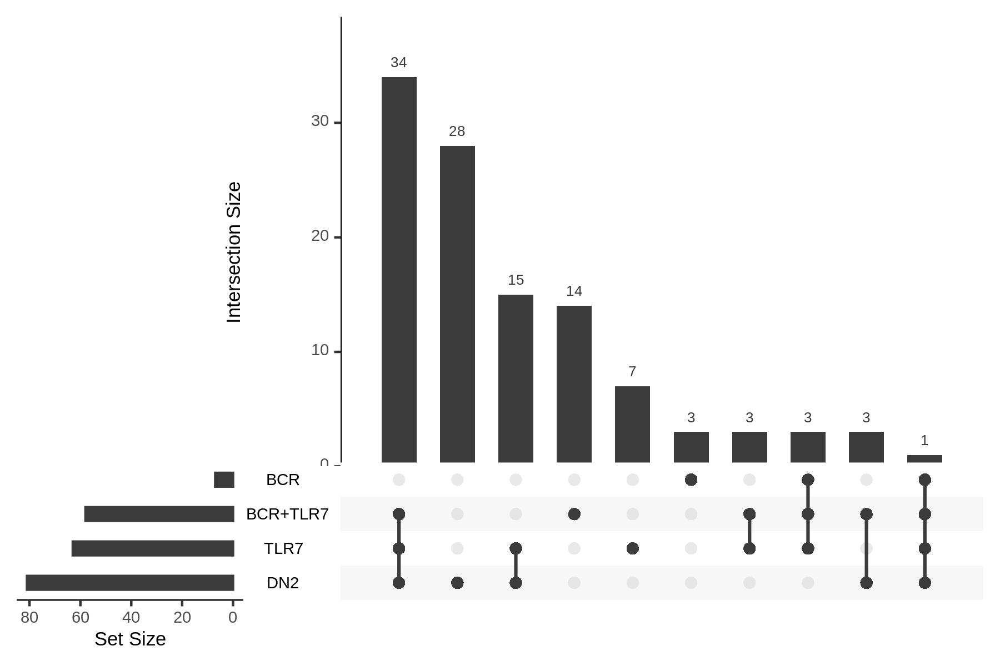<!-- -->

Extract B cells
---------------

    stims_24 <- c("day0", "BCR 24hr", "TLR7 24hr", "BCR+TLR7 24hr", "DN2 24hr")

    filtered_bcells <- meta_data %>%
      filter(stim %in% stims_24, ! cluster %in% c(0, 2, 6, 8))

    bcells_filt <- bcells_singlet %>%
      subset(cells = filtered_bcells$barcode)

    bcells_filt <- bcells_filt %>%
        FindVariableFeatures(nfeatures = 1000, selection.method = "vst") %>%
        ScaleData(., features = rownames(.)) %>%
        RunPCA(., features = VariableFeatures(.)) %>%
        RunUMAP(dims = 1:20, verbose = FALSE) %>%
        FindNeighbors(dims = 1:20, verbose = FALSE) %>%
        FindClusters(resolution = 0.5, verbose = FALSE)

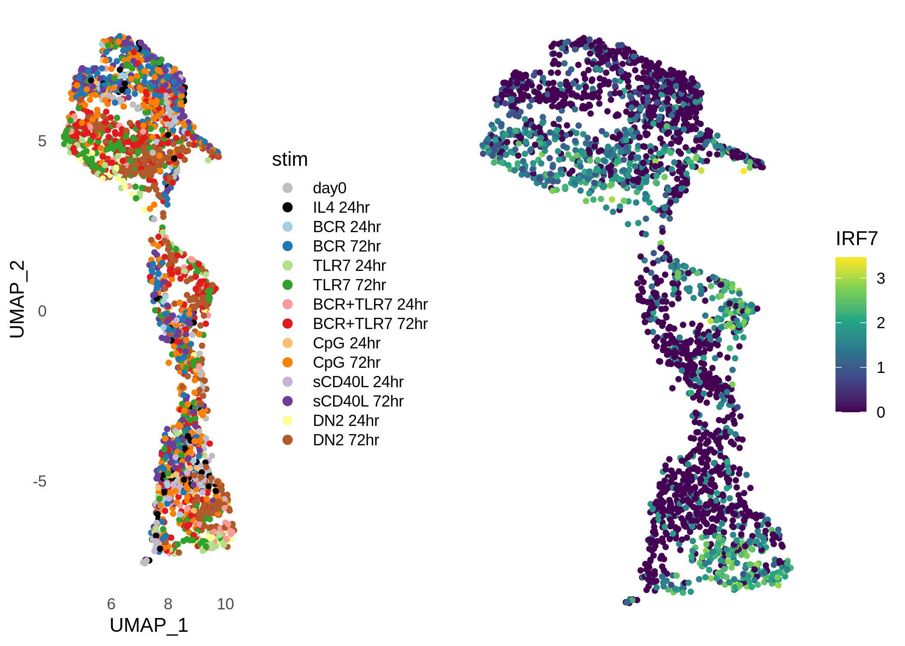<!-- -->

### Marker genes at 24 hours in respect to day 0

### Marker genes across all conditions at 24h and day 0

    Idents(bcells_filt) <- "HTO_maxID"

    all_markers_df <- 
      FindAllMarkers(bcells_filt,
                     only.pos = TRUE,
                     min.pct = 0.1,
                     logfc.threshold = 1) %>%
      as_tibble() %>%
      filter(p_val_adj < 0.05)

<!-- -->

    bcr_markers <- 
        FindMarkers(bcells_filt, 
                       ident.1 = "BCR 24hr",
                       ident.2 = "day0",
                       only.pos = TRUE,
                       min.pct = 0.1,
                       logfc.threshold = 0.5) %>%
        rownames_to_column("gene") %>%
        as_tibble()

    tlr_markers <- 
        FindMarkers(bcells_filt, 
                       ident.1 = "TLR7 24hr",
                       ident.2 = "day0",
                       only.pos = TRUE,
                       min.pct = 0.1,
                       logfc.threshold = 0.5) %>%
        rownames_to_column("gene") %>%
        as_tibble()

    bcrtlr_markers <- 
        FindMarkers(bcells_filt, 
                       ident.1 = "BCR+TLR7 24hr",
                       ident.2 = "day0",
                       only.pos = TRUE,
                       min.pct = 0.1,
                       logfc.threshold = 0.5) %>%
        rownames_to_column("gene") %>%
        as_tibble()

    dn2_markers <- 
        FindMarkers(bcells_filt, 
                       ident.1 = "DN2 24hr",
                       ident.2 = "day0",
                       only.pos = TRUE,
                       min.pct = 0.1,
                       logfc.threshold = 0.5) %>%
        rownames_to_column("gene") %>%
        as_tibble()

    markers_df <-
      bind_rows("BCR" = bcr_markers,
                "TLR7" = tlr_markers,
                "BCR+TLR7" = bcrtlr_markers,
                "DN2" = dn2_markers,
                .id = "stim") %>%
      filter(p_val_adj < 0.05) %>%
      select(-p_val, -p_val_adj)

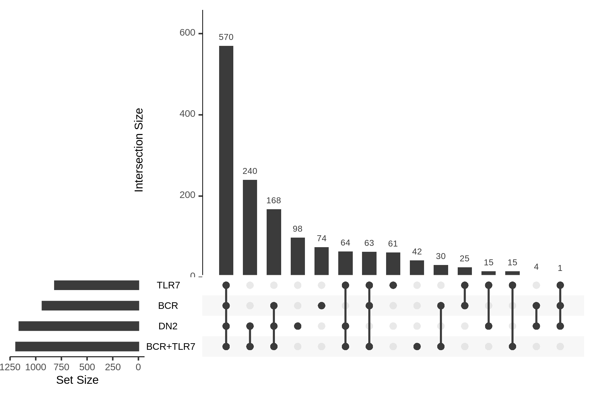<!-- -->

<!-- -->

### Gene ontology analysis of shared and exclusive genes

<!-- -->

ADTs
----

<!-- -->
