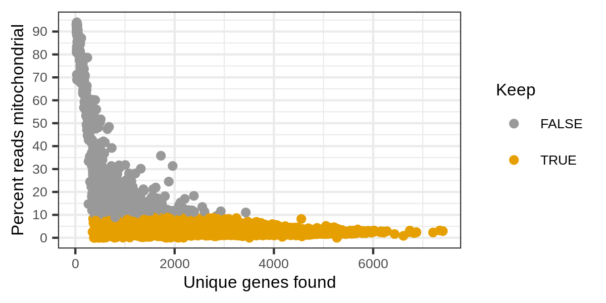
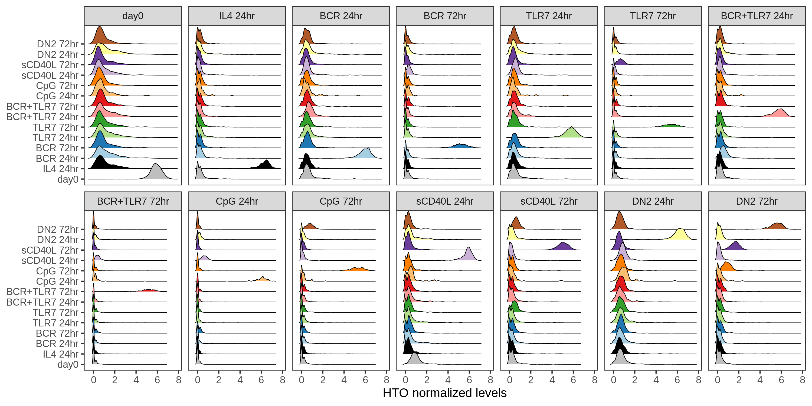
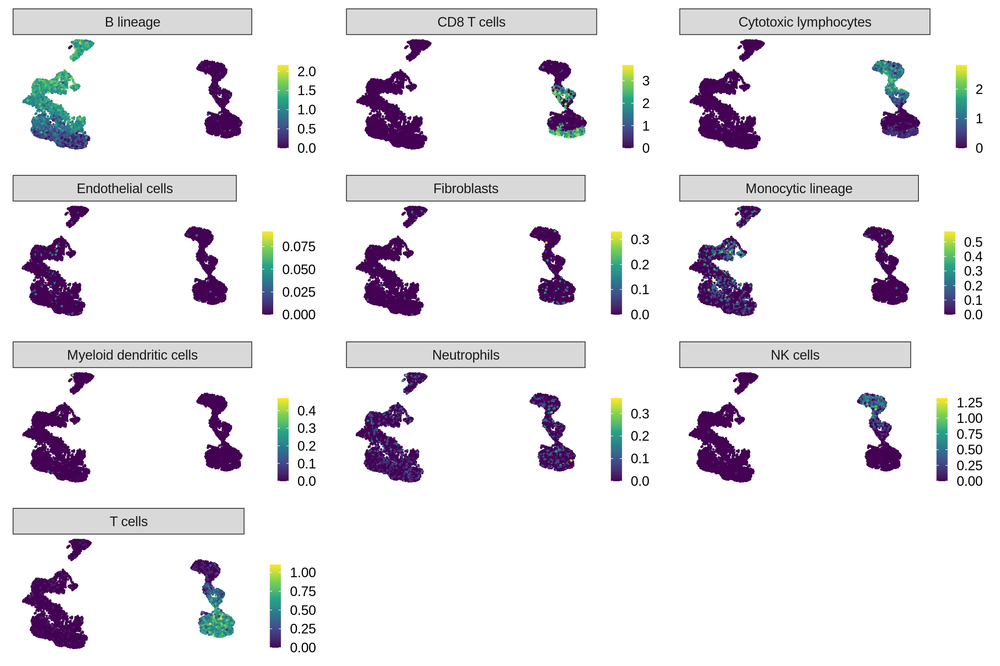
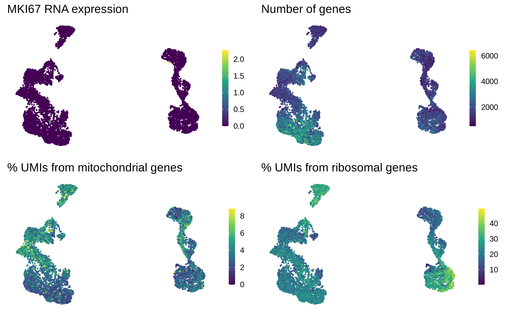
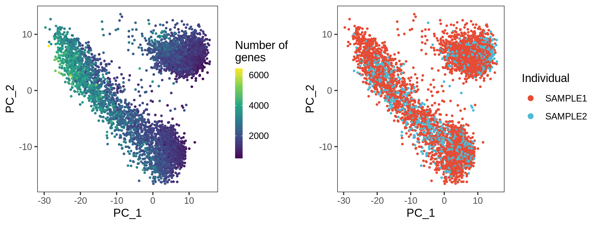
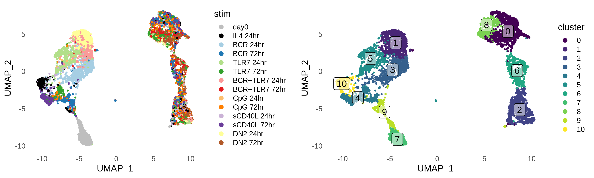
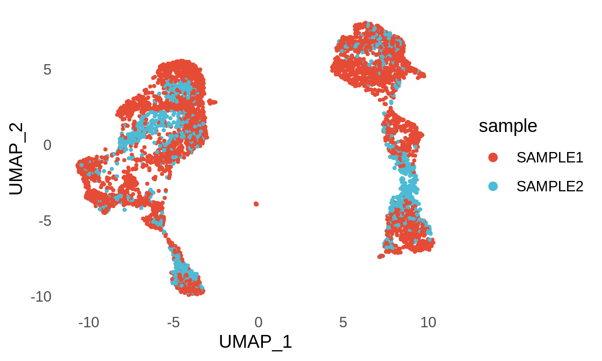
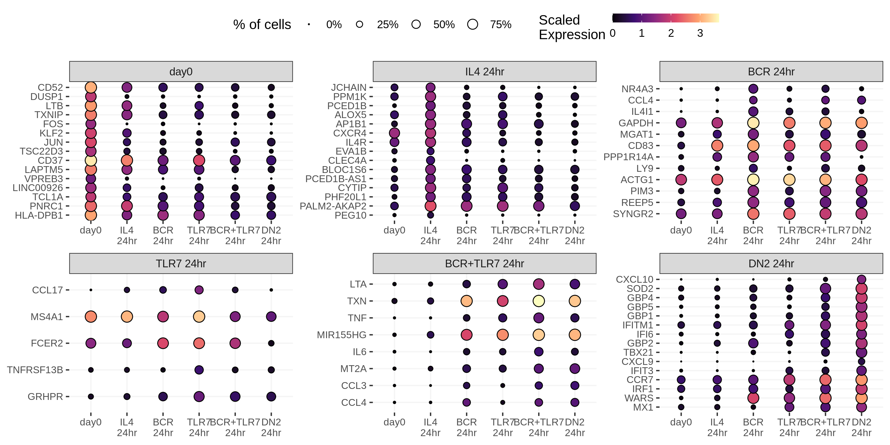
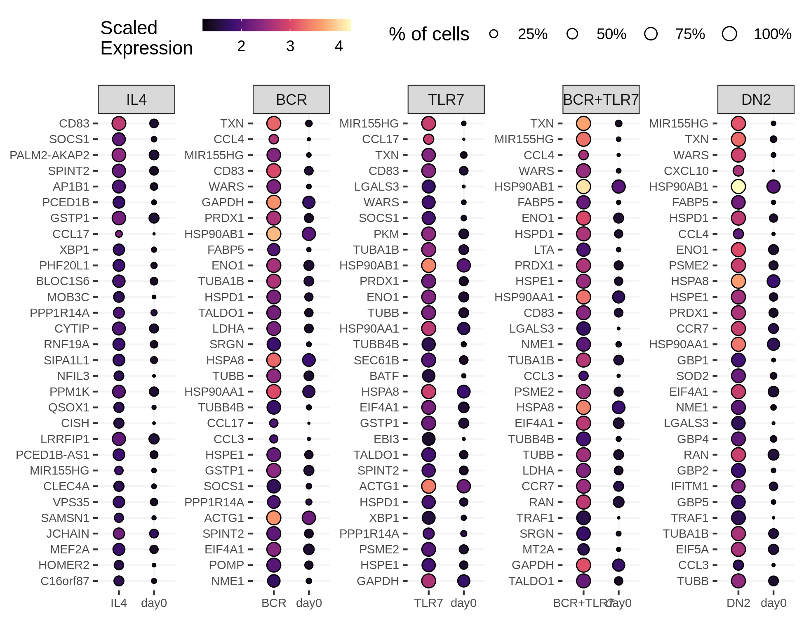
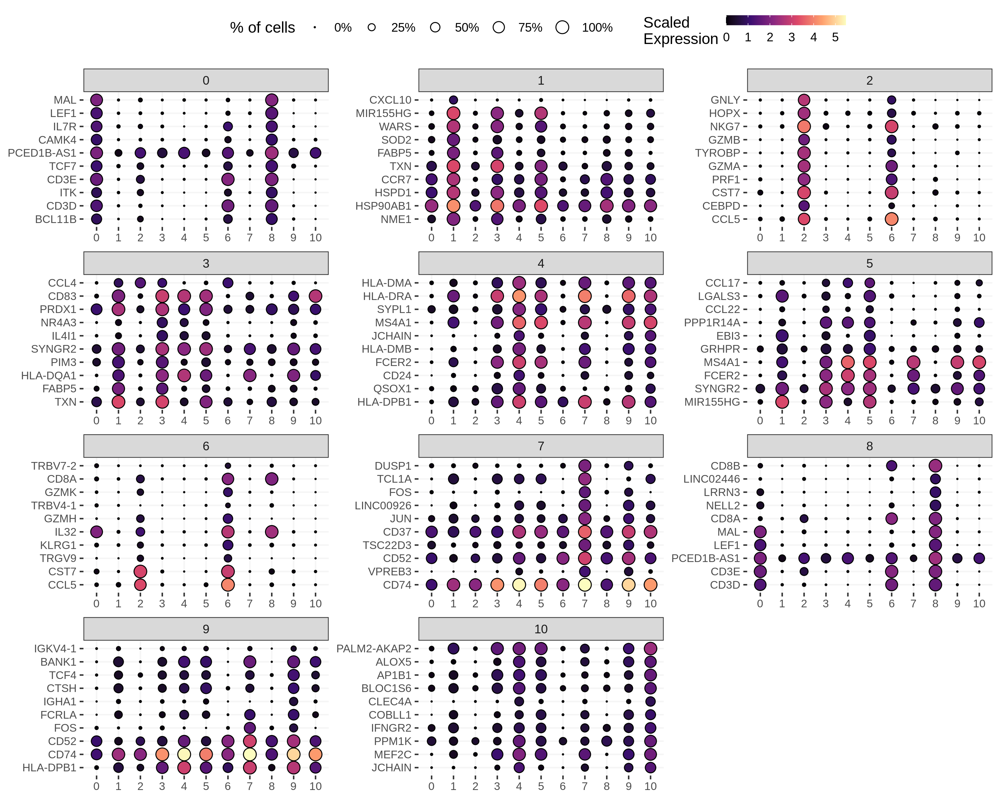

CITE-seq Pilot
================

## Packages

``` r
# single-cell data analysis
library(Seurat)
library(miQC)
library(scater)
library(MCPcounter)

# Data wrangling
library(tidyverse)

# Plotting
library(tidytext)
library(ggridges)
library(RColorBrewer)
library(cowplot)
```

## Cell Ranger data

``` r
cellranger_dir <- 
    file.path("/lab-share/IM-Gutierrez-e2/Public/Lab_datasets/CITEseq_pilot_2",
    "SN0257788/broad/hptmp/curtism/bwh10x/KW10170_Maria/220617_10X_KW10170_bcl",
    "cellranger-6.1.1/GRCh38/BRI-1743_hashing/outs/filtered_feature_bc_matrix") 

features_df <- file.path(cellranger_dir, "features.tsv.gz") %>%
    read_tsv(col_names = c("gene_id", "gene_name", "phenotype"))

mt_genes <- features_df %>%
    filter(phenotype == "Gene Expression", 
           grepl("^MT-", gene_name)) %>%
    pull(gene_id)

ribo_genes <- features_df %>%
    filter(phenotype == "Gene Expression", 
           grepl("^RPS\\d+|^RPL\\d+", gene_name)) %>%
    pull(gene_id)

data10x <- Read10X(cellranger_dir, gene.column = 1)
```

## Create the Seurat object

``` r
gene_exp <- data10x[["Gene Expression"]]

antibody <- data10x[["Antibody Capture"]] %>%
    .[!grepl("^Hashtag", rownames(.)), ] 

rownames(antibody) <- rownames(antibody) %>%
    sub("_prot$", "", .) %>%
    gsub("_", ".", .)

hashtags <- data10x[["Antibody Capture"]] %>%
    .[grepl("^Hashtag", rownames(.)), ]

rownames(hashtags) <- 
    c("day0", 
      "IL4 24hr",
      "BCR 24hr",
      "BCR+TLR7 24hr",
      "TLR7 24hr", 
      "sCD40L 24hr",
      "CpG 24hr",
      "DN2 24hr",
      "BCR 72hr",
      "BCR+TLR7 72hr",
      "TLR7 72hr",
      "sCD40L 72hr",
      "DN2 72hr",
      "CpG 72hr")

# stims in order for plotting
stims <- c("day0", "IL4 24hr", "BCR 24hr", "BCR 72hr", "TLR7 24hr", "TLR7 72hr",
           "BCR+TLR7 24hr", "BCR+TLR7 72hr", "CpG 24hr", "CpG 72hr", 
           "sCD40L 24hr", "sCD40L 72hr", "DN2 24hr", "DN2 72hr")

stims_colors <- c("grey", "black", brewer.pal(12, "Paired")) %>%
  setNames(stims)


# Create object
bcells <- CreateSeuratObject(counts = gene_exp, project = "bcells")
bcells[["ADT"]] <- CreateAssayObject(counts = antibody)
bcells[["HTO"]] <- CreateAssayObject(counts = hashtags)

# Normalize
bcells <- bcells %>%
  NormalizeData(normalization.method = "LogNormalize", margin = 2) %>%
  NormalizeData(assay = "HTO", normalization.method = "CLR", margin = 2) %>%
  NormalizeData(assay = "ADT", normalization.method = "CLR", margin = 2)

bcells[["percent_mt"]] <- PercentageFeatureSet(bcells, features = mt_genes)
bcells[["percent_ribo"]] <- PercentageFeatureSet(bcells, features = ribo_genes)

# demuxlet result
demuxlet_df <-
  "/lab-share/IM-Gutierrez-e2/Public/vitor/lupus/bcell_scrna/pilot_2/demuxlet/demuxlet_allsnps.best" %>%
  read_tsv() %>%
  select(barcode = BARCODE, best = BEST) %>%
  extract(best, c("status", "sample"), "([^-]+)-(.+)")

demuxlet_sng <- demuxlet_df %>%
  filter(status == "SNG")
```

## QC

Here we use the miQC package to model the percentage of mitochondrial
reads and number of genes, in order to identify and remove compromised
cells.

``` r
bcells_sce <- bcells %>%
    as.SingleCellExperiment() %>%
    addPerCellQC(subsets = list(mito = mt_genes))

model <- mixtureModel(bcells_sce)

plotFiltering(bcells_sce, model, posterior_cutoff = 0.8) +
  scale_y_continuous(breaks = scales::pretty_breaks(8)) +
  theme_bw()
```

<!-- -->

## Remove compromised cells

``` r
bcells_sce <- filterCells(bcells_sce, model)
```

    # Removing 723 out of 10562 cells.

``` r
cells_keep <- rownames(colData(bcells_sce))
bcells <- subset(bcells, cells = cells_keep)
```

## Demultiplex given the individual genotypes

``` r
bcells_sng <- subset(bcells, cells = demuxlet_sng$barcode)
```

## Demultiplex cells based on HTO

``` r
bcells_sng <- HTODemux(bcells_sng, assay = "HTO", positive.quantile = 0.99)

table(bcells_sng$HTO_classification.global)
```

    # 
    #  Doublet Negative  Singlet 
    #     3697       32     5591

``` r
Idents(bcells_sng) <- "HTO_maxID"
```

<!-- -->

<!-- -->

## Extract Singlets

``` r
Idents(bcells_sng) <- "HTO_classification.global"

bcells_singlet <- subset(bcells_sng, idents = "Singlet")

table(bcells_singlet@meta.data$HTO_maxID)[stims]
```

    # 
    #          day0      IL4 24hr      BCR 24hr      BCR 72hr     TLR7 24hr     TLR7 72hr BCR+TLR7 24hr BCR+TLR7 72hr      CpG 24hr      CpG 72hr   sCD40L 24hr   sCD40L 72hr      DN2 24hr      DN2 72hr 
    #           607           325           574           474           498           427           372           356            48           404           192           531           447           336

## Number of cells from each sample

<!-- -->

## Feature quantifications

<!-- -->

## PCA

``` r
bcells_singlet <- bcells_singlet %>%
    FindVariableFeatures(nfeatures = 2000, selection.method = "vst") %>%
    ScaleData(., features = rownames(.)) %>%
    RunPCA(., features = VariableFeatures(.))
```

<!-- -->

### Number of genes and cells per individual

<!-- -->

## UMAP and clustering

``` r
bcells_singlet <- bcells_singlet %>%
  RunUMAP(dims = 1:20, verbose = FALSE) %>%
  FindNeighbors(dims = 1:20, verbose = FALSE) %>%
  FindClusters(resolution = 0.5, verbose = FALSE)
```

<!-- -->

<!-- -->

### Hashtag staining

<!-- -->

### Total of B and non-B cells

<!-- -->

### Cell type annotation with MCP counter

<!-- -->

### Cell cycling

<!-- -->

## Marker genes for Seurat clusters (whole data, res = 0.5)

``` r
cluster_markers <- 
    FindAllMarkers(bcells_singlet, 
                   only.pos = TRUE,
                   min.pct = 0.05,
                   logfc.threshold = 1) %>%
    as_tibble() %>%
    filter(p_val_adj < 0.05)
```

## Marker genes per cluster

<!-- -->

## ADTs

<!-- -->
