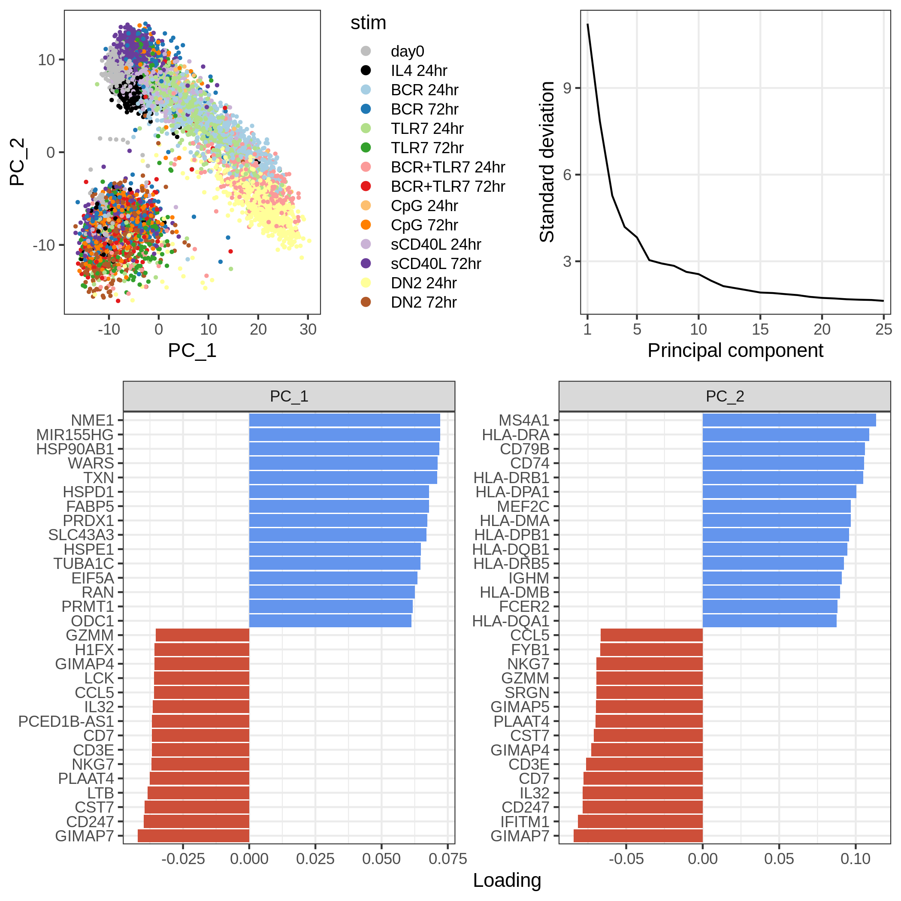
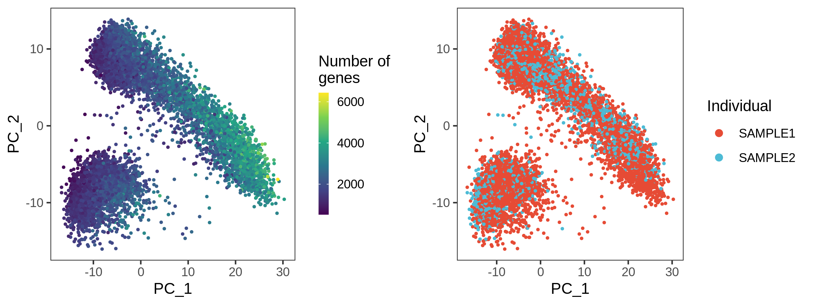
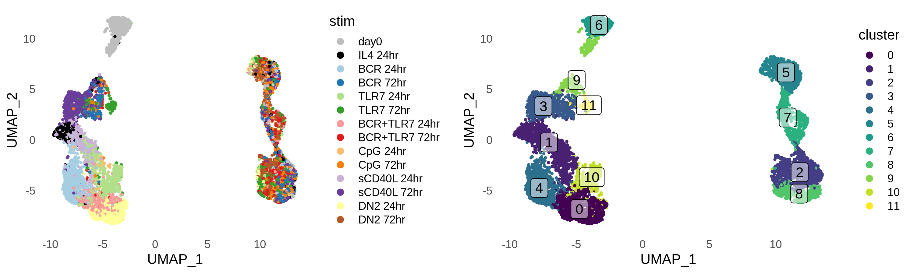
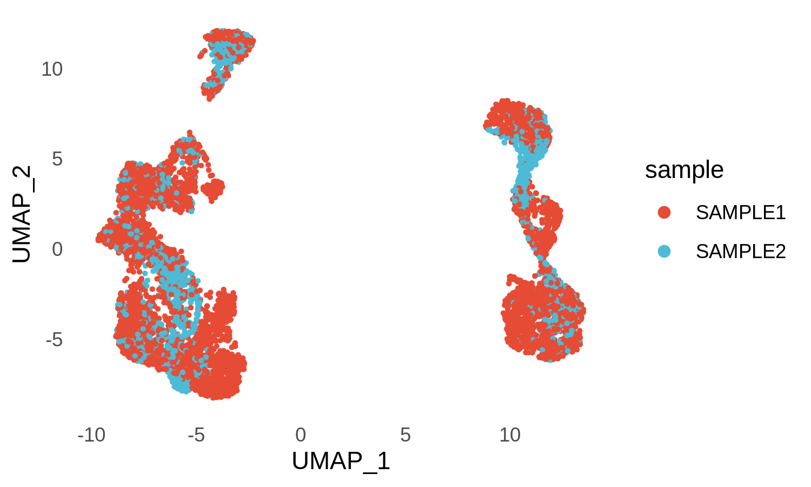
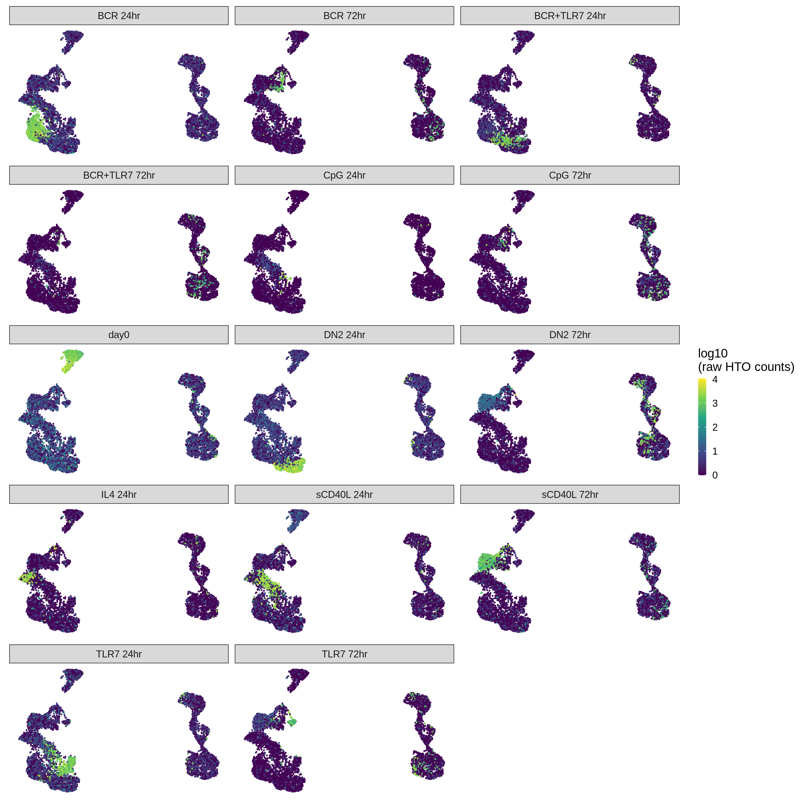
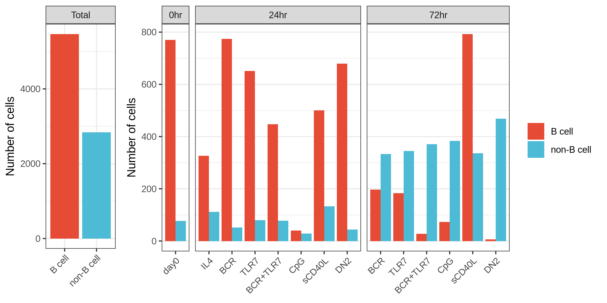
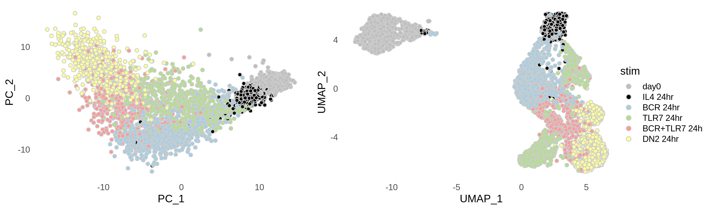
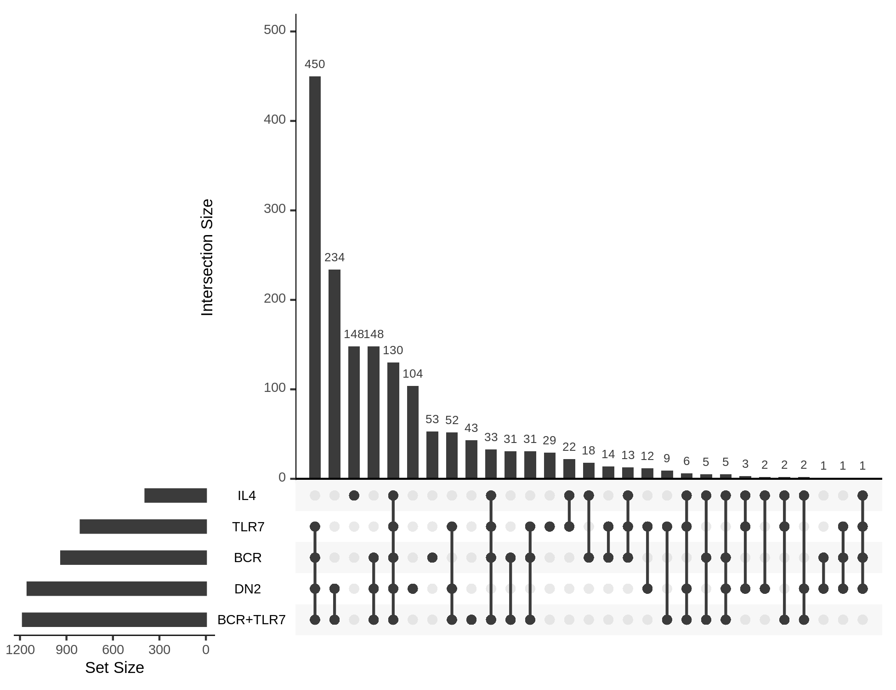
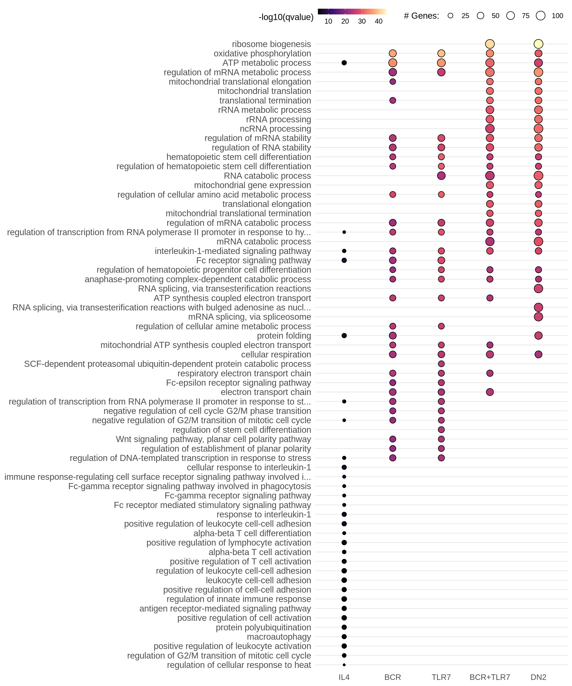

CITE-seq Pilot
================

Packages
--------

    # single-cell data analysis
    library(Seurat)
    library(miQC)
    library(scater)
    library(MCPcounter)

    # Gene Ontology
    library(clusterProfiler)
    library(org.Hs.eg.db)

    # Data wrangling
    library(tidyverse)

    # Plotting
    library(tidytext)
    library(UpSetR)
    library(ggridges)
    library(RColorBrewer)
    library(scico)
    library(ggsci)
    library(cowplot)

QC and data cleaning
--------------------

This process is describe in the README file in the parent directory.

Briefly, we used a custom demultiplexing approach based on HTO counts.
We extracted cells classified by singlets by both this approach,
Scrublet, and demuxlet.

    bcells_singlet <- readRDS("../data/pilot2.Rdata")

PCA
---

    bcells_singlet <- bcells_singlet %>%
        FindVariableFeatures(nfeatures = 2000, selection.method = "vst") %>%
        ScaleData(., features = rownames(.)) %>%
        RunPCA(., features = VariableFeatures(.))

<!-- -->

### Number of genes and cells per individual

<!-- -->

<!-- -->

UMAP and clustering
-------------------

    bcells_singlet <- bcells_singlet %>%
      RunUMAP(dims = 1:20, verbose = FALSE) %>%
      FindNeighbors(dims = 1:20, verbose = FALSE) %>%
      FindClusters(resolution = 0.5, verbose = FALSE)

<!-- -->

<!-- -->

### Hashtag staining

<!-- -->

### Total of B and non-B cells

<!-- -->

### Cell type annotation with MCP counter

<!-- -->

### Cell cycling

<!-- -->

Extract B cells
---------------

    stims_24 <- c("day0", "BCR 24hr", "TLR7 24hr", "BCR+TLR7 24hr", "DN2 24hr")

    filtered_bcells <- umap_df %>%
      filter(stim %in% stims_24, UMAP_1 < 0)

    bcells_filt <- bcells_singlet %>%
      subset(cells = filtered_bcells$barcode)

    bcells_filt <- bcells_filt %>%
        FindVariableFeatures(nfeatures = 1000, selection.method = "vst") %>%
        ScaleData(., features = rownames(.)) %>%
        RunPCA(., features = VariableFeatures(.)) %>%
        RunUMAP(dims = 1:20, verbose = FALSE) %>%
        FindNeighbors(dims = 1:20, verbose = FALSE) %>%
        FindClusters(resolution = 0.5, verbose = FALSE)

<!-- -->

### Marker genes at 24 hours in respect to day 0

### Marker genes across all conditions at 24h and day 0

    Idents(bcells_filt) <- "HTO_maxID"

    all_markers_df <- 
      FindAllMarkers(bcells_filt,
                     only.pos = TRUE,
                     min.pct = 0.1,
                     logfc.threshold = 1) %>%
      as_tibble() %>%
      filter(p_val_adj < 0.05)

<!-- -->

    bcr_markers <- 
        FindMarkers(bcells_filt, 
                       ident.1 = "BCR 24hr",
                       ident.2 = "day0",
                       only.pos = TRUE,
                       min.pct = 0.1,
                       logfc.threshold = 0.5) %>%
        rownames_to_column("gene") %>%
        as_tibble()

    tlr_markers <- 
        FindMarkers(bcells_filt, 
                       ident.1 = "TLR7 24hr",
                       ident.2 = "day0",
                       only.pos = TRUE,
                       min.pct = 0.1,
                       logfc.threshold = 0.5) %>%
        rownames_to_column("gene") %>%
        as_tibble()

    bcrtlr_markers <- 
        FindMarkers(bcells_filt, 
                       ident.1 = "BCR+TLR7 24hr",
                       ident.2 = "day0",
                       only.pos = TRUE,
                       min.pct = 0.1,
                       logfc.threshold = 0.5) %>%
        rownames_to_column("gene") %>%
        as_tibble()

    dn2_markers <- 
        FindMarkers(bcells_filt, 
                       ident.1 = "DN2 24hr",
                       ident.2 = "day0",
                       only.pos = TRUE,
                       min.pct = 0.1,
                       logfc.threshold = 0.5) %>%
        rownames_to_column("gene") %>%
        as_tibble()

    markers_df <-
      bind_rows("BCR" = bcr_markers,
                "TLR7" = tlr_markers,
                "BCR+TLR7" = bcrtlr_markers,
                "DN2" = dn2_markers,
                .id = "stim") %>%
      filter(p_val_adj < 0.05) %>%
      select(-p_val, -p_val_adj)

<!-- -->

<!-- -->

### Gene ontology analysis of shared and exclusive genes

<!-- -->

ADTs
----

<!-- -->
