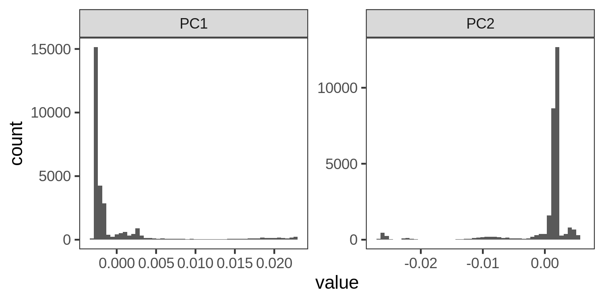
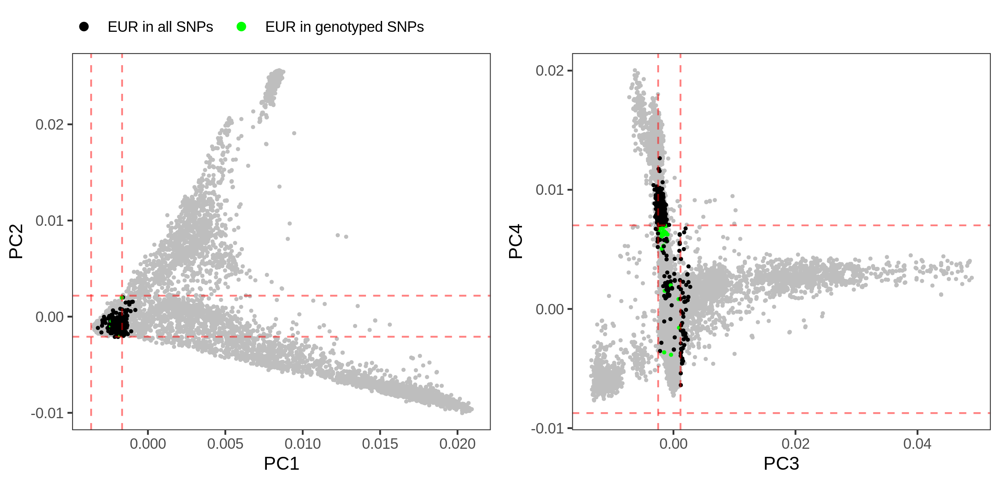
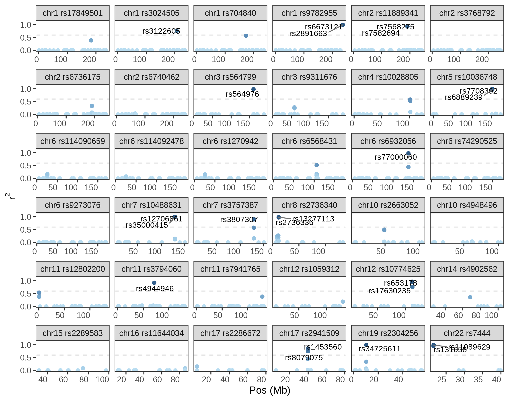
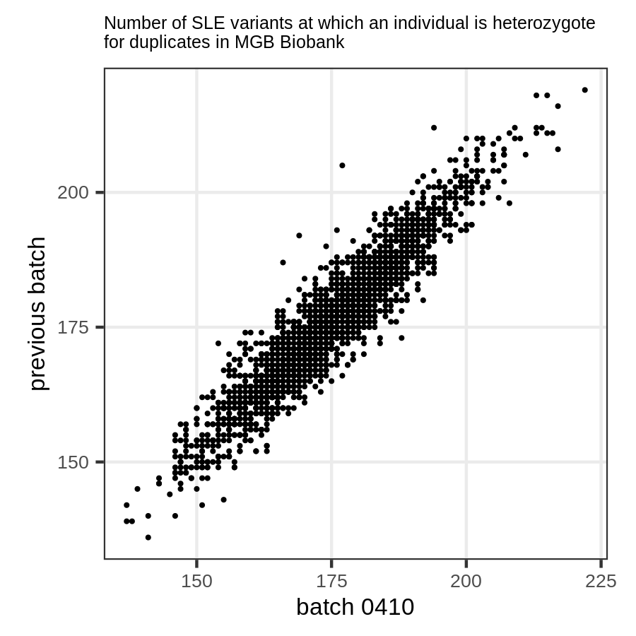

```{r setup, include=FALSE}
library(knitr)
knitr::opts_chunk$set(echo = FALSE, warning=FALSE, message=FALSE)
```

## 2. MGB Biobank analysis

### 2.1. Goals

- Among the individuals in MGB Biobank, select those who carry more European ancestry;
- Among those, select individuals who are more heterozygous at SLE loci;
- We will use the SLE loci reported by Bentham et al. (2015), Langefeld et al. (2017), and the TLR7 variant (see Teruel & Alarcon-Riquelme, 2016);
- Recruit these individuals to donate samples;
- Perform transcriptomic (ASE) and other analyses in multiple timepoints and stims;
- Identify dysregulated loci.

### 2.2. Input data

- MGB: 

| Batch | N     | Total Variants | Genotyped Variants | Source          |
|:-----:|:-----:|:--------------:|:------------------:|:---------------:|
| 0401  | 4,921 | ~79.1M         | 976K               | MEGA_TopMed     |
| 0402  | 5,336 | ~80.1M         | 1.1M               | MEGAEX_TopMed   |
| 0403  | 4,780 | ~79.8M         | 1.1M               | MEG_A1_A_TopMed |
| 0404  | 5,016 | ~80.9M         | 1.1M               | MEG_A1_B_TopMed |
| 0405  | 5,491 | ~81.9M         | 1.1M               | MEG_C_TopMed    |
| 0406  | 5,143 | ~80.0M         | 1.1M               | MEG_D_TopMed    |
| 0407  | 4,847 | ~76.4M         | 1.1M               | MEG_E_TopMed    |
| 0408  | 866   | ~40.0M         | 1.1M               | MEG_X1_TopMed   |
| 0410  | 13,140| ~105.8M        | 231K               | GSA_A_TopMed    | 

- 1000 Genomes data:
  - ~2,500 individuals low coverage data realigned to GRCh38 (not NYGC version).

### 2.3. Methods

The workflow for the analyses below is described in `workflow.md`.

- Selection of individuals who are genetically females
  - Compute individual-level heterozygosity with vcftools;
  - After visual inspection of the homozygosity distribution, select individuals with <0.985 homozygosity.

- VCF processing:
  - Remove variants with any missing genotypes;
  - Select only biallelic SNPs with MAF >= 0.1;
  - Remove A/T and C/G genotypes due to potential strand ambiguity;
  - Remove duplicates (these can be multiallelic variants or multiple variants with same position);
  - Select variants with the same position and alleles in both datasets;
  - Filter both datasets for the common set of variants;
  - Merge VCFs and run LD pruning for r2 < 0.1;
  - Concatenate VCFs for each chromosome into a single VCF.

- PCA:
  - plink pca

- ADMIXTURE
  - Unsupervised analysis on 1000 Genomes data;
  - Project MGB individuals onto 1000G reference panel.

- SLE risk variants
  - We take all variants at FDR<5% from [Langefeld et al. (2017)](http://www.nature.com/articles/ncomms16021);
  - For each individual, we compute an overall heterozygosity score at SLE variants.


### 2.4. Results

#### Select females

We extracted the genotyped variants from the chrX VCF (not imputed). 

After visual inspection of the plot below, we select individuals with homozygosity < 0.95, which we assume to be females. That includes ~55% of the individuals.

```{r sex}
include_graphics("./plots/chrX_het.png")
```


#### Ancestry information from genotype data

##### PCA

The PCA plot shows the MGB individuals in comparison with the 1000 Genomes data. We can see that individuals are distributed according to the 5 main continental groups. 

```{r pca_genos, echo=FALSE}
include_graphics("./plots/pca.png")
```

We can really see that on the plot above, but most individuals appear to have high European ancestry.


```{r}

```


##### Selecting individuals with high European ancestry

In order to select individuals with European ancestry given PC coordinates, we gate the PCA plot based on the range of values for PC1–PC4 in the 1000 Genomes European set.

```{r pca_selection}
include_graphics("./plots/pca_eur.png")
```

##### Temporary analysis: PCA with genotyped variants only

PCA with ~53K variants that we have in common across arrays and also 1000 Genomes, and after pruning for LD.

```{r}
include_graphics("./plots/pca_eur_genotyedvars.png")
```

```{r}

```


#### SLE variants

We selected SLE risk variants from Langefeld et al. and Bentham et al.

From Langefeld et al., we took all variants at FDR = 5%. From Bentham, we selected the variants which are not in LD with any variant in Langefeld et al. ($$r^2 < 0.6$$).

```{r bentham_ld}

```

Then, we computed a heterozygosity score that corresponds to the number of variants at which the individuals are heterozygotes.

Here is the distribution of scores among the ~19K European females. In blue we have the indiviuals that would be candidates for selection.

```{r het_score}
include_graphics("./plots/het_scores_dist.png")
```

##### Duplicates

In batch 0410 we have ~6,100 individuals who were included already in the biobank, but were apparently re-genotyped with the GSA array. These individuals have different genotypes at some loci, and that is reflected in the heterozigosity score.

```{r}

```