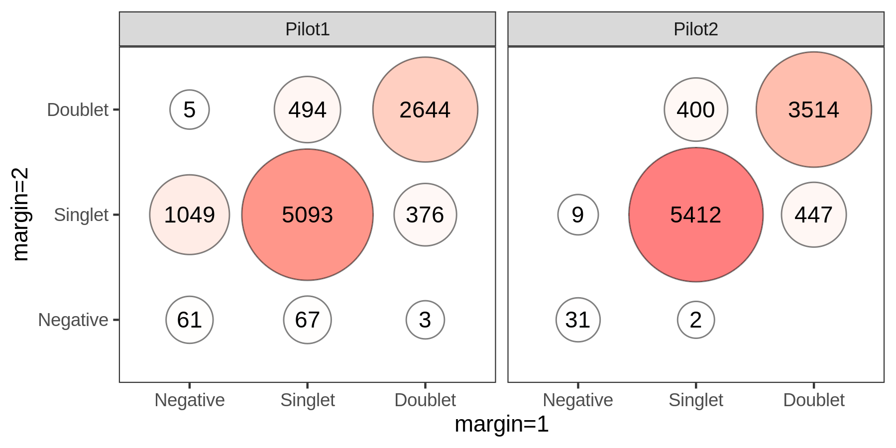
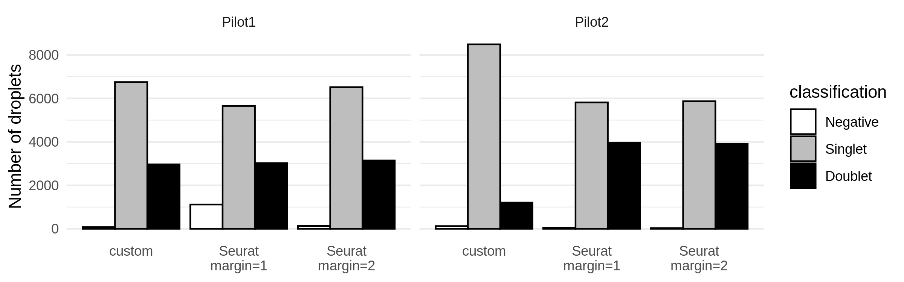
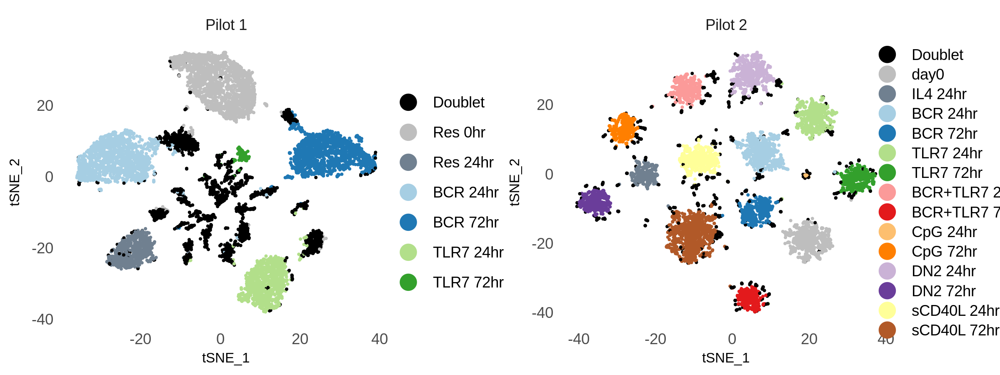
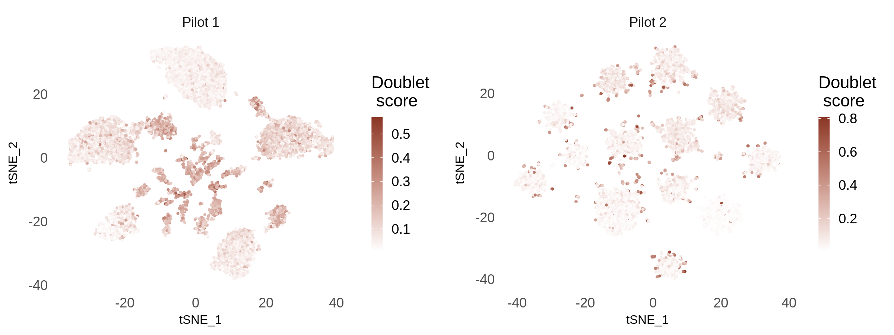
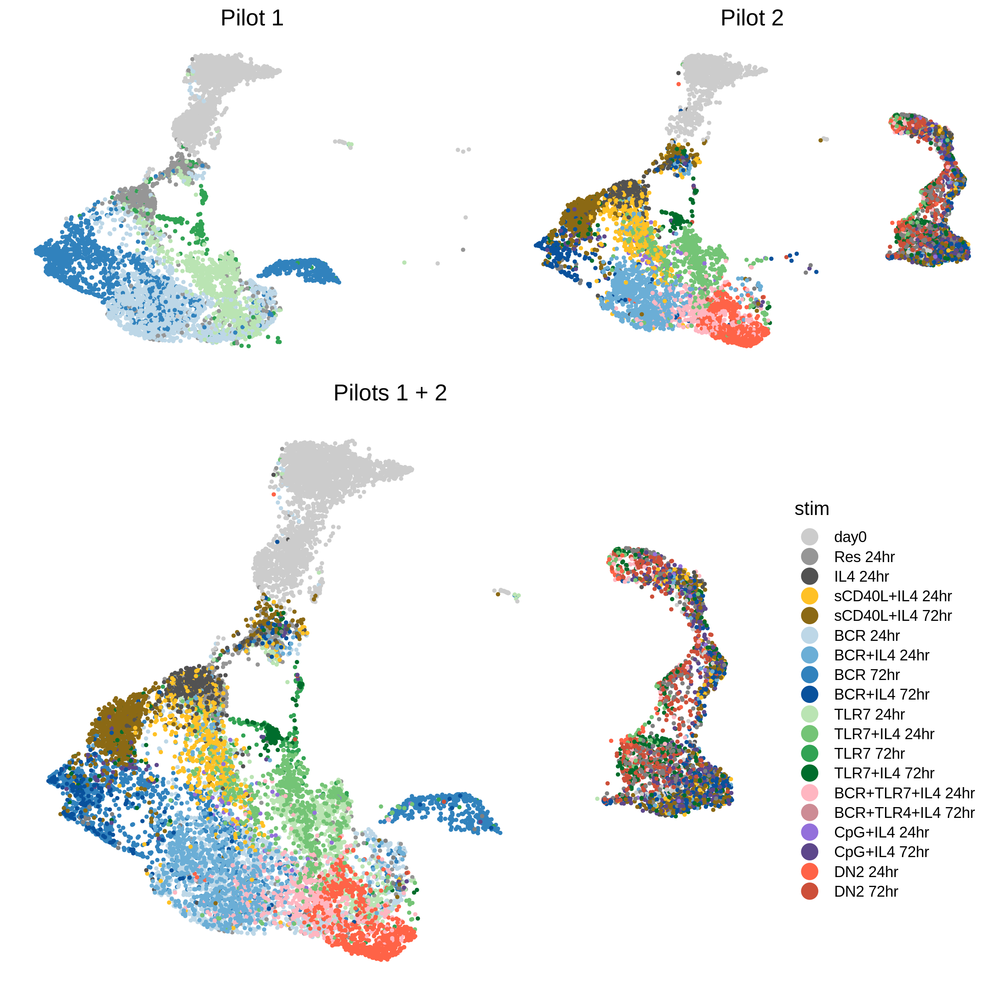

CITE-seq Pilots
================

Raw counts
----------

<!-- -->

Distribution of HTO counts
--------------------------

### Pilot 1

<!-- -->

<!-- -->

QC
--

Here we use the miQC package to model the percentage of mitochondrial
reads and number of genes, in order to identify and remove compromised
cells.

<!-- -->

    # Removing 4104 out of 13946 cells.

    # Removing 723 out of 10562 cells.

Demultiplex cells based on HTO
------------------------------

<!-- -->

<!-- -->

<!-- -->

In the plot above, we see 2 differences between pilots 1 and 2:

-   In pilot 1, HTO counts in higher, including for those cells being
    classified as “Negatives”;

-   In pilot 2, HTO counts for doublets not that higher than those for
    singlets.

Regarding the last point, doublets don’t necessarily have higher counts,
but a mixture of HTOs.

However, a lot of droplets being classified as doublets in pilot 2 have
a profile resembling singlets in respect to the mixture of HTO, as we
can see in the plots below.

<!-- -->
<!-- -->

Demultiplex by individuals’ genotypes or GMM-demux in Pilot 2
-------------------------------------------------------------

<!-- -->

Scrublet
--------

<!-- -->

Custom demultiplexing based on HTO
----------------------------------

Number of cells for custom vs Seurat demultiplex method
-------------------------------------------------------

<!-- -->

Profile of Singlets and Doublets in custom demultiplexing
---------------------------------------------------------

<!-- -->

<!-- -->

<!-- -->

Integrate Pilot 1 and Pilot 2
-----------------------------

<!-- -->
