CITE-seq Pilot
================

Packages
--------

    # single-cell data analysis
    library(Seurat)
    library(cluster)

    # Enrichment analysis
    library(clusterProfiler)
    library(org.Hs.eg.db)

    # Data wrangling
    library(tidyverse)

    # Plotting
    library(tidytext)
    library(ggridges)
    library(RColorBrewer)
    library(cowplot)
    library(UpSetR)
    library(scico)

QC and data cleaning
--------------------

This process is described in the README file in the parent directory.

Briefly, we ran a custom demultiplexing approach based on HTO counts. We
extracted cells classified as singlets by both HTO and Scrublet.

    bcells_singlet <- readRDS("../data/pilot1.Rdata")

PCA
---

    bcells_singlet <- bcells_singlet %>%
        FindVariableFeatures(nfeatures = 2000, selection.method = "vst") %>%
        ScaleData(., features = rownames(.)) %>%
        RunPCA(., features = VariableFeatures(.))

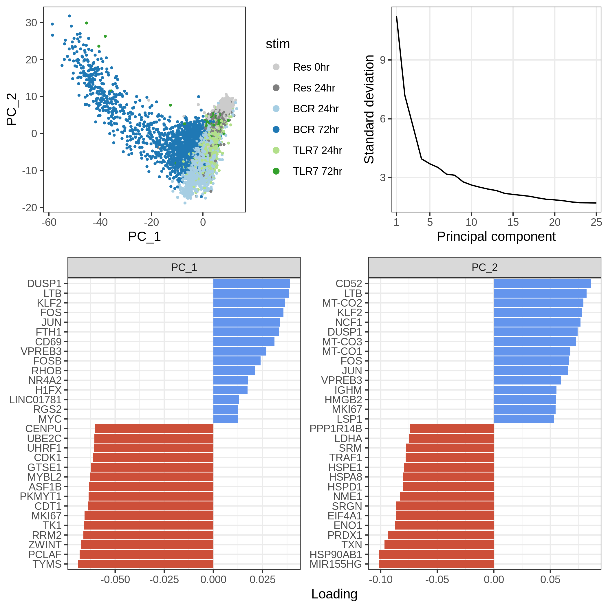<!-- -->

### Number of genes

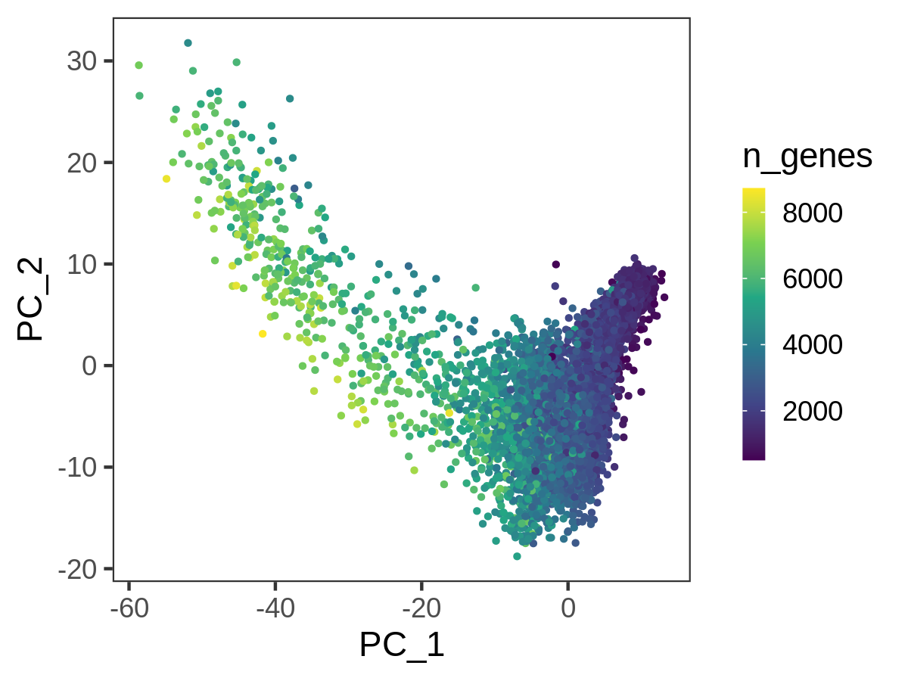<!-- -->

UMAP and clustering
-------------------

    bcells_singlet <- bcells_singlet %>%
      RunUMAP(dims = 1:20, verbose = FALSE) %>%
      FindNeighbors(dims = 1:20, verbose = FALSE) %>%
      FindClusters(resolution = 0.25, verbose = FALSE)

### Stimulus and Seurat clusters

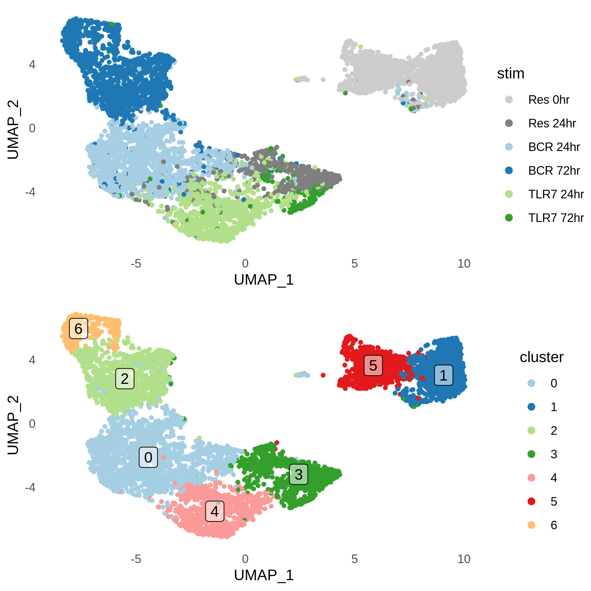<!-- -->

### Cell cycling

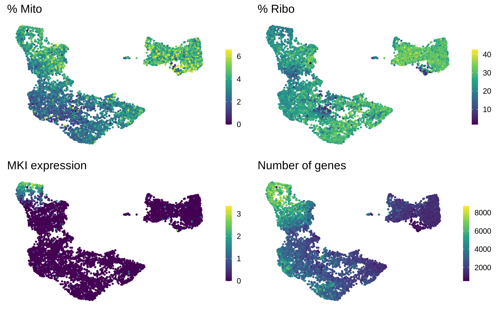<!-- -->

Marker genes for Seurat clusters (whole data, res = 0.5)
--------------------------------------------------------

    Idents(bcells_singlet) <- "seurat_clusters"

    cluster_markers <- 
        FindAllMarkers(bcells_singlet, 
                       only.pos = TRUE,
                       min.pct = 0.1,
                       logfc.threshold = 1) %>%
        as_tibble() %>%
        filter(p_val_adj < 0.05)

Marker genes per cluster
------------------------

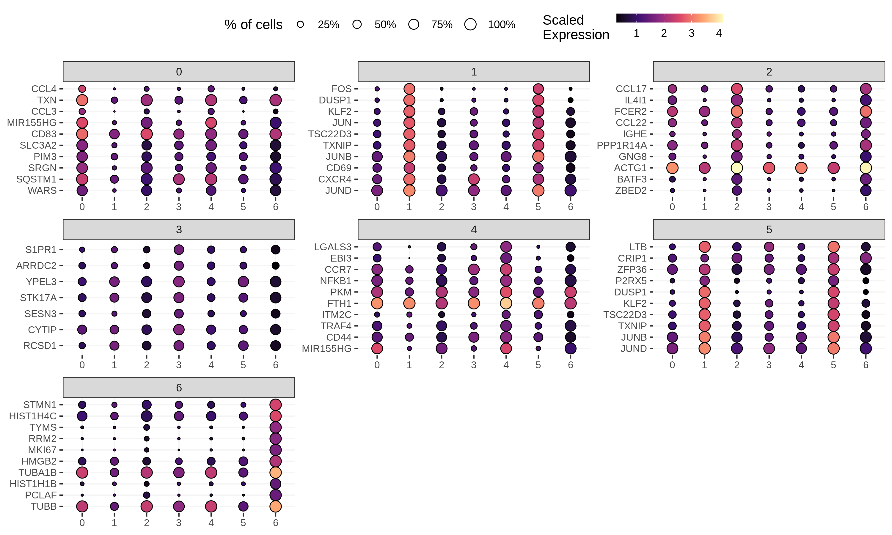<!-- -->

Marker genes for each stim condition
------------------------------------

    Idents(bcells_singlet) <- "HTO_maxID"

    bcells_markers <- 
        FindAllMarkers(bcells_singlet, 
                       only.pos = TRUE,
                       min.pct = 0.1,
                       logfc.threshold = 1) %>%
        as_tibble()

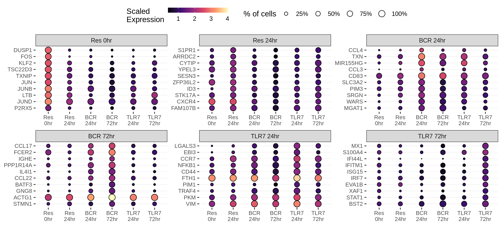<!-- -->

### DE genes between each condition and day 0

    bcr24_markers <- 
        FindMarkers(bcells_singlet, 
                       ident.1 = "BCR 24hr",
                       ident.2 = "Res 0hr",
                       only.pos = TRUE,
                       min.pct = 0.1,
                       logfc.threshold = .5) %>%
        rownames_to_column("gene") %>%
        as_tibble()

    tlr24_markers <- 
        FindMarkers(bcells_singlet, 
                       ident.1 = "TLR7 24hr",
                       ident.2 = "Res 0hr",
                       only.pos = TRUE,
                       min.pct = 0.1,
                       logfc.threshold = .5) %>%
        rownames_to_column("gene") %>%
        as_tibble()

    bcr72_markers <- 
        FindMarkers(bcells_singlet, 
                       ident.1 = "BCR 72hr",
                       ident.2 = "Res 0hr",
                       only.pos = TRUE,
                       min.pct = 0.1,
                       logfc.threshold = .5) %>%
        rownames_to_column("gene") %>%
        as_tibble()

    tlr72_markers <- 
        FindMarkers(bcells_singlet, 
                       ident.1 = "TLR7 72hr",
                       ident.2 = "Res 0hr",
                       only.pos = TRUE,
                       min.pct = 0.1,
                       logfc.threshold = .5) %>%
        rownames_to_column("gene") %>%
        as_tibble()

    markers_day0_df <-
      bind_rows("BCR 24hr" = bcr24_markers,
                "TLR7 24hr" = tlr24_markers,
                "BCR 72hr" = bcr72_markers,
                "TLR7 72hr" = tlr72_markers,
                .id = "stim") %>%
      filter(p_val_adj < 0.05) %>%
      select(-p_val, -p_val_adj)

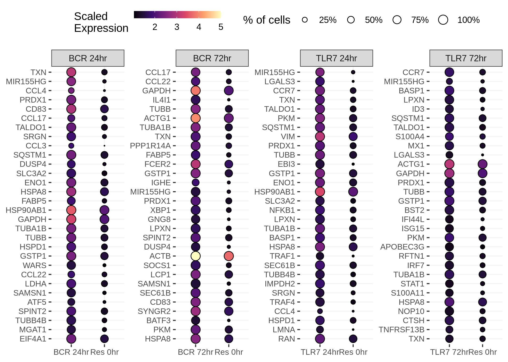<!-- -->

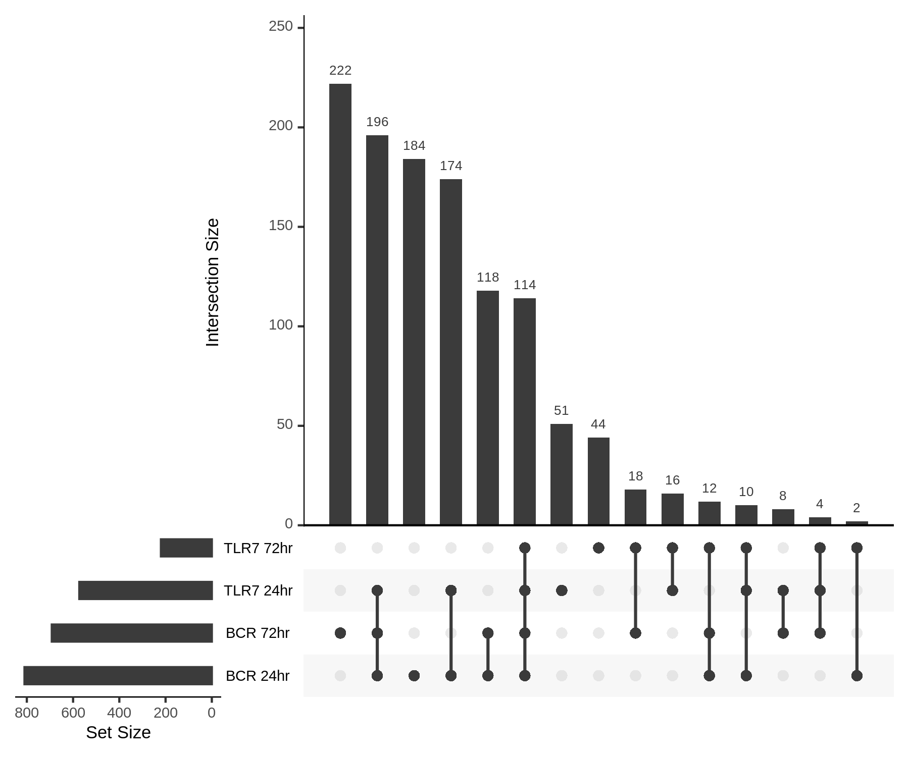<!-- -->

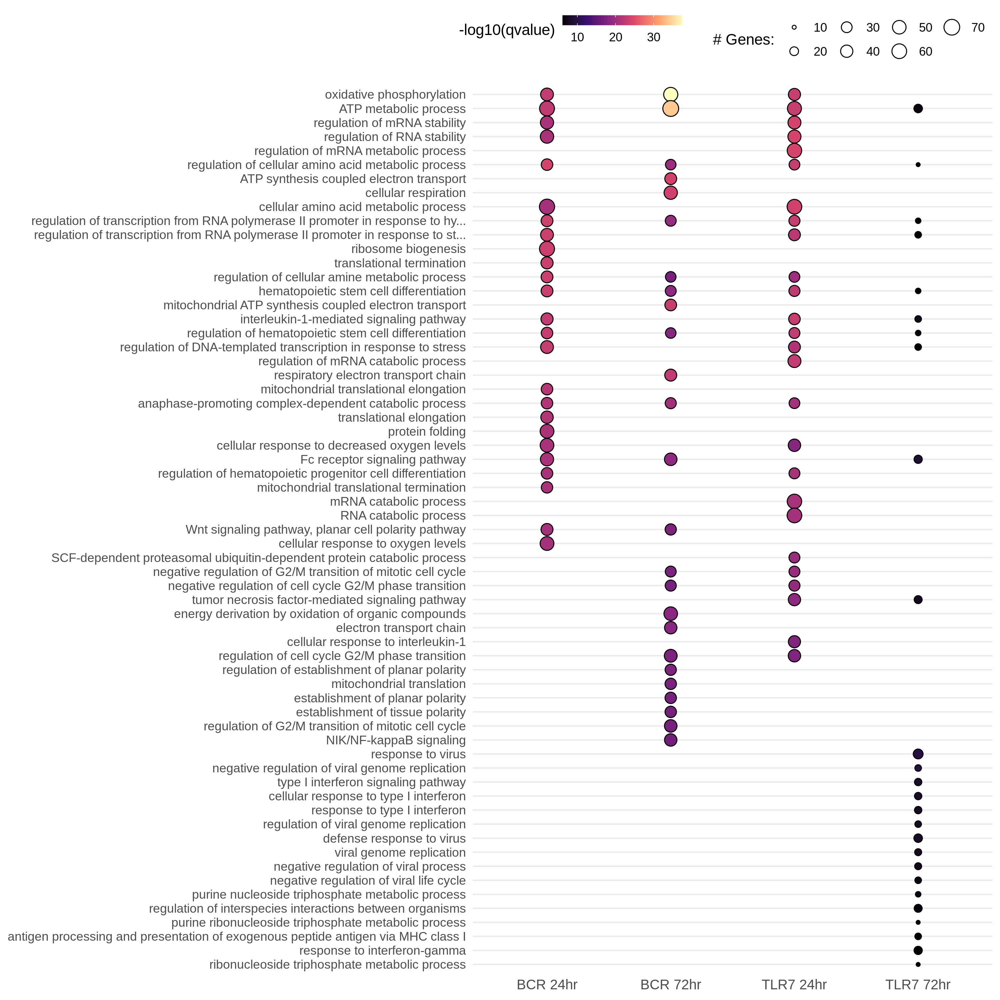<!-- -->

B cell genes (RNA)
------------------

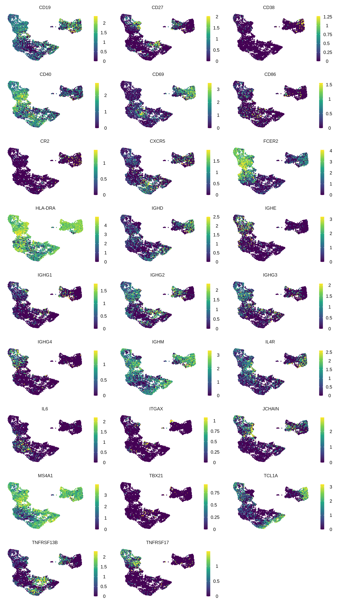<!-- -->

B cell genes (Protein)
----------------------

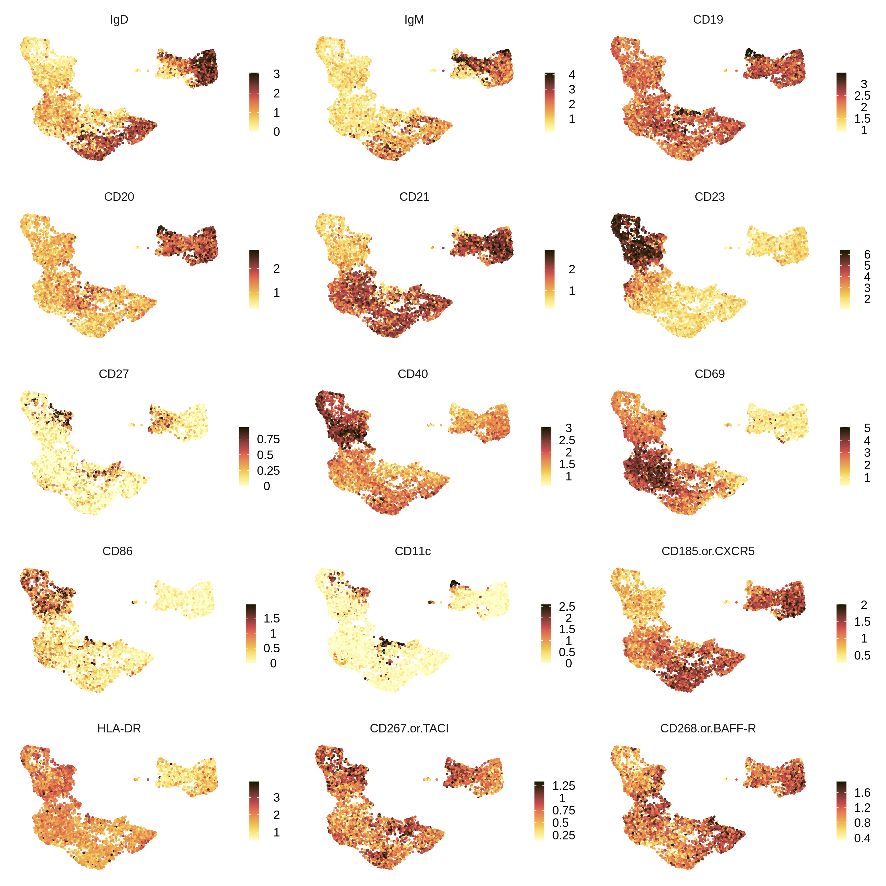<!-- -->

SLE GWAS genes
--------------

Reported genes in GWAS Catalog, with significant differential expression
(Log2FC &gt; 1, FDR = 5%) in any condition in respect to Resting 0
hours.

<!-- -->
