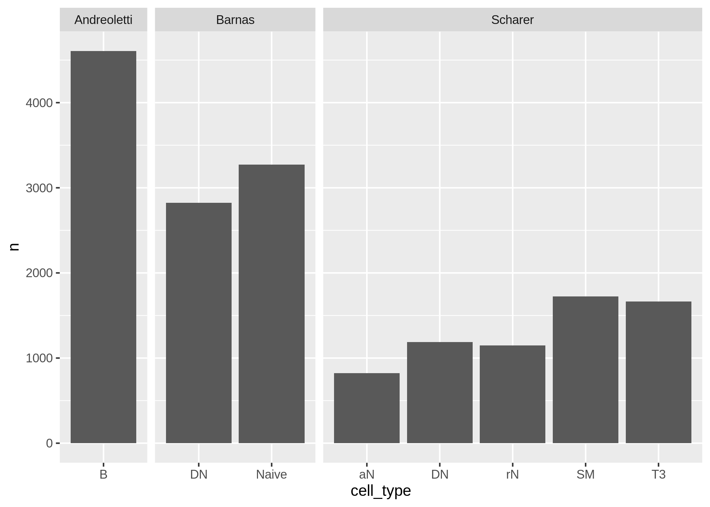
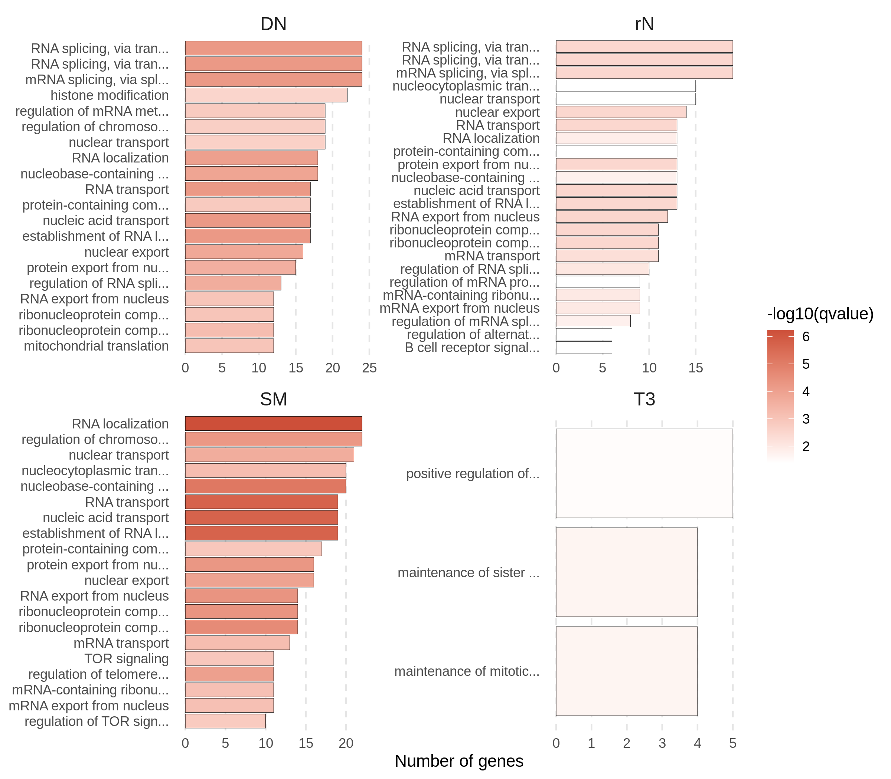

Splicing
================

## QC

<!-- -->

<!-- -->

## Number of splicing junctions passing the thresholds and tested by leafcutter

<!-- -->

## Differential splicing events between patients and controls

<!-- -->

## Comparison between Scharer et al and Barnas et al

<!-- -->

## GO enrichment

GO enrichment analysis for genes with at least one cluster with adjusted
p-value &lt; 0.1 in the Scharer dataset.

<!-- -->
