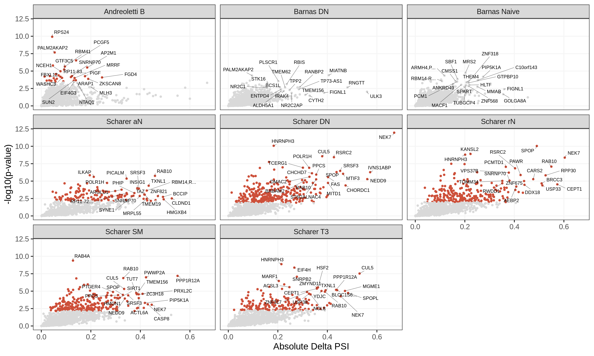
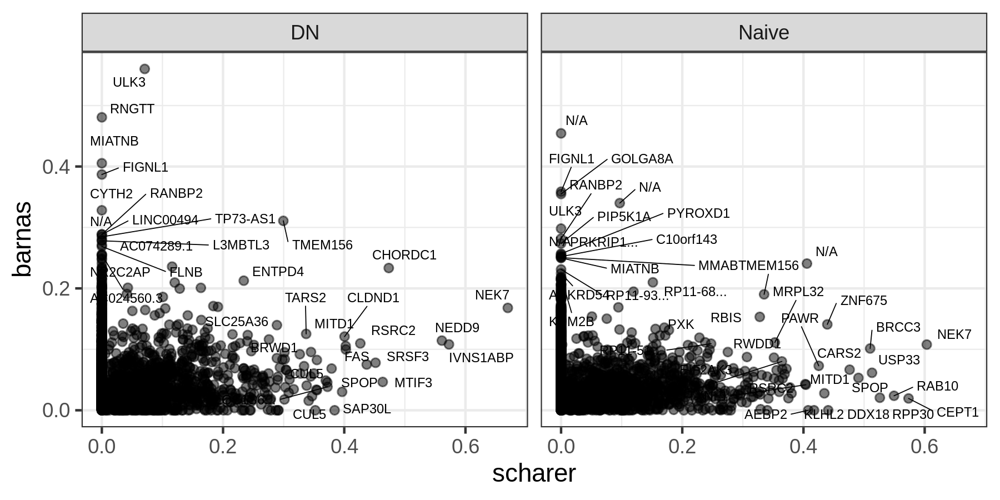

Splicing
================

## Differential splicing events between patients and controls in Scharer dataset

<!-- -->

## GO enrichment

GO enrichment analysis on genes with at least one cluster with absolute
delta PSI &gt; 0.1.

<!-- -->

## Comparison with differential transcript usage obtained with the DEXSeq pipeline

<!-- -->

## Differentially spliced genes that are also GWAS genes

<!-- -->

## Differentially spliced genes with sQTL-GWAS co-localizations in Mu et al. (2021)

<!-- -->
