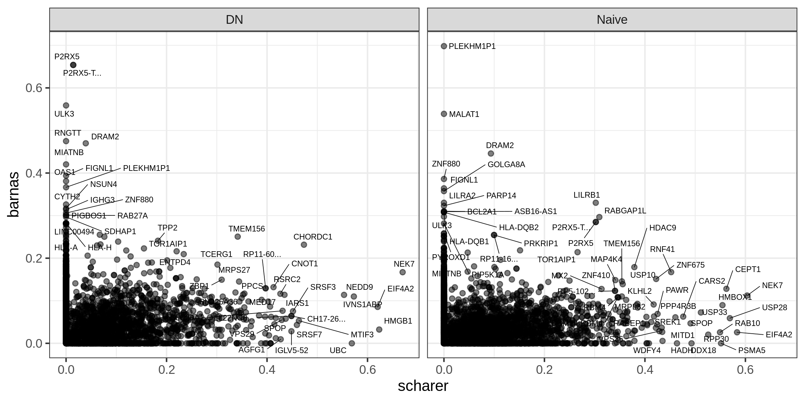

README
================

## Packages

``` r
library(tidyverse)
library(ggsci)
library(ggrepel)
```

## Functions

``` r
read_leaf <- function(cell_type) {
    
    sig <- 
        file.path("./results", cell_type, "leafcutter_cluster_significance.txt") %>%
        read_tsv() %>%
        separate(cluster, c("chr", "cluster"), sep = ":") %>%
        select(cluster, p.adjust, genes)

    eff <- 
        file.path("./results", cell_type, "leafcutter_effect_sizes.txt") %>%
        read_tsv() %>%
        mutate(cluster = sub("^.*(clu.*)$", "\\1", intron)) %>%
        select(cluster, logef, deltapsi)

    inner_join(sig, eff)
}
```

``` r
cell_types <- list.files("results") %>%
    .[!. %in% "PbPc"] %>%
    setNames(., .)

leaf_df <- map_df(cell_types, read_leaf, .id = "cell_type") %>%
    group_by(cell_type, cluster) %>%
    slice(which.min(p.adjust)) %>%
    ungroup()
```

<!-- -->
