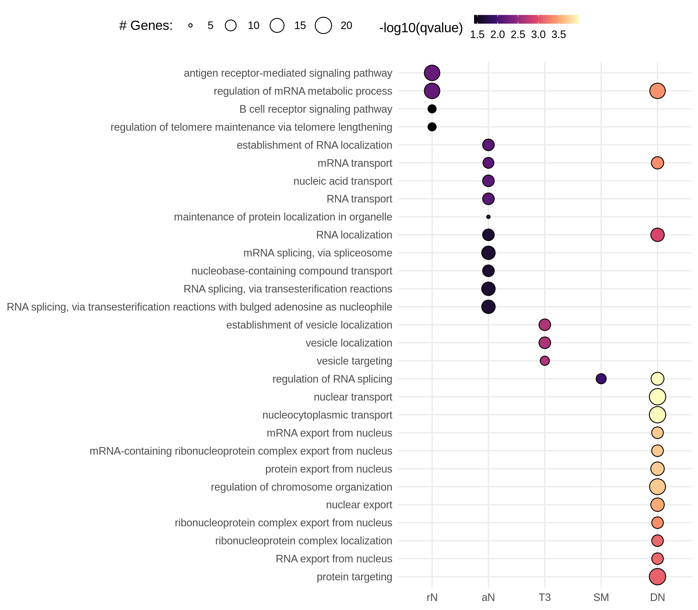
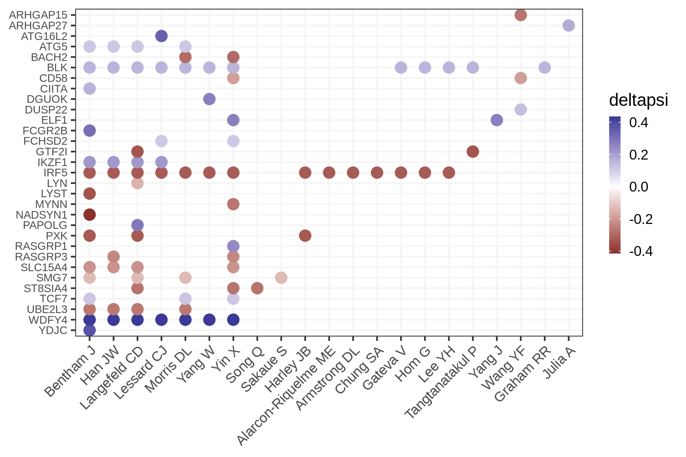
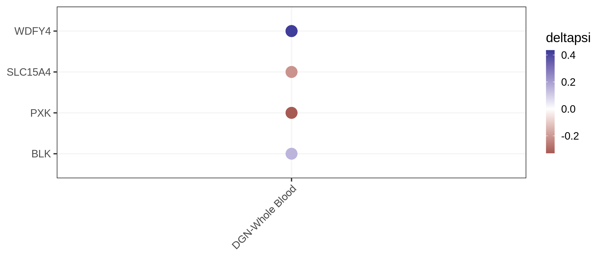
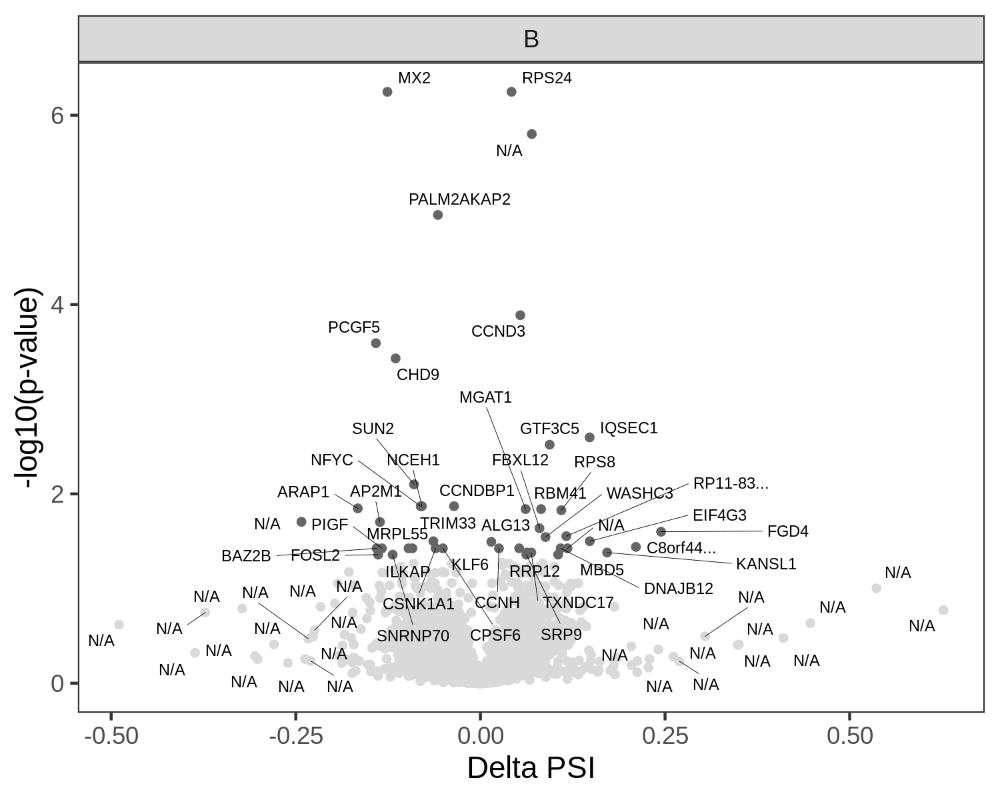
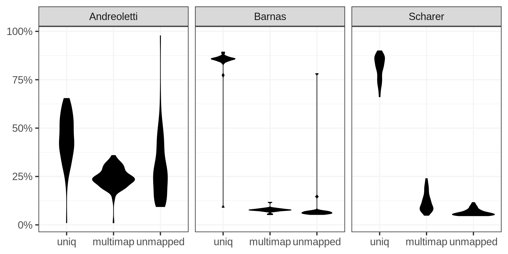

Splicing
================

Differential splicing events between patients and controls in Scharer dataset
-----------------------------------------------------------------------------

<!-- -->

Comparison between Scharer et al and Barnas et al
-------------------------------------------------

<!-- -->

Comparison with differential transcript usage obtained with the DEXSeq pipeline
-------------------------------------------------------------------------------

<!-- -->

Exploring why AS sometimes does not lead to DTU
-----------------------------------------------

### AS in HMGB1, EIF4A2, and RPL15

<!-- -->

### Expression levels for the AS isoforms in HMGB1 and EIF4A2

<!-- -->

GO enrichment
-------------

GO enrichment analysis on genes with at least one cluster with absolute
delta PSI &gt; 0.1.

<!-- -->

Differentially spliced genes that are also GWAS genes
-----------------------------------------------------

<!-- -->

Differentially spliced genes with sQTL-GWAS co-localizations in Mu et al. (2021)
--------------------------------------------------------------------------------

<!-- -->

Andreoletti et al. 
-------------------

<!-- -->

<!-- -->
