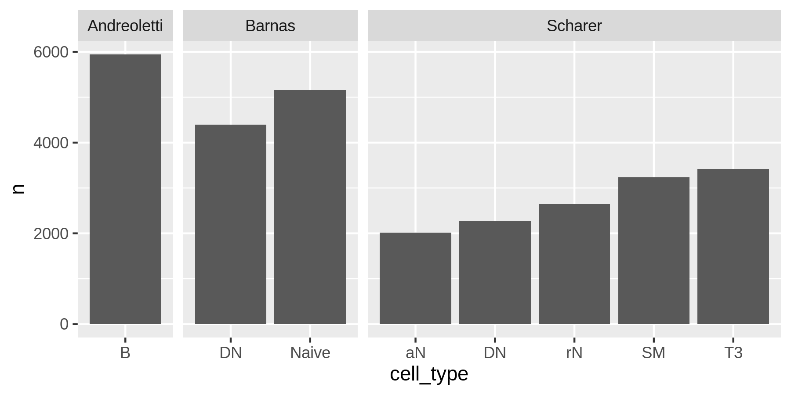
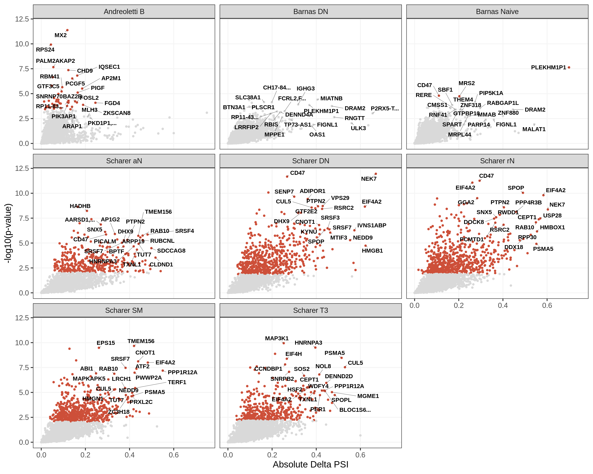
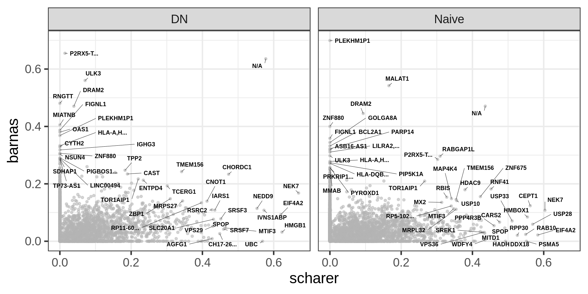
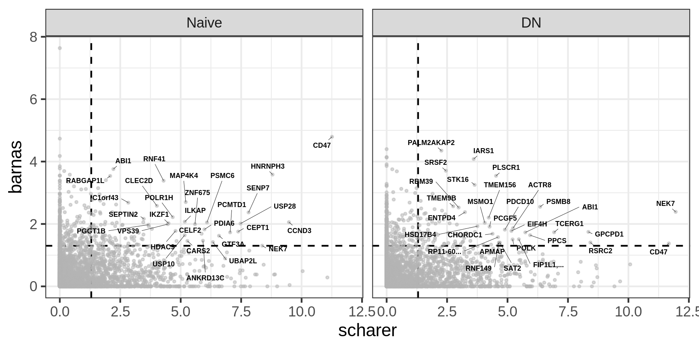
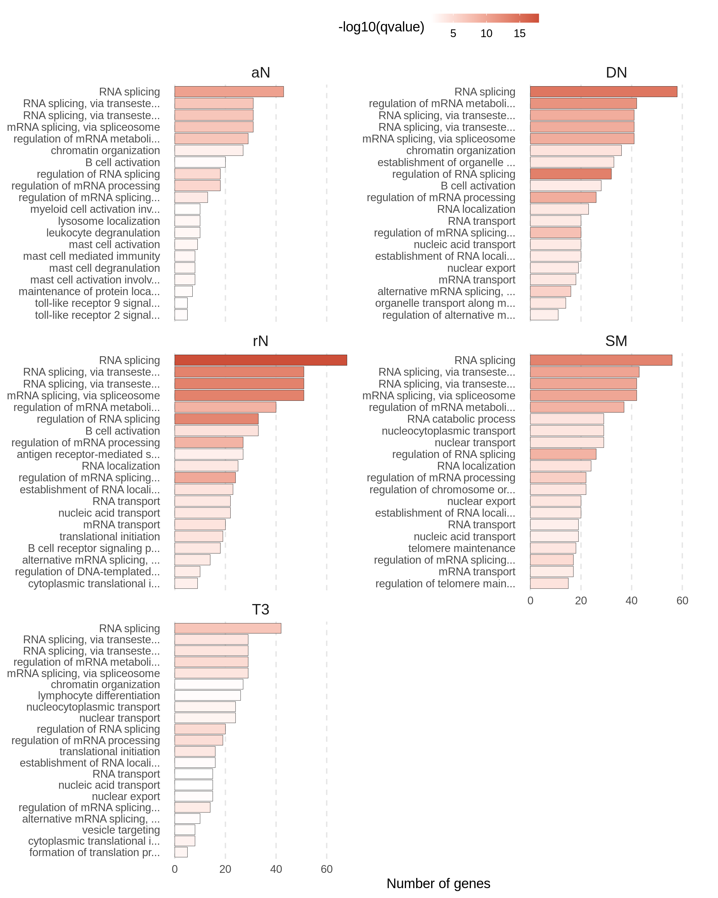
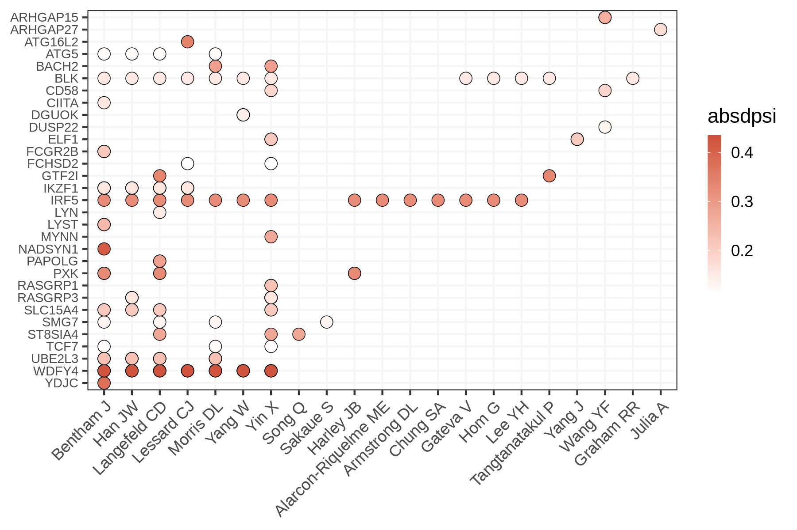
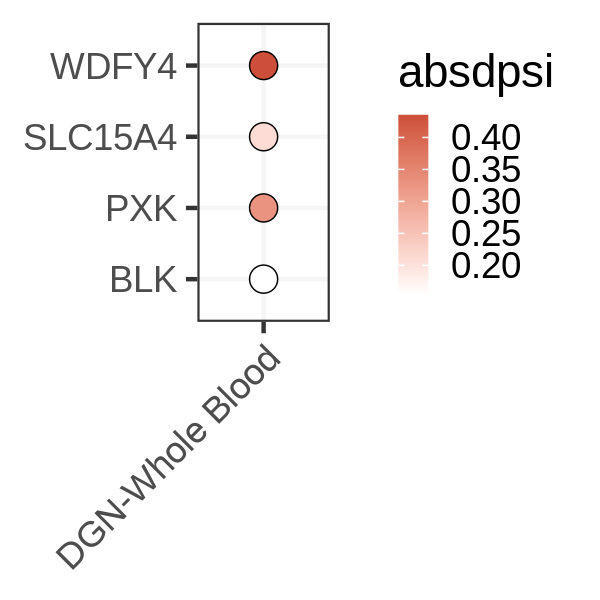

Splicing
================

## Number of splicing junctions passing the thresholds and tested by leafcutter

<!-- -->

## Differential splicing events between patients and controls

<!-- -->

## Comparison between Scharer et al and Barnas et al

### Highest absolute PSI per gene

<!-- -->

### Smallest nominal p-value per gene

\* dashed line corresponds to -log10(0.05)

<!-- -->

## GO enrichment

GO enrichment analysis for genes with at least one cluster with adjusted
p-value &lt; 0.1 in the Scharer dataset.

<!-- -->

# Differentially spliced genes in Scharer et al. data that are also GWAS genes

<!-- -->

## Differentially spliced genes in Scharer et al. data with sQTL-GWAS co-localizations in Mu et al. (2021)

<!-- -->
